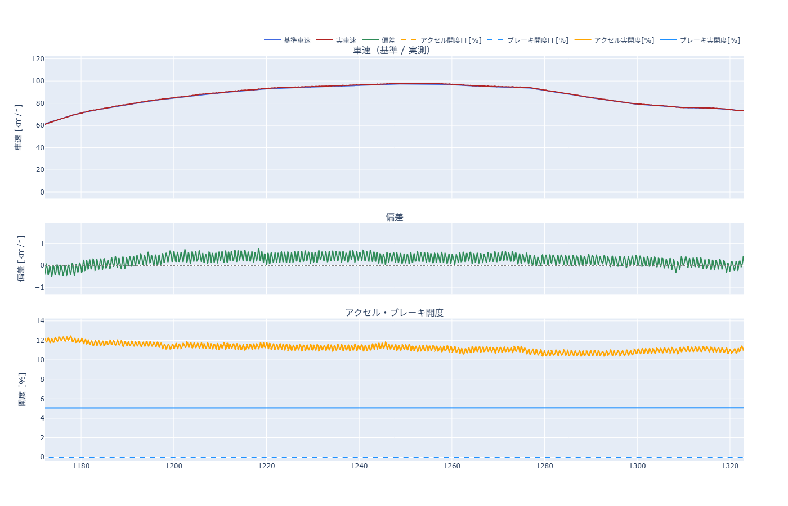

# ペダルのバタバタ操作問題— 2026-09-21

`docs/Problem/ProblemReport_20260919.md` が完了した時点で、\
手順3を走行したところ、KPIにはないが、不自然すぎるペダル操作を確認したので、改善する\
【走行結果】\
`tests/research/results/report20260921_RunFF_2.md`\
`tests/research/results/drive_log_real_20260921_085635.csv`



## 問題点
- ペダル操作を小刻みに変更している\
  上図からわかるように、アクセル開度を小刻みに変更しており、それに伴って、偏差も細かな変動が生じている\
  約11.9% → 約10.51% → 約11.9%...繰り返し\
  目標車速に届いているわけでもない
  偏差は微小であり、KPI違反ではないが、人間の操作とはかけ離れた操作であるため、着手する

## 手順1: 問題点の理解（2026-09-22）

> 以降、**本レポートの手順**は「手順1」「手順2」…と書き、`ProblemReport_20260910.md` の
> 大きな手順（FF のみの走行など）は「**20260910 手順3**」のように書き分ける。

対象データ: `tests/research/results/drive_log_real_20260921_085635.csv` の `section=MODE_DRIVE`
35998 行（50ms 周期・1800s、レポートは `report20260921_RunFF_2.md`）。数値はすべてこの 1 本の実測。

### 1-1. 言葉の定義（この章で使う 4 つ）

| 用語 | 意味 |
|---|---|
| **ばたつき** | ペダル指令が 1 秒に 1 回以上の速さで上下すること。ここでは **0.9〜1.7Hz の帯**と決める |
| **帯 RMS** | その帯だけを取り出した（0.9〜1.7Hz バンドパス後の）信号の標準偏差。「その速さでどれだけ揺れているか」の大きさ。単位は元の信号と同じ |
| **方向反転** | 指令が 上げ → 下げ（下げ → 上げ）に切り替わった回数。1 秒あたりで数える |
| **保持時間** | 指令が ±0.25% の幅から出るまで留まった時間。人間の「なるべく開度を一定に保つ」に対応する |

### 1-2. 何が起きているか

図の t=1236〜1242s を 1 行ずつ見ると、次が 0.73 秒周期でそのまま繰り返している。

| | 谷 | 山 |
|---|---|---|
| アクセル指令 | **10.92%** | **11.60%** |
| 偏差（実車速 − 基準） | **+0.70 km/h** | **+0.15 km/h** |

指令の振幅は ±0.34%、偏差の振幅は ±0.27 km/h。**目標に届いていないから踏み増しているのではなく、
届いたり行き過ぎたりを 1 秒に 1.4 回繰り返している。**

走行全体（15s 窓・非重複・基準車速 5km/h 以上の窓のみ・94 窓の中央値）:

| 見るところ | 実測値 | 読み方 |
|---|---|---|
| 卓越周波数（**偏差**で測る） | **1.455 Hz** | 周期 0.69s。図の区間（t=1170〜1320s）だけで見ると 1.37Hz。実車速そのものだと WLTP の加減速（低周波・大振幅）に埋もれるので、基準を引いた偏差で測る |
| 実車速の帯 RMS | **0.094 km/h** | 実際に車速が揺れている |
| 偏差の帯 RMS | 0.094 km/h | 同上（基準がこの帯で動いていないため） |
| **基準車速**の帯 RMS | **0.013 km/h** | 実車速の 1/7。**目標の作り方が原因ではない** |
| アクセル指令の帯 RMS | 0.102 % | |
| アクセル指令の方向反転 | **3.65 回/s**（ACCEL 区間 1527.6s・総移動 1718%） | 1 秒に 3.65 回、上げ下げが入れ替わる |
| ブレーキ指令の方向反転 | 0.38 回/s（BRAKE 区間 262.7s・総移動 168%） | アクセルの **1/10**。ばたついているのはアクセル側 |
| アクセルを ±0.25% で保てた時間 | 中央値 **0.25s**・p90 0.65s | ±0.5% に緩めても中央値 0.40s・p90 2.65s |
| 惰行（両ペダル待機）の時間 | 9.65s / 1800s（0.5%） | 「操作しないで追従する」場面がほぼ無い |
| アクセル実開度の総移動 | 1588 mm / 1800s | 参考値（アクチュエータの動いた距離） |

**速度が高いほど大きい**（基準車速の帯別・実車速の帯 RMS 中央値 [km/h]）:

| 基準車速 [km/h] | 5〜20 | 20〜40 | 40〜60 | 60〜80 | 80〜100 | 100〜120 | 120〜 |
|---|---|---|---|---|---|---|---|
| 帯 RMS | 0.070 | **0.068** | 0.094 | 0.111 | 0.142 | 0.143 | **0.160** |

### 1-3. KPI にいくら効いているか

偏差から 0.9Hz より速い成分だけを落とす（＝ばたつきだけを消す）と、プライマリー KPI は次のようになる。

| | 生 | 0.9Hz ローパス後 | 0.5Hz ローパス後 |
|---|---|---|---|
| 符号反転 [回/5s]（基準 ≤1） | **6** | **3** | 2 |
| p95 [km/h]（基準 ≤0.4） | 0.619 | 0.578 | 0.557 |
| 最大逸脱 [km/h]（基準 ≤1.0） | 1.780 | 1.533 | 1.489 |

- **符号反転 6 回のうち半分はばたつきが作っている**（`ProblemReport_20260919.md` 15.6 で 3 → 6 回に
  悪化した分がちょうどこれにあたる）。
- 一方で、ばたつきを完全に消しても符号反転は 3 回・p95 は 0.578 で、**3 つの KPI はどれも通らない**。
  ばたつきは「符号反転を半分に戻す」効果はあるが、これだけで KPI が満たせるわけではない。
- 偏差そのものへの寄与は小さい（p95 0.619 → 0.578、最大 1.780 → 1.533。最大逸脱の残りは
  `ProblemReport_20260919.md` 15.5 の停止間際で、こちらは KPI 評価から除外済み）。

### 1-4. 今回の対象範囲

走行中のペダル操作全体を見たうえで、**着手するのはアクセル側のばたつき**とする。理由:

- ブレーキ指令の方向反転は 0.38 回/s でアクセルの 1/10。ブレーキは「バタバタ」していない。
- 惰行が 9.65s しか無い（＝ほぼ常にどちらかのペダルを操作している）点は
  `ProblemReport_20260919_2.md` の「操作しないで追従運転できるところは開度を変更しない」と
  食い違うが、これはばたつきと同じ原因（下記 1-5）から出ている可能性が高いので、
  **ばたつきを直したあとに再測定して判断する**。
- 停止間際の `|偏差| > 1.0`（6 区間・3.8s）は `ProblemReport_20260919.md` 15.5 のユーザー判断で
  KPI 評価から除外済み。本ドキュメントでも対象外。

### 1-5. 原因の当たり（確定は本レポート手順2）

**C5 の「FF」は、名前は FF だが中身は比例フィードバックを持っている。**

1. C5 は特徴量を `v0 = 実車速`・先読みを `基準車速の絶対値`で作る（`tests/research/mode_drive.py:407-435`）。
   したがって `dv_h = 基準(t+h) − 実車速(t)` となり、**偏差がそのまま特徴量に入る**。
   さらに `desired_accel = dv_1.0 / 1.0s`（`tests/research/ff_candidate.py:381-383`）なので、
   偏差 1 km/h は要求加速度 1 km/h/s として効く。
2. 学習済みモデル（`test_vehicle_20260921_085550.pkl`）で `∂アクセル開度 / ∂実車速` を数値評価すると:

   | 車速 | 合計 | うち `dv`（偏差）経路 | うち `dv_past`（実測加速度）経路 |
   |---|---|---|---|
   | 30 km/h | 0.97 | 0.97 | 0.00〜0.10 |
   | 60 km/h | 1.07 | 1.08 | 0.03〜0.16 |
   | 96 km/h | 1.25〜1.32 | **1.33** | 0.03〜0.09 |
   | 120 km/h | 1.43〜1.63 | **1.44** | 0.01〜0.19 |

   単位 %/(km/h)。**主因は `dv_past`（微分のように働く項）ではなく `dv`（偏差そのもの）**であり、
   速度が上がるほどゲインが高い。1-2 の「速度が高いほど帯 RMS が大きい」と向きが一致する。
3. 実測でも同じ大きさ: t=1170〜1320s の「偏差 → FF 指令」の回帰の傾きは **−0.93 %/(km/h)**、
   0.9〜1.7Hz 帯だけで見ると 1.45 %/(km/h)（`ProblemReport_20260919.md` 15.6 の既測値）。
4. ループの遅れ: 指令 → 実開度は **0.05s**（1 周期。サーボはよく追従している）。
   実開度と実車速のリップルは **0.35s ずらしたとき**にいちばん相関が高い（≒ 0.48 周期）。
   ただしこれは「ペダルの効きが 0.35s 遅れている」と「ペダルと車速が逆位相になっている」の
   どちらでも同じ形になるので、**遅れの独立した実測にはなっていない**（本レポート手順2 で分ける）。
   確かなのは、**1.4Hz で揺れ続けているという事実そのもの**が「一周まわって位相 180°・ゲイン 1 以上」
   を意味することで、ゲイン側は 2. の 1.0〜1.44 %/(km/h) で実際に足りている。
5. **20260910 手順3**（FF のみのモード走行）の経路には、この揺れを止めるもの（平滑化・偏差の不感帯・レートリミット・ヒステリシス）が
   1 つも無い（`tests/research/mode_drive.py:152 require_simple_arbiter` が有効化を拒否する。
   レートリミットはユーザー方針で不採用）。近いのは要求加速度側の `coast_band_kmhs 0.5`
   （偏差に対する不感帯ではない）と待機位置だけ。

**何が困るか**: (a) 人間の操作と見た目が違う、(b) 符号反転 KPI を 3 → 6 回に押し上げている、
(c) アクチュエータが 1800s で 1588mm 余分に動く（摩耗・発熱）、(d) **20260910 手順4** で Kp を足すと、
**すでに 1.0〜1.44 %/(km/h) 入っているところにさらに上乗せする**ことになる。

### 1-6. 本レポート手順3（KPI 策定）への入口

この問題のゴール KPI の候補（決めるのは本レポート手順3）:

| 候補 | いまの値 | 測る場所 |
|---|---|---|
| アクセル指令の方向反転 [回/s] | 3.65 | レポート 5 章 |
| 実車速の帯 RMS（0.9〜1.7Hz）[km/h] | 0.094 | 同上 |
| アクセル開度を ±0.25% で保てた時間の中央値 [s] | 0.25 | 同上 |
| アクセル実開度の総移動 [mm/1800s] | 1588 | 走行ログ |
| （既存のプライマリー KPI）符号反転 [回/5s] | 6 | 1 章 |

### 1-7. 再現方法

```bash
# 5 章に上の数値が出る
.venv/bin/python -m tests.research.mode_report \
    tests/research/results/drive_log_real_20260921_085635.csv --label FF

# 前の走行（06:05）と並べる
.venv/bin/python -m tests.research.compare_runs \
    tests/research/results/drive_log_real_20260921_060459.csv \
    tests/research/results/drive_log_real_20260921_085635.csv
```

指標の定義と計算は `tests/research/kpi.py`（`chatter_metrics`）にある。

## 手順2: 原因洗い出し（段A: 既存ログだけで分かったこと）

実機は動かしていない。9/19〜9/21 の手順3 走行 9 本と、20260910 手順2 の走行 1 本を読み直した結果。

### 2-1. 仮説の並べ方

「1.4Hz の揺れという**信号がどこから入るか**」で切ると、入口は 7 つしかない。

| # | 仮説（信号の入口） |
|---|---|
| H1 | 制御ループの**比例**（C5 の `dv` 経路＝偏差が特徴量に入る） |
| H2 | 制御ループの**微分**（`dv_past` 経路＝実測の加速度） |
| H3 | 車速の**計測**（CAN の更新周期・階段化・ノイズ） |
| H4 | **アクチュエータ**（開度の量子化・追従遅れ） |
| H5 | **車両／ダイナモ**（駆動系やロードコントロールの共振） |
| H6 | 制御の**タイミング**（周期のジッタ・詰まり） |
| H7 | **モデルの非線形**（動作点によってゲインが跳ねる・不感帯切り上げの折れ） |

### 2-2. 決め手 — 実質 Kp と揺れの大きさが 9 本すべてで対応する

用語: **実質 Kp** = `∂アクセル開度 / ∂実車速` [%/(km/h)]。C5 は `dv_h = 基準(t+h) − 実車速(t)` を
特徴量にするので、FF でありながらこの値だけ比例フィードバックとして効く（手順1 の 1-5）。
学習済み pkl から直接計算できる。

**揺れの大きさ**は、どの走行も同じ条件（基準 5〜60 km/h の 15s 窓・0.9〜1.7Hz の帯 RMS の中央値）で
揃えて測った。9/21 の 2 本は 1800s 走行なので、先頭の Low 相当の帯だけを使っている。

| 走行 | FF モデル（pkl） | 実質 Kp（40km/h） | 車速の帯 RMS [km/h] | 開度の帯 RMS [%] |
|---|---|---|---|---|
| 9/20 05:15 | 20260919_195430 | **0.523** | **0.0284** | 0.013 |
| 9/20 05:26 | 20260919_195430 | 0.523 | 0.0313 | 0.014 |
| 9/19 05:51 | 20260918_193408 | **0.699** | 0.0476 | 0.039 |
| 9/19 06:02 | 20260918_193408 | 0.699 | 0.0539 | 0.040 |
| 9/19 06:36 | 20260918_193408 | 0.699 | 0.0582 | 0.042 |
| 9/19 06:53 | 20260918_193408 | 0.699 | 0.0616 | 0.051 |
| 9/19 07:18 | 20260918_193408 | 0.699 | 0.0535 | 0.041 |
| 9/21 08:56 | 20260921_085550 | **0.984** | **0.0750** | 0.083 |
| 9/21 06:05 | 20260921_055107 | **1.151** | **0.1089** | 0.161 |

**Kp と揺れの相関は 0.969**（4 種類の pkl・9 本）。Kp がいちばん低い 9/20 でいちばん静かで、
いちばん高い 9/21 06:05 でいちばん暴れる。**同じ向きに、同じ順で並ぶ。**

ユーザー確認済み: **9/20 と 9/21 のあいだに車両・ダイナモ側は何も変えていない**。
変わったのはソフト側（クリープ判定の作り直し・不感帯 8.21→3.68%・定速階段の設定ミス修正）だけで、
その結果として pkl の実質 Kp が上がった。

さらに、揺れの大きさは**フィードバックの増幅の式にそのまま乗る**:

    揺れ = d / (1 − P × Kp)

- `d` = ループが無いときに残る揺れ（外乱）
- `P` = 1.4Hz でのペダル→車速の応答 [km/h per %]

9 本に当てはめると **d = 0.027 km/h・P = 0.65 km/h per %**（残差 RMS 0.0075 km/h）。
このとき**ループゲイン P×Kp は 0.34（9/20）→ 0.46（9/19）→ 0.64（9/21 08:56）→ 0.75（9/21 06:05）**。
1 に近づくほど増幅が効くので、Kp が 2.2 倍（0.52→1.15）になると揺れは 3.8 倍になる。

> 注意: これは 4 点・2 パラメータの当てはめで、**「d が 3 日間同じ」「位相がちょうど増幅する向き」を
> 仮定している**。`P = 0.65` は推定値であって測定値ではない（→ 2-6・段B）。

### 2-3. 計測・アクチュエータ・タイミングは 3 日間とも動いていない

| 見るところ | 9/19 | 9/20 | 9/21 | 判定 |
|---|---|---|---|---|
| CAN 車速の同値連続（停車を除く） | 4.2% | 4.0% | 3.6% | 変化なし |
| → 推定 CAN 更新間隔 | 52ms | 52ms | 52ms | 変化なし |
| `cycle_ms` 中央値 / p95 | — | — | 40.8 / 41.9ms | 50ms 超は 0.01% |
| 1 周期以上の遅れ（各レポート 2 章） | 1 回 | 1〜2 回 | 1 回 | 変化なし |
| 実開度の指令への追従（9/21） | — | — | 1 サンプル遅れ・振幅比 **0.997** | 忠実に追従 |
| 開度の量子化（9500 パルス = 100%） | — | — | 0.0105% | リップル振幅 0.14% の **1/13** |

（`config_testVehicle.yaml` のコメントは「CAN は約10Hz」とあるが、**実測は約 19Hz**。
`src/infra/can_reader.py` に平滑化・補間は無く、キャッシュした最新値をそのまま返す。）

### 2-4. ペダルを動かさなければ、同じ車で 1.4Hz は出ない

20260910 手順2 の走行（`drive_log_real_20260921_082539.csv`。手順3 の 08:56 と**同じ日・同じ車**）で、
開度を一定に保っている区間を測った。

| 区間 | 車速 | 開度 | 車速の帯 RMS |
|---|---|---|---|
| 定速保持 | 60.9 km/h | 11.20% | **0.0046 km/h** |
| 定速保持 | 111.0 km/h | 12.17% | **0.0032 km/h** |
| ACCEL_SWEEP（開度一定） | 18→80 km/h | 11.68% | 0.033 km/h |

手順3 の同じ速度帯が 0.075〜0.109 なので、**1/20〜1/3**。
開度も車速もほぼ同じなのに、**ペダルを動かさなければ揺れない**。

### 2-5. 仮説の判定

| # | 仮説 | 判定 | 根拠 |
|---|---|---|---|
| H1 | **`dv`（偏差）経路の実質 Kp** | **主因** | 2-2。9 本で相関 0.969・増幅の式にも乗る。車両側は不変 |
| H2 | `dv_past`（微分）経路 | 否定 | 経路別感度で寄与 1/10 以下（手順1 の 1-5） |
| H3 | 車速の計測 | 否定 | 2-3 で 3 日間不変。2-4 で開度一定なら出ない |
| H4 | アクチュエータ | 否定 | 2-3。振幅比 0.997 で追従、量子化はリップルの 1/13 |
| H5 | 車両／ダイナモの共振 | **保留** | 2-4 で**自励はしない**。ただし加振に対する応答は未測定（2-6） |
| H6 | 制御のタイミング | 否定 | 2-3。`cycle_ms` p95 41.9ms、1 周期超の遅れ 1 回/1800s |
| H7 | モデルの非線形 | 否定 | 実質 Kp は 0.97（30km/h）→1.45（125km/h）と**なめらかで折れ点なし**。指令 11% は不感帯 3.68% から十分離れている |

**結論（段A 時点）**: ばたつきは **C5 の `dv` 経路が持つ比例フィードバックが作っている**。
その大きさは pkl ごとに決まり、Kp が上がると揺れが増える。ただし**「なぜ 1.4Hz なのか」**は、
車両側の応答 `P` を測らないと言い切れない（H5 が保留のまま）。

### 2-6. 残っている穴と、それを埋める測定（段B）

> **2026-09-24 訂正**: 下の「実測 0.92 は積分モデルの約 7 倍」は測り方の誤り。閉ループでは
> 車速リップル ÷ 指令リップルは**制御器の逆数 1/Kp** になり、車両の応答 P ではない（0.92 ≈ 1/1.08）。
> P(f) が未知なのは変わらない。詳細は 2-8。

手順3 の実測では 車速リップル 0.094 / 指令リップル 0.102 km/h per %、つまり比は **0.92**。
一方、静的なペダルゲイン表（`accel_gain_kmhs_per_pct`。95〜105km/h で約 1.2 km/h/s per %）から
単純な積分モデルで出すと 1.455Hz では **0.13 km/h per %** にしかならない。**実測はその約 7 倍**。
2-2 の当てはめも `P = 0.65`（積分モデルの 3.5 倍）を要求している。

つまり **1.4Hz 付近で車が「思ったより大きく」応答している可能性**があり、それが本当なら
対策は「Kp を一律に下げる」ではなく「**その周波数だけ落とす**」になる。ここは既存ログでは測れない
（開度一定の区間には 1.4Hz の入力が無く、走行中は閉ループなので入力と出力を分離できない）。

**段B でやること**: 一定速度で基準開度に ±0.3% の正弦波を重ね、0.2〜2.0Hz でペダル→車速の
ゲインと位相を直接測る（フィードバックを切った開ループ測定）。
**段A の予測は `P(1.4Hz) ≈ 0.65 km/h per %`・ループゲイン `P×Kp ≈ 0.64`**。
測定がこれを裏切れば 2-2 の当てはめの前提（外乱 `d` が一定・位相の仮定）が誤っていたことになる。

### 2-7. 再現方法（段A）

```bash
# 実質 Kp（level_gain）と、1.4Hz での経路別内訳（sinusoid_gain）
.venv/bin/python -m tests.research.model_gain \
    tests/research/results/models/test_vehicle_20260918_193408.pkl \
    tests/research/results/models/test_vehicle_20260919_195430.pkl \
    tests/research/results/models/test_vehicle_20260921_055107.pkl \
    tests/research/results/models/test_vehicle_20260921_085550.pkl \
    --speeds 30,40,60,96,120 --freq 1.4

# 揺れの大きさ（走行ごと）
.venv/bin/python -m tests.research.compare_runs <CSV> <CSV> …
```

`model_gain.py` の 1.4Hz の内訳でも、どの pkl でも**合計のほぼ全部が `dv` 経路**で
`dv_past` 経路は 0.02〜0.27（20260921_085550 の 96km/h なら 合計 1.24 / dv 1.33 / dv_past 0.04）。
手順1 の 1-5 の結論（主因は `dv`、`dv_past` ではない）は 4 つの pkl すべてで成り立つ。

### 2-8. 段B の進捗と引き継ぎ（2026-09-24 時点）

**進捗**

| 段 | 内容 | 状態 |
|---|---|---|
| B-1 | 加振走行コード `tests/research/excite.py`（手順 11）＋解析 `--analyze` | 完了（スタブで理論値と一致: 0.7Hz 0.057 / 1.4Hz 0.029 km/h per %、位相 約 −90°） |
| B-2 1本目 | 実機 `drive_log_real_20260924_041846.csv` | **中断**（到達フェーズで整定せず 90s 打ち切り、加振ブロック 0 本） |
| B-1b | 中断を受けた手直し（下記） | 完了（`pytest tests/research/test_research_excite.py` 15 passed・`ruff check` OK、スタブ走行はユーザー判断で省略） |
| B-2 2本目 | 実機 `drive_log_real_20260924_055632.csv` | 完了（2速度×7周波数 全 14 ブロック取得、SNR 3.6〜12） |
| B-3 | 解析 → `P×Kp` 表 → 原因確定 → `reportYYYYMMDD_FreqResp.md` | 完了（`tests/research/results/report20260924_RunFreqResp.md`、詳細は下記 2-9） |

**B-2 1本目で分かったこと（実測）**

1. **中断の直接原因** — 到達 PI（Kp 0.3・Ki 0.05。定速階段と同じ既定値）が 60km/h のまわりで
   **0.34Hz・車速 std 0.34km/h・符号反転 3.5 回/5s** のハンチングを続け、整定条件
   「±0.5km/h に 3s 連続」が一度も成立しなかった。実績のある定速階段の条件は ±1.0km/h
   （`cruise_hold_settle_tol_kmh`）で、B-1 で幅だけ厳しくしていた。同じ PI の過去の定速保持
   （9/20×2・9/21）も std 0.54〜0.64km/h・約 0.2Hz で揺れていた。スタブ（遅れのない純積分器）では出ない。
2. **安全面の穴** — 打ち切り時はペダル解放だけで、緩減速・停車保持を通らなかった（60km/h から惰行）。
3. **2-6 の訂正** — 閉ループの「車速/指令」の比は 1/K。今回 3.31（1/0.30 = 3.32、位相 −170°）、
   手順3 の 0.92 も C5 の 60km/h の実質 Kp 1.08 の逆数。**P(f) は開ループ加振でしか測れない**。
4. **原因の当たりへの影響** — 「車速偏差のフィードバックが揺れを作る」は補強（開度一定なら 60km/h で
   std 0.009km/h、どの閉ループでも揺れる）。ただし **Kp を C5 の 1/3〜1/5 にしても揺れは止まらず、
   周波数が下がるだけ**:

   | 制御 | 実質 Kp [%/(km/h)] | 揺れの周波数 |
   |---|---|---|
   | 到達 PI（今回） | 0.3 | 0.34Hz |
   | 定速保持（同じ PI・過去） | 0.3 | 約 0.2Hz |
   | 9/19・9/20 の C5 系 | 0.48〜0.92 | 0.31〜0.42Hz |
   | 9/21 の C5 | 0.97〜1.44 | 0.73〜1.4Hz |

   → **Kp を下げるだけの対策では 1.4Hz が 0.3Hz の揺れに置き換わる見込み**（手順4 の論点）。

   > **2026-09-24 訂正**: 段B で実測した `P(f)` を使うと、純粋な P 制御 K=0.3 の最大増幅率
   > `1/|1+K·P|` は **1.45（60km/h・0.5Hz）・1.32（100km/h・0.5Hz）**で、共振（増幅率が
   > 大きく跳ねる点）は無い。つまり**線形モデルでは「Kp を下げると 0.3Hz に置き換わる」は
   > 支持されない**。0.3Hz のハンチングは別の未解明な現象（候補: ECU 内部の段差・不感帯と
   > 積分のリミットサイクル）であり、この表の対応関係だけから結論づけられない。
   > また 9/19・9/20 の 0.31〜0.42Hz は基準車速 5〜60km/h の低速窓で出ており、低速域の `P` は
   > 段B で測っていない（60km/h 以上のみ）。
   > **ユーザー決定**: 0.3Hz のハンチングは別論点として残す（手順4 で考慮するが、今は深追いしない）。
5. **ユーザーの見立て（車両の分解能）** — 定速開度 11.20%→60.9km/h、12.17%→111km/h で
   **定常では 1% ≈ 50km/h**。アクチュエータ 1 パルス（0.0105%）≈ 0.5km/h ＝ KPI p95 0.4km/h と同程度で、
   「わずかな開度で車速が振れる」は定常感度として正しい。一方、揺れの指令は std 0.10%（約 10 パルス）で、
   **アクチュエータ分解能が揺れを作っているのではない**。車両（ECU）内部の段差・不感帯は未確認
   （ユーザー判断で今回の加振には含めない）。
   ユーザーの要望: **そういう車両でもバタつかない制御にしたい**（手順4 の設計目標）。

**B-1b の手直し**（`tests/research/` のみ。PI ゲインは変えていない）

- 整定条件 `excite.approach_band_kmh` 0.5→**1.0**、`approach_settle_s` 3.0→**6.0**（ハンチング約 2 周期）
- 加振中の基準開度 = **整定窓 6s の指令開度の平均**（瞬時値はハンチングで ±0.14% 振れ、固定すると定常で数 km/h ずれる）。
  コンソールに `整定: … base = 窓平均 X%（瞬時値 Y%）に固定` と出る
- 制御側の中断（到達打ち切り・±8km/h 逸脱）は `_ControlAbort` → **緩減速で停車・停車保持**。
  過電流・アラーム・CAN 読み取り失敗・最高速超えは従来どおりペダル解放

**次の担当がやること（2026-09-24 完了分）**

1. 実機再走行 → 完了（`drive_log_real_20260924_055632.csv`、2速度×7周波数 全ブロック取得）
2. 解析 → 完了（`report20260924_RunFreqResp.md`）
3. 判定 → 完了（2-9 参照。H1 確定・H5 は「共振」ではなく「遅れ」として説明、0.3Hz は別論点）
4. 成果物 → 完了（`tests/research/results/report20260924_RunFreqResp.md`、本レポート「## 原因」更新、`docs/memo.md` に記録、memory 更新）
5. 未決事項（ユーザー判断待ち・本件と無関係のため据え置き）: `test_research_config.py::test_stop_brake_floor_settings_are_validated` が
   失敗（yaml の `stop_brake_floor_offset_pct` 6.0 vs テスト期待 8.0。本件とは無関係）

### 2-9. 段B の結果（2026-09-24）

段B（一定速度に ±0.3% の正弦波を重ねる開ループ加振走行）を実機で完走し、車両側の応答 `P(f)` を
初めて直接測った。以降はこの実測にもとづく。

#### 2-9-1. 用語

| 用語 | 意味 |
|---|---|
| **P（ペダル→車速の周波数応答）** | ある周波数 `f` の正弦波でペダル指令を揺らしたとき、車速がどれだけ・どれだけ遅れて揺れるか。単位 km/h per %（ゲイン）と度（位相）の組。フィードバックを切った**開ループ**でしか測れない（2-6・2-8 の 3） |
| **位相** | 車速の揺れが指令の揺れに対してどれだけ遅れるか。−90° は 1/4 周期遅れ、−180° は半周期遅れ（山と谷が入れ替わる） |
| **ループゲイン L** | `L(f) = C5 の応答(f) × P(f)`。制御ループを一周した後にどれだけ信号が増幅されるかの複素数 |
| **増幅率** | `1/|1+L|`。外乱（ノイズ）がループを回るたびに何倍にされるか。位相が −180° 付近で `|L|` が 1 に近いほど大きくなる |

#### 2-9-2. 実測 P(f)（`drive_log_real_20260924_055632.csv`、SNR 3.6〜12）

| 速度 | 0.2Hz | 0.35Hz | 0.5Hz | 0.7Hz | 1.0Hz | 1.4Hz | 2.0Hz |
|---|---|---|---|---|---|---|---|
| 60km/h ゲイン [km/h/%]・位相 | 3.988・−114.5° | 2.027・−130.6° | 1.620・−141.2° | 1.055・−149.8° | 0.892・−172.4° | 0.674・−195.5° | 0.582・−231.9° |
| 100km/h | 3.386・−105.6° | 2.134・−117.5° | 1.521・−126.9° | 1.122・−143.5° | 0.805・−165.4° | 0.618・−191.9° | 0.548・−230.0° |

（位相は −180° をまたいで単調に遅れ続けるように連続表示。生の解析出力は 1.4Hz 以降 +164.5°・+168.1°・
+128.1°・+130.0° と表示されるが、これは −360° した値と同じ角度で、位相が一周を超えて遅れていることを表す）

- **段A の予測**（2-6・2-2）: `P(1.4Hz) ≈ 0.65 km/h per %` → **実測 0.674（60km/h）/ 0.618（100km/h）で一致**
- **位相が −180° を横切る周波数**（1.0Hz と 1.4Hz の直線補間）: **60km/h 約 1.13Hz、100km/h 約 1.22Hz**

#### 2-9-3. C5 込みのループゲイン（複素数、位相込み）

C5（pkl `test_vehicle_20260921_085550`）の `dv`・`dv_past` 両経路を合わせた複素応答（`model_gain.py` の
特徴量計算と同じ組み立てで、実部・虚部を数値評価）を実測 `P(f)` に掛けたもの。

| 速度 | 0.2Hz \|L\| | 0.5Hz \|L\| | 1.0Hz \|L\| | 1.4Hz \|L\| |
|---|---|---|---|---|
| 60km/h | 4.23 | 1.61 | 0.82 | 0.65 |
| 100km/h | 4.49 | 1.93 | 1.09 | 0.79 |

| 速度 | 0.2Hz 増幅率 | 0.5Hz 増幅率 | 1.0Hz 増幅率 | 1.4Hz 増幅率 |
|---|---|---|---|---|
| 60km/h | 0.26 | 1.04 | **4.59** | 2.62 |
| 100km/h | 0.23 | 0.64 | **3.55** | 3.42 |

−180° を横切る点（2-9-2）では `|L| ≈ 0.76`（60km/h）/ `≈ 0.93`（100km/h）＝**安定限界（|L|=1・位相
−180°）のすれすれ**。1〜1.4Hz 帯で外乱が 2.6〜4.6 倍に増幅されている。

#### 2-9-4. 実走のスペクトルとの突き合わせ

9/21 08:56 の実走（`drive_log_real_20260921_085635.csv`）の偏差スペクトルを、基準車速の帯（15s 窓）ごとに
分けて山を取り直すと:

| 基準車速帯 | 20〜40km/h | 50〜70km/h | 90〜110km/h | 110〜135km/h |
|---|---|---|---|---|
| 偏差スペクトルの山 | 1.04Hz | 1.04Hz | 1.37Hz | 1.51Hz |

2-9-2・2-9-3 の予測（60km/h 台で 1.1Hz 強、100km/h 台で 1.2Hz 強が −180° 点）とおおむね一致する。
手順1 の表の「卓越周波数 1.455Hz」は、94 窓の中央値を高速側の窓が押し上げていたための見かけの値で、
速度帯ごとに見ると予測との食い違いはない。

2-2 の当てはめ（`d = 0.027 km/h`・増幅率で説明するモデル）とも整合する: `0.027 × (3〜4.6) ≈ 0.08〜0.12`
に対し、手順1 の実測の帯 RMS は **0.094 km/h** で範囲内。

#### 2-9-5. 低周波では dv 経路が役に立っている

0.2Hz では `|L| ≈ 4.2〜4.5` と大きいが、位相が −180° から遠いため増幅率は **0.23〜0.26**（＝外乱を
1/4 程度に抑え込む側）。つまり `dv`（偏差）経路は低周波の外乱抑制に寄与しており、**Kp を全周波数帯で
一律に下げると、この低周波の抑え込みも失う**（手順4 の設計上の注意点）。

#### 2-9-6. 注意（測定の限界）

- 加振振幅は指令 ±0.3%。実走のリップル（開度の帯 RMS 約 0.1%、2-2）より大きいため、**非線形性
  （振幅依存のゲイン変化）は未確認**
- 周波数点は 7 点（0.2/0.35/0.5/0.7/1.0/1.4/2.0Hz）のみ。−180° 点は 1.0Hz と 1.4Hz の間の**直線補間**
- 加振は **60km/h・100km/h のみ**。低速域（60km/h 未満）の `P` は未測定（2-8 の 4 の訂正注記の
  9/19・9/20 の 0.31〜0.42Hz を P で説明できるかは今回の対象外）

#### 2-9-7. 判定の更新

| # | 仮説 | 段A時点 | 2026-09-24 更新 |
|---|---|---|---|
| H1 | `dv`（偏差）経路の実質 Kp | 主因 | **確定**（2-9-3 のループゲインで裏付け） |
| H5 | 車両／ダイナモの共振 | 保留 | **否定**（「共振」ではなく「車両の遅れ」。位相が約 1.1〜1.2Hz で −180° に達するために増幅が起きているだけで、その周波数だけゲインが跳ねているわけではない） |

#### 2-9-8. 再現方法

```bash
.venv/bin/python -m tests.research.excite --analyze tests/research/results/drive_log_real_20260924_055632.csv \
    --pkl tests/research/results/models/test_vehicle_20260921_085550.pkl --report
```

`tests/research/results/report20260924_RunFreqResp.md` に P(f) の表と図が出力される（2-9-2 の表と同じ値）。
2-9-3 のループゲインは、この P(f) と C5 の複素応答（`model_gain.py` の特徴量組み立てを流用した
その場限りの計算スクリプト、本体コードへの追加なし）を掛け合わせて別途算出した。

## 原因
**C5 の `dv`（偏差）経路が持つ比例フィードバック（実質 Kp 0.97〜1.45 %/(km/h)）と、車両の遅れ
（約 1.1〜1.2Hz で位相 −180° に達する）が重なり、ループゲインが −180° 点で 0.76〜0.93（安定限界
すれすれ）になって、1〜1.5Hz の外乱を 2.6〜4.6 倍に増幅している**（2026-09-24 確定、根拠は 2-9）。

段A の根拠（2-2: 4 種類の pkl・9 本の走行で、実質 Kp と揺れの大きさが相関 0.969 で対応。車両・
ダイナモ側は同期間に変更なし）に、段B の実測 `P(f)`（2-9-2）とループゲイン（2-9-3）が加わり、
「なぜ 1.4Hz なのか」（車両側の応答）も含めて確定した。

**手順4 への示唆**: 1〜1.5Hz のループゲインを ≲0.5 まで下げる、またはその周波数帯で位相を補う対策が
候補になる。**Kp を全周波数帯で一律に下げると、低周波（0.2Hz 付近）の外乱抑制（2-9-5）も失う**ため、
周波数を選ばない一律のゲイン低下は最適ではない可能性が高い。
なお、**到達 PI（Kp=0.3）の 0.3〜0.34Hz のハンチング（2-8 の 4）は、この線形モデルでは説明できない
別現象・未解明のまま**（ユーザー決定により今回は深追いしない）。


## 手順3: ゴール KPI（2026-09-24 決定）

### 3-1. 決定事項

| 項目 | 決定 |
|---|---|
| 主 KPI | **アクセル指令の往復回数**（山または谷から 0.1% 以上戻ったら 1 回） |
| しきい値 | **全体 ≤0.4 回/s、かつ 60 秒ごとの最大 ≤1.0 回/s** |
| 補助 KPI（合否には使わない） | 実車速の帯 RMS（0.9〜1.7Hz）≤0.04 km/h。1.4Hz 現象そのものの確認用（9/21 は 0.094、開度一定なら 0.003〜0.005） |
| 既存の Must KPI | 最大逸脱・p95・符号反転はそのまま。**ゴール = これらとペダル操作の滑らかさを同時に満たす** |
| 参考値（合否に使わない） | 保持時間の中央値・アクチュエータの総移動量・しきい値なしの方向反転 |
| PRD | プライマリー KPI（Must）に「ペダル操作の滑らかさ」として追加済み（`docs/product-requirements.md`） |

### 3-2. 数え方（実装 `tests/research/kpi.py` の `pedal_reversals` / `pedal_reversal_rates`）

- **往復 1 回** = アクセル指令が上げ → 下げ（下げ → 上げ）に切り替わったこと。ただし山（谷）から
  0.1% 以上戻ったときだけ認める。0.1% は約 10 パルス（1 パルス 0.0105%）。
  一方向の踏み増し・戻しは 0 回。1 パルス程度の細かい上下も 0 回。
- **対象の行** = `MODE_DRIVE`・`phase=ACCEL`・基準車速 5km/h 以上。連続する ACCEL 区間ごとに数え、ブレーキ区間をまたいで数えない。
- **全体** = 往復回数の合計 ÷ 対象の時間 [s]。
- **60 秒ごと** = 経過時間で重ならない 60s の窓に区切り、各窓の回数 ÷ その窓の対象時間。対象時間が 15s 未満の窓は除き、残りの**最大**をとる（1240s 付近のような局所的なばたつきを全体の平均で薄めないため）。
- 設定は `config_testVehicle.yaml` の `kpi.pedal_reversal_*`。レポートは `mode_report` の 1 章（判定表の 4 行め）と 5 章、比較は `compare_runs` の末尾 2 列。
- 判定は既存 Must の総合判定・「満たした項目数」には含めず、別枠で出す。

### 3-3. なぜこの指標か（既存ログ 4 本での比較）

| 指標 | 9/20 05:15（静か） | 9/19 05:51 | 9/21 08:56 | 9/21 06:05（最悪） | 判別力 |
|---|---|---|---|---|---|
| しきい値なしの方向反転 [回/s] | 2.31 | 2.83 | 3.65 | 3.98 | 低い（1.7 倍） |
| **往復回数（0.1% 以上戻ったら 1 回）全体 [回/s]** | **0.48** | 0.82 | **1.64** | 2.18 | 高い（4.5 倍） |
| 同・60 秒ごとの最大 [回/s] | 0.78 | 1.18 | 2.98 | 3.12 | 高い |
| 開度を ±0.25% で保てた時間の中央値 [s] | 0.40 | 0.35 | 0.25 | 0.15 | 低い |
| 開度指令の帯 RMS 0.9〜1.7Hz [%] | 0.040 | 0.054 | 0.128 | 0.190 | 高いが 1.4Hz 専用 |
| 開度指令の帯 RMS 0.2〜0.6Hz [%] | 0.127 | 0.128 | 0.120 | 0.120 | 差なし |
| 参考: 基準車速の加速度が向きを変える回数 [回/s] | 0.27 | 0.28 | 0.19 | 0.19 | 必要最低限の往復 |

- **しきい値なしの方向反転は判別力が低い**: 1 パルスの上下も数えるため、静かな走行でも 2.3 回/s 出る。
- **0.9〜1.7Hz の帯だけの指標にしない理由**: 手順2 の 2-8 の 4 のとおり、Kp を下げると揺れが 0.3Hz に置き換わるおそれがある。0.2〜0.6Hz の開度の揺れは全走行に同程度あり、帯 RMS ではその置き換わりを見逃す。往復回数は周波数を問わず数える。
- 0.05% / 0.1% / 0.2% のどの幅で数えても走行の順位は変わらない（幅の選び方に鈍感）。
- ブレーキ側は車速 5km/h 以上で踏んだ時間が 5〜11s しかなく、KPI にするには小さすぎるため対象外。

### 3-4. しきい値の選び方と現状

- 全体 0.4 回/s は、基準車速そのものが向きを変える回数（0.19〜0.28 回/s）のすぐ上。人間らしい操作を優先して決めた（ユーザー決定）。
- 60 秒ごとの最大 1.0 回/s は、局所的なばたつきを検出する線。
- **9/20（問題が出る前）でも全体 0.48 回/s で不合格。** 4 本ともまだ達成しておらず、これは 1.4Hz の揺れの除去だけでなく、開度を保つ操作全体の改善が必要という意味になる。

| 走行 | 全体 [回/s] | 60 秒ごとの最大 [回/s] | 判定 |
|---|---|---|---|
| 9/20 05:15 | 0.48 | 0.78 | ❌ |
| 9/19 05:51 | 0.82 | 1.18 | ❌ |
| 9/21 08:56 | 1.64 | 2.98 | ❌ |
| 9/21 06:05 | 2.18 | 3.12 | ❌ |

### 3-5. 再現方法

```bash
.venv/bin/python -m tests.research.compare_runs \
    tests/research/results/drive_log_real_20260920_051538.csv \
    tests/research/results/drive_log_real_20260921_085635.csv
# 末尾 2 列（指令往復 全体 / 60s窓最大）が上の表の値。1 本ずつ見るなら mode_report の 1 章
.venv/bin/python -m tests.research.mode_report \
    tests/research/results/drive_log_real_20260921_085635.csv --label FF
```

## 解決策
以下の案を検討する
1. 候補① 人間の操作をより再現する\
  人間が操作するときは、なるべく一定開度で車速をコントロール(加速・一定・減速のすべて)して\
  偏差が±0.XX以内なら開度を変更しない。または操作しない
  `docs/Problem/ProblemReport_20260919_2.md`参照
  上記、制御が手順3の中に組み込まれているかを確認して、問題を解決できる部分を検討する
2. フィードバック制御を取り入れる(手順4)
  C5は実質Kpが入っている制御\
  ハンチングをしているので、Ki,Kdを入れることで解決できるか検討する
  ただし、フィードバック制御は手順4になるため、このレポートでは、コードの実装は行わず、このドキュメントの更新のみ行う
3. そのほか
  原因を洗い出して、解決できそうな部分があれば修正する

## 手順4: 解決策検討の結論（2026-09-24）

### 4-1. C5の特徴量と計算式（前提の整理）

`tests/research/mode_drive.py:407-435`（`_ff_inputs`）→ `ff_candidate.py:373-383` → `src/domain/model_training.py:163-200`（`build_feature_row`）の流れで、C5は次の3つから特徴量を作る。

| 名前 | 中身 | 実測/目標 |
|---|---|---|
| `v0` | 今の実車速 | 実測 |
| `future_speeds` | `t+0.5s, t+1.0s, t+2.0s, t+3.0s` の基準車速 | 目標（絶対値） |
| `past_speeds` | `t−0.5s, t−1.0s` の実車速履歴 | 実測 |

```
dv_h      = future_speeds[h] − v0        （h = 0.5, 1.0, 2.0, 3.0）
dv_past_h = v0 − past_speeds[h]           （h = 0.5, 1.0）
desired_accel = dv_1.0 / 1.0s
```

`dv_h = 基準(t+h) − 実車速(t) = [基準(t+h) − 基準(t)] + [基準(t) − 実車速(t)]` と展開すると、
どの `dv_h` にも「今の偏差」がそのまま混ざることがわかる。これが「FFの中に比例フィードバックが
入っている」（手順2 の 1-5）の正体。

推定器は `PolynomialFeatures(degree=2, include_bias=False)` → `StandardScaler` → `Ridge`
（`src/domain/model_training.py:145-159`）。9特徴を2次まで完全展開してから正則化付き線形回帰。

### 4-2. どのホライズンが実質Kpを作っているか（新規測定）

pkl (`test_vehicle_20260921_085550.pkl`) の開度を各 `dv_h` で数値微分し、寄与を分解した
（`_load_pkl`＋`build_feature_row`を使った読み取り専用スクリプト、`src/`・制御コードは無変更）。

| 車速 | dv_0.5 | dv_1.0 | dv_2.0 | dv_3.0 | 合計（＝実質Kp、手順2 の値と一致） |
|---|---|---|---|---|---|
| 30km/h | **1.03** | 0.11 | −0.05 | 0.01 | 0.97 |
| 60km/h | **0.93** | 0.23 | −0.02 | 0.01 | 1.08 |
| 96km/h | **1.10** | 0.26 | −0.02 | 0.01 | 1.33 |
| 120km/h | **1.39** | 0.12 | −0.04 | 0.02 | 1.44 |

**実質Kpの8〜9割は `dv_0.5`（最短先読み）から来ている。** `dv_2.0`・`dv_3.0` はほぼ0。理由は
WLTPの加速度が最大でも0.5km/h/s程度で、0.5秒先まではまだ基準がほとんど動かないため
`dv_0.5 ≈ 基準(t) − 実車速(t)`（今の偏差そのもの）に近くなるから。

一方、`dv_0.5`〜`dv_3.0` を全部やめて「V0＋要求加速度」のような少数特徴量に作り直す案（ユーザー
初期提案）は採用しない。複数ホライズンの`dv`をやめて別構成にゼロから作り直すのは実質C1に近い
再学習が要り、パラメータ・設計の単純化という方針に合わないため。

### 4-3. `dv_past_h` の要否（ユーザー指摘）

`dv_past_h = v0 − past_speeds[h]` を「素の `past_speeds[h]`」に置き換えられないかという指摘。

数式的な答え：**表現力は変わらない。** `v0` は既に別の特徴量として入っているので、
`(v0, past_h)` を渡しても `(v0, v0−past_h)` を渡しても、2次多項式展開後に作れる関数の空間
（`v0, past_h, v0², v0·past_h, past_h²` の組み合わせ）は数学的に同一（差分は`v0`との線形結合で、
2変数の2次多項式の張る空間は座標の取り方によらない）。

ただしRidgeは係数の大きさを罰する正則化がかかるため、座標の取り方（差分か絶対値か）で
学習結果の数値は変わる。`dv_past`経路の実質Kpへの寄与は元々小さい（0.02〜0.27、手順2 の 2-7）
ので大きな変化は予想しないが、置き換えたら再学習・再検証が要る。→ **Aの再学習と同時に対応する**
（表現力を落とさない単純化なので、素の`past_speeds`に変更する）。

### 4-4. 現在のペダル開度は特徴量に無い（ユーザー指摘）

`src/domain/model_training.py` 冒頭に設計方針が明記されている：
「追従誤差の補正はPIDに委ねるため、FFは基準軌跡のみの関数とする」。現在のペダル開度はFFの
入力に含まれない。

「予測開度と現在開度の差が閾値以下なら変えない」という提案は、**本番の`PedalArbiter`に
既に実装されている**ことが判明した（`src/domain/control/pedal_arbiter.py:108-110`）。

```python
# 微小変化は前回開度を保持（サーボの震えと ON-OFF チャタを抑える・B-7-3）。
if abs(applied - self._last_accel_opening) < max(0.0, p.accel_min_step_pct):
    applied = self._last_accel_opening
```

`accel_min_step_pct`（既定0.2%）がこれに当たる。同じ調停クラスには
`switch_hysteresis_pct`（アクセル/ブレーキ切替ヒステリシス）・`accel_rate_limit_pct_s` /
`brake_rate_limit_pct_s`（変化率制限）・`accel_reengage_dwell_s`（ブレーキ直後のアクセル
再踏込ディレイ）も揃っている。`tests/research/config_testVehicle.yaml` の `arbiter.*` に
同じ設定項目が既にあるが、`require_simple_arbiter`（`tests/research/mode_drive.py:152`）が
全部falseでないと走行を拒否する形で、`ProblemReport_20260910.md` の「第2段階」用に
意図的に眠らせてあるだけだった。**新しいコードを書く必要はなく、既存の（設計済みだが未有効化の）
パラメータを有効化するだけ。**

なお`ProblemReport_20260921.md` 1-5 で「レートリミットはユーザー方針で不採用」と一度判断して
いるが、今回は「レートリミット」ではなく「微小変化の保持（`accel_min_step_pct`）」と
「切替ヒステリシス（`switch_hysteresis_pct`）」を先に試す方針とし、変化率制限
（`accel_rate_limit_pct_s`等）は対象外とする。

**実行上の制約（ユーザー指示）**: `PedalArbiter`を流用する場合も、実行は`tests/`環境からのみ
行う。（**2026-09-24 追記: 下の「src import 可」は手順5-1 で改訂された。`tests/` は `src/` を消しても
動く状態を目標とする（5-1 参照）。調停を実装する際は `PedalArbiter` を import せず、必要部分を
`tests/research` 側へ持ち込むこと。**）`src.domain.control.pedal_arbiter.PedalArbiter`のクラス定義を`tests/research/`側から
import して呼ぶのは可（`ff_candidate.py`が`src.domain.control.feedforward.FeedforwardController`
を、`pattern_loop.py`が`src.domain.control.pedal_safety.enforce_pedal_exclusion`を同様に
importしている既存パターンと同じ）。`src/`のエントリーポイント（本番の起動経路・実機ドライバ）を
直接実行することは禁止のまま。

### 4-5. 決定した実行順序

案Bの試算（`future_speeds`を「X秒かけて基準へ合流する軌道」に置き換えたときの実質Kp。
同じpklで再計算、参考値）:

| 合流時間X | 30km/h | 60km/h | 96km/h | 120km/h |
|---|---|---|---|---|
| 0.5s（現状） | 0.97 | 1.08 | 1.33 | 1.44 |
| 1.0s | 0.46 | 0.62 | 0.78 | 0.74 |
| 1.5s | 0.25 | 0.39 | 0.51 | 0.47 |
| 2.0s | 0.14 | 0.27 | 0.37 | 0.33 |

X=1.5〜2.0sまで伸ばすと実質Kpは半分以下になるが、案A（特徴量是正）と調停（既存機能の有効化）を
先に試し、それでも足りなければ検討する（ユーザー決定）。

**サブステップ（本レポート手順5〈実装〉の内訳。1つずつユーザー確認を挟む）**

1. **案A**: C5の特徴量是正
   - `config_testVehicle.yaml`に、使う特徴量をTrue/Falseで選べる設定を追加
     （先読みホライズンを`h1=1.0, h2=2.0, h3=3.0`のように命名。`dv_0.5`＝主犯のホライズンを
     既定で除外できるようにする）
   - `dv_past_h`は素の`past_speeds[h]`に変更（4-3）
2. **20260910手順2 相当**: 再学習
3. **20260910手順3 相当**: モード走行（WLTP_Low, Mid, Hi, ExHi）
4. 結果確認・KPI達成度判断（既存Must KPI＋本レポート手順3のペダル往復回数KPI）
5. 調停（`PedalArbiter`の`accel_min_step_pct`・`switch_hysteresis_pct`等）を有効化し、
   パラメータを設定（`tests/`側からimportして実行。4-4の制約に従う）
6. **20260910手順3 相当**: モード走行
7. 結果確認
8. ここまでで未達なら**案B**（合流軌道化。上表）を検討

## 手順5: 実装（進捗）

### 5-1. 案A: 特徴量の選択設定（2026-09-24 実装済み・ユーザー確認待ち）

**方針変更（ユーザー決定）**: `tests/` は `tests/` だけで完結する（`src/` を丸ごと消しても動く）。
`src/` は編集も実行もしない。今回は案Aに必要な「特徴量・学習・pkl 読み込み」だけを
`tests/research/ff_model.py` へ持ち込んだ（src の `model_training.py` / `feedforward.py` の必要部分を移植。
`model_type` 文字列は同じなので、本番で作った旧 pkl もそのまま読める）。

| 項目 | 内容 |
|---|---|
| 設定 | `config_testVehicle.yaml` に `features:` セクション。`h0_s〜h3_s`（先読み 0.5/1.0/2.0/3.0）と `use_h0〜use_h3`、`p1_s/p2_s`（過去 0.5/1.0）と `use_p1/use_p2`、`past_as_delta`、`use_v0_sq`、`use_dv1_x_v0`。**YAML の現値は案A（`use_h0: false`・`past_as_delta: false`）**、dataclass の既定値は本番の9特徴 |
| 外し方 | `use_h0: false` は **dv_0.5 の列だけ**を外す。0.5s 先はホライズンとして残る（停車保持の判定・ブレーキ下限が従来どおり 0.5s 先を見るため。変わるのはモデルの入力だけ） |
| 過去 | `past_as_delta: false` で `v0 − past` ではなく `past` そのもの（列名 `past_0.5`, `past_1.0`）。表現力は同じ（4-3） |
| 検証 | `use_h1: false`（レジーム判定に使う）・非昇順・0 以下は `validate_config` が拒否 |
| 配線 | 学習（手順2 / `relearn`）は `cfg.features` の特徴量で学習し、使う特徴量名を表示。モード走行は pkl の特徴量名を表示し、設定と食い違えば警告（走行は pkl のまま続く） |
| 案A の特徴量 | `[v0, dv_1.0, dv_2.0, dv_3.0, v0_sq, dv1_x_v0, past_0.5, past_1.0]`（9→8 列） |

**確認したこと（Claude 実行）**
- 移植の同等性: 旧 pkl（`test_vehicle_20260921_085550.pkl`）の実質Kp は 0.970 / 1.078 / 1.330 / 1.439（30/60/96/120km/h）で 4-2 の合計と一致。
- 案Aで手順2 のログ（`drive_log_real_20260921_082539.csv`）から学習した試験用 pkl の実質Kp:
  **0.565 / 0.773 / 0.991 / 1.003**（同じ速度）。**dv_0.5 を外すだけでは 4〜5 割しか下がらない**
  （dv_1.0 が偏差を肩代わりして係数が増えるため。4-2 の「8〜9割が dv_0.5」は旧 pkl の内訳であり、
  外して再学習すると他のホライズンが引き継ぐ）。このため案A単独で KPI に届くかは実機走行（サブステップ3）で
  判断する。試験用 pkl は確認後に削除済み（`--dry-run` でも pkl は作られる）。
- テスト: `test_research_ff_model.py`（新規 12 件）・`test_research_config.py`・ff_candidate / model_gain / pattern_drive /
  train_candidate_model / model_analysis / ff_explain / mode_drive のテストが通る（`ruff check tests/research` も合格）。
  `test_stop_brake_floor_settings_are_validated` だけ失敗するが、HEAD の時点で YAML 6.0 とテスト期待値 8.0 が
  食い違っていた既存の不整合で、今回の変更とは無関係。

**src からの切り離しの残り（別作業項目。今回は対象外）**
- 走行ログ・車両定数の型: `src.models.drive_log.DriveLog`・`src.models.profile`（`FeedforwardParams` / `VehicleProfile`、`pedal_gain_at`、`coast_decel_at`）、`src.models.driving_mode` ほか
- 物理定数推定: `src.domain.model_training`（`estimate_dynamics_params`・`COAST_CURVE_BIN_KMH`・`_estimate_pedal_gain_curve` 等）、`src.domain.control.pedal_plan`（`pedal_gain_at`・`analytic_efforts`）、`conversions`・`learning_drive`・`pre_check`・`kpi_monitor`・`pedal_safety`
- ドライバ・設定: `src.infra`（アクチュエータ・CAN・UPS・設定読込み）、`src.app.robot_controller`
- `ff_explain.py`: 本番 `FeedforwardController` を使う説明ツール。**新しい特徴量の pkl（`dv_excluded_horizons_s` 入り）は本番側が読めないため、案A の pkl には使えない**。ff_model 側へ移すのが次の候補
- `train_candidate_model.py`（C6 用）は特徴量に既定 spec を使う（`cfg.features` は未配線）

**次**: ユーザーが `ruff` / `pytest` / `model_gain` を実行して確認 → OK なら 5-2（手順2 相当: 再学習）へ。

### 5-2. 再学習（2026-09-24 実施・ユーザー確認待ち）

手順2 を実機で走り直すと不感帯・クリープ速度も変わり 1 変数比較にならないため、既存の手順2 ログから
`relearn`（段2.5）で再学習した。

```bash
.venv/bin/python -m tests.research.relearn tests/research/results/drive_log_real_20260921_082539.csv
```

| 項目 | 結果 |
|---|---|
| 新 pkl | `test_vehicle_20260924_153151.pkl`（`config_testVehicle.yaml` の `model_path` を更新。候補は C5 のまま） |
| 設定の変化 | `model_path` の 1 行のみ（不感帯・クリープ・惰行カーブ・ペダルゲインは実質同値） |
| 特徴量 | `[v0, dv_1.0, dv_2.0, dv_3.0, v0_sq, dv1_x_v0, past_0.5, past_1.0]`（dv_0.5 なし・過去は素の値） |
| 学習精度 | アクセル R²=0.974（MAE 0.57）／ブレーキ R²=0.797（MAE 1.11） |
| 実質Kp（30/60/96/120km/h） | 0.565 / 0.773 / 0.991 / 1.003（旧 0.970 / 1.078 / 1.330 / 1.439） |

**次**: ユーザー確認 → OK なら 5-3（モード走行 WLTP_Low/Mid/Hi/ExHi。実機）。

## 手順6: ホライズン自動選択（ペダル別・自動）の議論・決定（2026-09-28）

**状態: 進行中（段1・2・2b・2c 完了。段2c の h1 は打ち切り→ProblemReport_20260929 へ移管。次は段3）**

### 6-1. きっかけ

手順3（`report20260928_RunFF.md`、`drive_log_real_20260928_070218.csv`）を確認したところ、
`use_h0: false`（dv_0.5 を特徴量から外す。手順5-1 の案A）にした結果、KPI |偏差|>1km/h が
かえって悪化していた（下表）。「0.5 を使う/使わないの二択」ではなく、**先読み時間そのものを
車ごとに自動で決めるべき**というユーザー方針が出た。バタつきはホライズンではなく
ペダル調停（またはKi）で吸収する。参照: `docs/ideas/add-requirements_2_運転モデルの適合方法.md`
（先読み h0〜h3 を true/false 固定ではなく自動計算する案）。

| 走行（同じ 062254 の学習データ） | dv_0.5 | |偏差|>1 [s] | ペダル往復 全体 [回/s] |
|---|---|---|---|
| 9/21 08:56（`test_vehicle_20260921_085550.pkl`） | あり | 6.4 | 1.64 |
| 9/24〜（`test_vehicle_20260924_153151.pkl` 系統） | なし | 151.2〜76.6 | 0.89〜1.08 |

### 6-2. オフライン検証（`drive_log_real_20260928_062254.csv`・25 パターン・17504 行。
パターン単位 5 分割交差検証。読み取り専用スクリプトでの試算、コードは未変更）

| ホライズン | アクセル CV-MAE / R² | ブレーキ CV-MAE / R² | 戻し時間（アクセル / ブレーキ） |
|---|---|---|---|
| 現行 `1,2,3`（h0 除外） | 1.386 / 0.962 | 1.242 / 0.688 | 約0.9s / 約0.6〜1.6s |
| `0.5,1,2,3`（h0 込み） | 1.215 / 0.973 | 1.008 / 0.760 | 約0.5s / 約0.4〜0.7s |
| 貪欲法で選んだ組 | `(0.1,0.5,1,3)` 1.186 | `(0.1,0.3,0.8,1)` **0.860（−31%）** | — / 約0.35s |

- **戻し時間** = 1 ÷（実質Kp × ペダルゲイン）。現行 pkl（`test_vehicle_20260928_065534.pkl`）は
  30〜120km/h で 1.09〜1.15 /s とほぼ一定 → **最短ホライズンが FF に隠れた比例フィードバックの
  速さを決めている**（車速に依らない）。手順3 実測の閉ループ U/E（偏差→指令の交差スペクトル比）
  1.0Hz で 4.7〜5.5、pkl の実質Kp 5.25 とおおむね一致
- |偏差|>1 の 76.6s のうち 55.3s は減速中（低速・実車速が基準より速い側）→ ブレーキモデルの
  改善（MAE −31%）が直接効く見込み
- 手順4 4-2 の「実質Kpの8〜9割は dv_0.5」は旧 pkl の内訳であり、外して再学習すると別のホライズンが
  引き継ぐ（手順5-1 で確認済み）ため、単純な true/false ではなく交差検証で組ごと評価する必要がある

### 6-3. ユーザー決定（2026-09-28）

| 項目 | 決定 |
|---|---|
| 選び方 | 交差検証 MAE 最良をそのまま採用。最短ホライズンの下限は設定だけ用意し、既定は無効 |
| ペダル別 | アクセル・ブレーキで別々のホライズンを選ぶ（データ上の最適が違うため） |
| 探索方法 | 貪欲法（前向き選択。レジームの h1=1.0s から始め、CV-MAE が最も下がる 1 本を足す） |
| 採否 | オフラインの点数では決めない。段2 の実機比較で判断する |

### 6-4. 全体計画

計画ファイル: `/home/raspi5_16gb/.claude/plans/docs-problem-problemreport-20260921-md-immutable-stardust.md`
1 段ずつ実装 → Claude が確認 → ユーザーが実行して確認 → 次の段へ。テストは変更箇所のみ。

| 段 | 内容 | 走行 | 状態 |
|---|---|---|---|
| 0 | 本セクション作成・`docs/memo.md` 記録 | なし | ✅ 完了 |
| 1 | 手順2 のモデル作成にホライズン自動選択を実装（`config.features` にペダル別ホライズン、新規 `horizon_search.py`）。062254 から relearn して `model_path` 更新 | なし（オフライン） | ✅ 完了（Claude確認 2026-09-28。ユーザーは `relearn --dry-run` 等で再確認） |
| 2 | 手順3 実機（調停なし）＝調停の基準。070218 と比較 | 実機 | ❌ 破綻（2026-09-28。最大逸脱 126.30km/h。原因は 6-7）。段2b の後に再実施 |
| 2b | 実質Kp（偏差への反応の向き）の合否条件を実装（案a）。探索候補・最終 pkl の両方で確認し、逆向きなら学習を止める | なし（オフライン） | ✅ 完了（Claude確認 2026-09-28。ユーザー確認待ち） |
| 2（再） | 段A・B（段1・2b）の結果だけを見るため、手順2 の実機を再実施して手順3 を走る（h1 は 1.0s のまま。比べる変数を 1 つに保つ）。※ 手順2 を回さず 155259 から `relearn` で作り直す案もあり（6-10 参照） | 実機 | ✅ 完了（2026-09-29 ユーザー実施。155259 から relearn → 手順3 完走。070218 より改善、Must KPI は未達のまま。6-11） |
| 2c | h1（ペダル選択・レジーム判定に使う先読み 1.0s）の決め方。根拠なし（6-10）。段3 の前に扱う | なし（議論のみ） | ✅ 完了（本レポートでは深掘りを打ち切り h1=1.0s のまま。課題は ProblemReport_20260929 へ移管。6-13。ユーザー判断 2026-09-29） |
| 3 | ペダル調停（`PedalArbiter` 相当）を `tests/research` に移植・有効化。**設計入力に追加（6-12）: 保持判定を開度差だけでなく結果（車速偏差・加速度誤差の帯）でも行う／開度を動かした後の最小保持時間** | スタブ | ⬜ 未着手 |
| 4 | 手順3 実機 調停あり／なし比較（Must KPI＋ペダル往復 KPI） | 実機 | ⬜ 未着手 |

### 6-5. 段1 の内容（実装済み）

- `config_testVehicle.yaml` `features:` に `horizon_search`（既定 true）・探索の格子
  （`search_min_s/max_s/step_s` 0.1〜3.0・0.1刻み）・`search_max_horizons`（既定4）・
  `search_min_improvement`（既定0.01・仮値）・`search_min_horizon_s`（既定0.0＝無効）・
  `search_cv_splits`（既定5）を追加。`h0_s`（停車保持・ブレーキ下限が見る先）と
  `h1_s`（レジーム判定）は探索しない固定値のまま
- `FeedforwardModel`（`ff_model.py`）に `accel_spec`/`brake_spec`（ペダル別の `FeatureSpec`）と
  `stop_horizon_s`（停車保持・ブレーキ下限の `ref_next` が見るホライズン。pkl の新規キー）を追加。
  `spec`（pkl の `feature_spec`）はアクセル・ブレーキの**和集合**になり、`horizons`/`past_horizons`
  は今までどおりこの和集合を返す（mode_drive 側は無変更で動く）。`predict_effort` は和集合の
  future/past を辞書化してから、ペダルごとに自分の spec の列だけを取り出して自分のモデルに渡す。
  旧 pkl（`accel_feature_spec`/`brake_feature_spec` が無い）は両ペダルとも `feature_spec` を使う
  完全後方互換（回帰テストで `predict_effort` が変更前と一致することを確認済み）
- `ff_candidate.train_inverse_model_effective`: `feature_spec` 引数を `accel_spec`/`brake_spec`
  に分割。学習行列もペダルごとに別々の spec で作る（A1 の「効いている行だけ」選別は今までどおり）
- 新規 `tests/research/horizon_search.py`: パターン単位 5 分割交差検証で貪欲法（前向き選択）。
  `search_pedal`（1 ペダル分）・`search_ff_horizons`（アクセル・ブレーキ両方）・
  `format_result_table`（進捗の表示）
- `pattern_drive.build_ff_model`: `features.horizon_search: true` なら学習前に探索を実行し、
  各段の表と選んだホライズンを表示してから学習する（`main` の手順2・`relearn` の両方が通る）
- ペダル別 spec の pkl を単一 spec 前提で読むと壊れるツール（`ff_explain.py`・`model_analysis.py`
  の `run_metrics`）には `require_single_spec_pkl` で分かりやすい拒否メッセージを追加（対応は範囲外）。
  `model_gain.py` は `--side accel|brake` でどちらの戻し時間も測れるように拡張
- `mode_drive.prepare_mode_drive` の表示: ペダル別 spec の pkl はアクセル・ブレーキ別に先読み・過去を
  表示し、設定との食い違い警告も h0/h1/過去/その他フラグだけで判定する

**確認（Claude 2026-09-28）**

- 単体テスト: 新規 `test_research_horizon_search.py`（9件）＋既存ファイルへの追加分を含め、
  `tests/research` 全体で 719 件合格（既知の無関係な失敗3件のみ: `test_pedal_search_new_keys_are_validated`・
  `test_pedal_search_creep_keys_validate`・`test_stop_brake_floor_settings_are_validated`。
  いずれも本変更が触れていない `pedal_search`/`stop_brake_floor_offset_pct` の値のずれで、
  `test_stop_brake_floor_settings_are_validated` は既存ドキュメント記載どおり既知の失敗）
- `ruff check tests/research`: 合格
- `.venv/bin/python -m tests.research.relearn tests/research/results/drive_log_real_20260928_062254.csv --dry-run`
  を実行し、6-2 のオフライン試算と完全一致することを確認:
  アクセル `[0.1, 0.5, 1.0, 3.0]`（CV-MAE 1.186）・ブレーキ `[0.1, 0.3, 0.8, 1.0]`（CV-MAE 0.860）。
  確認用 pkl は削除済み（`--dry-run` は config を書き換えないが pkl ファイルは作るため）
- `.venv/bin/python -m tests.research.main --steps 1,3 --hw stub --limit-s 90` がエラー無く完走
  （既存の pkl はまだ旧形式＝単一 spec のため、後方互換パスの確認）

**次**: ユーザーが下のコマンドで再確認 → OK なら段2（実機で手順2→3。新しいホライズンで学習した
pkl を作り、070218 と比較）へ。

### 6-6. ユーザー確認用コマンド（段1）

```bash
.venv/bin/ruff check tests/research
.venv/bin/python -m pytest tests/research -q   # 約5分。既知の失敗3件（無関係）以外は全部合格
.venv/bin/python -m tests.research.relearn tests/research/results/drive_log_real_20260928_062254.csv --dry-run
# アクセル [0.1, 0.5, 1.0, 3.0]・ブレーキ [0.1, 0.3, 0.8, 1.0] が出れば OK（6-2 の試算と一致）
```

### 6-7. 段2 実機の破綻と原因（2026-09-28）

段1 の pkl で段2（手順2→3）を実機で走ったところ、**追従がまったく成立しなかった**（ユーザー報告:
「まったく話にならない」）。

| 項目 | 値 |
|---|---|
| 手順2 ログ | `tests/research/results/drive_log_real_20260928_155259.csv` |
| 作った pkl | `test_vehicle_20260928_162435.pkl`（アクセル `[0.1,0.5,1.0,2.6]`・ブレーキ `[0.2,0.7,1.0,2.3]`） |
| 手順3 ログ | `tests/research/results/drive_log_real_20260928_162436.csv` |
| 手順3 結果 | `tests/research/results/report20260928_RunFF_3.md`。最大逸脱 126.30km/h・p95 113.93km/h、Must KPI 3項目とも不合格 |

**症状（生データ確認）**: 発進直後は追従できていたが、実車速が基準よりわずかに遅れた瞬間に
アクセル FF が不感帯まで落ち、以後 1800s のあいだクリープ速度（約5km/h）から一度も抜け出せなかった。

| 時刻 | 基準 | 実車速 | 偏差 | アクセルFF |
|---|---|---|---|---|
| 18.5s | 23.9 | 23.8 | −0.03 | 23.5% |
| 19.0s | 26.0 | 25.6 | −0.39 | 14.4% |
| 20.0s | 27.5 | 26.3 | −1.17 | 4.74%（不感帯＝下限） |

**原因**: 実車速が基準より遅れたとき、アクセル FF が**下がる**（逆向きの）モデルになっていた。
「実車速が 1km/h 遅れたときの開度の反応」（符号つき。正＝正しい向き、負＝逆向き）を pkl から
直接測ると:

| pkl | 20km/h | 60km/h | 100km/h | 130km/h |
|---|---|---|---|---|
| `test_vehicle_20260928_065534.pkl`（段1 前） | +3.6 | +5.3 | +7.3 | +9.0 |
| `test_vehicle_20260928_162435.pkl`（段2 で使用） | −0.1 | **−5.5** | **−7.6** | **−7.1** |

60km/h 以上で符号が逆転している。**「MAE を優先したのが悪いのでは、R² の方が良いのでは」という
ユーザー疑問を検討した結果、指標の選び方の問題ではないと確認した**:

- 学習データ（手順2。閉ループなしで自分の軌跡を走った記録）には、`dv_h`（先読み先の基準 − 今の
  実車速）が偏差を含まない。しかし走行時は `dv_h = 基準(t+h) − 実車速(t)` に**必ず偏差が乗る**。
  学習データには「全部の `dv_h` が同じ量だけずれる」場面が一度も出てこないため、偏差への反応の
  向きは学習データからは決まらない。
- 実際 `test_vehicle_20260928_162435.pkl` のアクセルモデルは `dv_0.1` の係数が −3.1、`dv_0.5` が
  +9.0 と、大きな値が逆向きに打ち消し合っていた（短いホライズンを複数入れるとこの打ち消し合いが
  起きやすい）。
- 交差検証は学習データ（偏差 0）の中でしか点数をつけない。MAE でも R² でも、二乗誤差を言い換えた
  ものに近く、同じデータの上では順位はほぼ同じになる。どちらの指標でも偏差への反応は測れない。
- 段1 の確認でこれを見落とした一因: `model_gain.level_gain` が `abs()` を返すため、符号が消えて
  いた（`tests/research/model_gain.py`）。

**再発防止の方針（ユーザー決定 2026-09-28）**:
- 戻し方: git ではなく**設定だけ**戻す（9/21 以降コミットが無く、段2〜段6 の作業が git には無いため）
- 選び方: **案a**。探索（貪欲法）は残し、「偏差への反応が正しい向き」の組だけを候補にして、その中
  で CV-MAE 最良を選ぶ

### 6-8. 段2b: 実質Kp の合否条件を実装（案a。2026-09-28）

`tests/research/ff_model.py` に `deviation_gain(model, spec, v0, pedal, eps)` を追加した。
`model_gain.level_gain` と同じ中心差分だが、絶対値にせず符号を残し、ペダルごとに
「正しい向きなら正」になるよう揃える（accel は `-∂u/∂v0`、brake は `∂u/∂v0`）。

- `config_testVehicle.yaml` の `feedforward.model_path` を段1 前の `test_vehicle_20260928_065534.pkl`
  に戻した（git ではなく設定のみ）
- `features:` に `search_gain_check_speeds_kmh`（既定 `[20,40,60,80,100,120]`）・
  `search_min_deviation_gain`（既定 0.0。仮値: 向きが正しいことだけを見る。上限は置かない。
  バタつきは段3 の調停で吸収する方針）を追加
- `horizon_search.search_pedal`: 各候補を全有効行で学習したモデルで `deviation_gain` を測り
  （候補の学習行の v0 範囲に入るチェック速度だけ）、下限を割る候補を CV-MAE に関係なく除外する。
  `format_result_table` に「実質Kp最小」「除外(実質Kp)」列を追加。
  **開始点（h1 のみ）が不合格でも打ち切らない**（設計変更。下の「実装中に見つかったこと」参照）
- `pattern_drive.build_ff_model`: `train_inverse_model_effective` の直後、**保存した pkl そのもの**
  を両ペダルで再確認する（`horizon_search: true/false` どちらでも）。下限を割ったら `ConfigError`
  で学習を止める（探索候補では合格でも、WLTP 重み付け等で最終学習の条件が違うと結果が変わりうる
  ため、保存直前にもう一度確かめる。**この最終確認が実質的な安全網**）
- `model_gain.py` の CLI 表示を絶対値の `level_gain` から符号つきの `deviation_gain` に変更
  （`level_gain`/`gain_table` 自体は `excite.py`・既存テストのため絶対値のまま残す）

**実装中に見つかったこと（当初計画からの変更）**: 「開始点（h1 のみ）が不合格なら
`LearningDataError` で止める」という当初案を、155259（段2 が破綻した学習データそのもの）で
試したところ、ブレーキの開始点が 20〜120km/h で −0.03〜+0.13（ノイズレベルで符号が反転）となり
即座にエラーになった。しかし段2 で実際に使われた pkl（`test_vehicle_20260928_162435.pkl`）の
ブレーキは、探索がホライズンを足した最終形（`[0.2,0.7,1.0,2.3]`）では 10〜140km/h 全域で
+0.93〜+2.76 と正しい向きだったことを `model_gain` で確認した（＝開始点だけでは弱くノイズだが、
足せば直る組が実在する）。開始点で打ち切ると、この「足せば直る」経路そのものを塞いでしまうため、
開始点の不合格では止めず、各候補の除外だけで探索を続ける設計に変更した。最終防波堤は
`pattern_drive.build_ff_model` の保存直前チェック（上記）に一本化した。

**確認（Claude 2026-09-28）**

- 単体テスト: 新規 `deviation_gain` のテスト（`test_research_ff_model.py`。accel/brake で符号が
  反転すること）を含め、`tests/research` 全体で 724 件合格（既知の無関係な失敗3件のみ:
  `test_pedal_search_new_keys_are_validated`・`test_pedal_search_creep_keys_validate`・
  `test_stop_brake_floor_settings_are_validated`。いずれも本変更が触れていない値のずれ）
- `ruff check tests/research`: 合格
- `.venv/bin/python -m tests.research.relearn tests/research/results/drive_log_real_20260928_155259.csv --dry-run`
  （段2 が破綻した学習データそのもの。`horizon_search: true` に戻して実行）:
  アクセル `[0.5, 1.0, 2.6]`（CV-MAE 1.196。段2 で使った `[0.1,0.5,1.0,2.6]` から **0.1 が除外**
  された）・ブレーキ `[0.2, 0.7, 1.0, 2.3]`（CV-MAE 0.809。段2 と同じ組）で完走。探索の途中経過で
  「除外(実質Kp)」列にアクセル1件・ブレーキ21件（開始点への +0.2 の段）の除外が出た
- `.venv/bin/python -m tests.research.model_gain <065534.pkl> <段2bで作ったpkl> --side accel/brake`
  で 10〜140km/h 全域が正であることを確認:
  アクセル 6.54〜21.55（旧 065534 は 3.26〜9.56）・ブレーキ 0.93〜2.76（U字で全域プラス。旧
  065534 は 60km/h 付近をピークに下がり続け 110km/h 以降マイナス）。確認用 pkl
  （`test_vehicle_20260928_204949.pkl`）は削除済み

**次**: ユーザーが 6-9 のコマンドで再確認 → OK なら段2 を実機で再実施（新しいホライズンで学習した
pkl を作り、070218 と比較）へ。

### 6-9. ユーザー確認用コマンド（段2b）

```bash
.venv/bin/ruff check tests/research
.venv/bin/python -m pytest tests/research -q   # 既知の失敗3件（無関係）以外は全部合格
# 段2 が破綻した学習データで、実質Kpの合否条件つきで選び直す（config は horizon_search: true）
.venv/bin/python -m tests.research.relearn tests/research/results/drive_log_real_20260928_155259.csv --dry-run
# アクセル [0.5, 1.0, 2.6]・ブレーキ [0.2, 0.7, 1.0, 2.3] が出れば OK（6-8 の確認結果と一致）
```

OK なら段2 を実機で再実施（ユーザーが別ターミナルで実施。段2 と同じコマンド）:

```bash
.venv/bin/python -m tests.research.main --steps 1,2,3 --hw real; echo "exit=$?"
.venv/bin/python -m tests.research.mode_report tests/research/results/drive_log_real_<新>.csv --label FF
.venv/bin/python -m tests.research.compare_runs \
    tests/research/results/drive_log_real_20260928_070218.csv \
    tests/research/results/drive_log_real_<新>.csv
# 実質Kpが全速度で正であることも確認する（<新pkl> は手順2 が保存した pkl のパス）
.venv/bin/python -m tests.research.model_gain \
    tests/research/results/models/test_vehicle_20260928_065534.pkl <新pkl> --side accel
.venv/bin/python -m tests.research.model_gain \
    tests/research/results/models/test_vehicle_20260928_065534.pkl <新pkl> --side brake
```

**手順2 が実質Kpの下限を割ったらそこでエラーになり、手順3 には進まない**（6-8 の安全網）。

### 6-10. 議論メモ（2026-09-29）と段2 再実施・段2c の追加

**ユーザー決定（2026-09-29）**

| 項目 | 決定 |
|---|---|
| 段2 | 段A・B（段1・2b）の結果だけを見るため、手順3 の実機走行を行う（変更を増やさない） |
| h1 | 今回は 1.0s のまま。決め方の課題は**ペダル調停（段3）の前に段2c として扱う** |
| 特徴量・係数の記録 | config に特徴量（ペダル別ホライズン・特徴量名）を書き戻す（参照用）。係数（元の単位に換算）は pkl の隣の同名 `.yaml`。**走行時は pkl を正とし、config の値は読まない** |

**Q&A（議論で確認した事実）**

| 質問 | 答え |
|---|---|
| ペダル別ホライズンは config のどこか | **config には無い**。`features:` にあるのは探索条件だけ（`config_testVehicle.yaml:120-132`）。選ばれた秒数は pkl の `accel_feature_spec`/`brake_feature_spec` にだけ入る（`pattern_drive.py:662`）。今はログの「選んだ先読み」行でしか見えない |
| モデルはアクセル・ブレーキで同じか | **形は同じ、中身は別**。2 次多項式→標準化→Ridge（`ff_model.make_estimator`）。学習行（そのペダルが効いている行だけ）・ホライズン・係数が別。段2 の pkl（162435）は入力 9 個→項 54 個 ×2 モデル |
| ペダルはどう選ぶか | `ff_candidate.py:416-438`。要求加速度 =（1s 先の基準 − 今の車速）÷ 1s が、惰行加速度の ±`coast_band_kmhs`(0.5) の中なら惰行、上ならアクセル、下ならブレーキ。※ `ff_model.py:543-576` の「符号で選ぶ」書き方は古い（本番互換）実装 |
| h1=1.0s の根拠 | **データ由来の根拠なし**。本番 `src/domain/model_training.py:103` の既定値を引き継いだだけ（`docs/memo.md:1189` に「根拠未決」と記録済み） |
| h1 の使い道（5 か所） | ①ペダル選択（`ff_candidate.py:416-438`）②ブレーキ開度計算（`:553`）③特徴量 `dv1_x_v0` ④ホライズン探索の開始点 ⑤WLTP 重み付けの格子（`wltp_grid.py:103`） |
| 車によって最適値は違うか | **違う可能性は十分ある**（推測）。実車速が基準より 1km/h 遅れると要求加速度は 1/h1 だけずれるので、h1 が短いほど惰行の帯から外れやすく切り替わりが増える（ばたつきに直結）。段3（ProblemReport_20260916）では 0.5s が判定の 99% を決めて惰行が消えた |
| CV-MAE で h1 を決められるか | **決められない**。CV-MAE は開度の当たり具合の点数で、h1 の主な仕事の「ペダル選択」は学習データの上で点数にできない（実質Kp と同種の問題）。実機比較か、車の応答遅れの実測（`accel_onset` 等）から決める |

**注意（未確認）**: 現在の config は `features.search_max_horizons: 10`（6-5 の既定は 4）。6-8 の確認結果
（アクセル `[0.5,1.0,2.6]`・ブレーキ `[0.2,0.7,1.0,2.3]`）と違う組が選ばれる可能性がある。

**実装（特徴量・係数の記録）（2026-09-29）**: 計画ファイル `/home/raspi5_16gb/.claude/plans/docs-problem-problemreport-20260921-md-floating-breeze.md`。
走行動作は変えない（参照用。走行は pkl を正とし、config・係数 yaml は読まない）。

- `ff_model.raw_unit_coefficients`（標準化を戻した元の単位の係数と切片。`pipeline.predict` と一致）と
  `export_model_coefficients`（pkl の隣に `<pkl名>.yaml` を書く: ペダル別のホライズン・特徴量・項ごとの係数）を追加
- `config_testVehicle.yaml` の `feedforward:` に `model_accel_horizons_s`・`model_brake_horizons_s`・
  `model_accel_features`・`model_brake_features`・`model_coef_path` を追加（`FeedforwardSection` にも項目を追加）。
  `pattern_drive.build_ff_model` が `model_path` と一緒に自動保存する（手順2・`relearn` の両方）
- 既に作成済みの pkl（`test_vehicle_20260929_051025.pkl`）の分は、pkl から書き出して config に反映済み

**relearn の実行結果（ユーザー実行 2026-09-29。config の `search_max_horizons: 10`）**: 155259 から
`test_vehicle_20260929_051025.pkl` を作成。**6-8（4 本まで）と違い、ブレーキが 5 本になった**。

| ペダル | 選ばれたホライズン [s] | CV-MAE | 備考 |
|---|---|---|---|
| アクセル | `[0.5, 1.0, 2.6]` | 1.196 | 6-8 と同じ |
| ブレーキ | `[0.1, 0.2, 0.7, 1.0, 2.3]` | 0.798 | 6-8 の `[0.2,0.7,1.0,2.3]` に +0.1 が加わった（`search_max_horizons` 4→10 のため。実質Kp最小 +2.09 で合格） |

**確認（Claude 2026-09-29）**: 変更箇所のテスト（`test_research_ff_model.py`・`test_research_pattern_drive.py`・
`test_research_config.py`）106 件合格、`ruff check` 合格。失敗 3 件は既知の無関係な失敗
（`test_pedal_search_new_keys_are_validated`・`test_pedal_search_creep_keys_validate`・
`test_stop_brake_floor_settings_are_validated`）。

### 6-11. 段2（再）の結果: 手順3 実機（2026-09-29 05:31 JST・ユーザー実施）

条件: `test_vehicle_20260929_051025.pkl`（155259 から relearn。ホライズン 6-10）・h1=1.0s・調停なし・FF のみ。
走行ログ `drive_log_real_20260929_053152.csv`、レポート `tests/research/results/report20260929_RunFF.md`。
比較相手は 6-1 の 070218（`report20260928_RunFF.md`。`use_h0: false`・ホライズン固定）。

| 項目 | 基準 | 070218（9/28） | 053152（今回） | 判定 |
|---|---|---|---|---|
| 最大逸脱 [km/h] | ≤ 1 | 3.41 | 2.88（t=902.9s・Mid・55km/h 減速中） | 改善・未達 |
| 偏差 p95 [km/h] | ≤ 0.4 | 0.90 | 0.46 | 改善・未達（あと 0.06） |
| 符号反転（最大 /5s） | ≤ 1 | 3 | 2 | 改善・未達 |
| \|偏差\|>1 km/h の合計 [s] | （KPI ではない） | 76.6（45 回） | 7.9（19 回） | 約 1/10 |
| ペダル往復 全体 [回/s] | ≤ 0.4 | 1.08 | 2.41 | **悪化**・未達 |
| ペダル往復 60s 最大 [回/s] | ≤ 1.0 | 2.30 | 3.80 | **悪化**・未達 |

- 完走（1800s）。ガバナー作動 0.0s。ペダル不感帯より浅い指令 0s。実質Kp の合否条件（段2b）が効き、6-7 の破綻は再発しなかった
- 偏差側は改善: 070218 で最大だった「|偏差|>1 の合計 76.6s」が 7.9s に減った（ホライズン自動選択の効果と読める。
  ただし 070218 は `use_h0: false` の別設定で、ホライズン以外の差は無いか未確認）
- **ペダル往復は 2.4 回/s と悪化**（9/21 08:56 の 1.64 回/s よりも多い）。アクセル指令の方向反転 4.30 回/s、
  アクセル⇔ブレーキ切り替え 68 回、卓越周波数 0.30 Hz。調停なしの FF のみ走行なので、段3 のペダル調停の対象
- 最大逸脱 2.88km/h は 55km/h の減速中（t=902.9s、2.1s 続く）。Must KPI 3 項目は 0/3 のまま
- 実機比較の判断は**ユーザー**（「KPI は改善した」。段2c へ進む）。Claude はオフラインの点数では採否を決めない

**次**: 段2c（h1 の決め方）を別ターミナルで進める。その後、段3（ペダル調停）。

### 6-12. 議論メモ（2026-09-29）: 現在のペダル開度を特徴量に入れる案

**状態: 議論のみ（実装なし）。結論＝特徴量には入れず、人間の操作の考え方は段3（調停）の設計入力にする**

**きっかけ（ユーザー案）**: 今の FF は開度 1 点を連続的に予測するモデルで、現在のペダル開度（またはエフォート）は
特徴量に無い。人間は「今これくらい踏んでいる。車速を合わせるために、これくらい踏み増そう／戻そう」と考える。
現在開度を特徴量に入れればバタつきが減るのではないか。「これがペダル調停になるなら議論はここで終了」。

**用語**: 「現在開度を入れる」＝ 特徴量に `u(t−Δt)`（直前の開度指令）を加えて学習すること。
「調停」＝ 予測開度を出したあと、走行側で保持・切替ヒステリシス・変化率制限をかける後段（4-4）。
両者は別物（前者はモデルの中、後者は外）。

| 論点 | 内容（★＝未計測の見込み） |
|---|---|
| 学習データの開度 | 手順2 の格子ステップ走行では、開度はパターンが決め、ステップが切り替わる瞬間以外は同じ値のまま（50ms 周期）。★ `u(t)` と `u(t−0.05s)` の R² はほぼ 1 のはず |
| 何が困るか① | 回帰は「直前の開度をそのまま返す」を覚え、車速・先読みの係数が薄まる（模倣学習の copycat 問題）。CV-MAE は大きく良くなるが、走行ではペダルをほとんど動かさないモデルになる。ホライズン探索（6-3）は CV-MAE で選ぶため、この特徴量を喜んで選ぶ |
| 何が困るか② | 学習データに「偏差を見てこれだけ踏み増した」場面が 1 回も無い（開度は偏差への反応ではなくパターンで決まる）。偏差への反応の向き・大きさは学習データから決まらない。6-7 と同じ構図 |
| 何が困るか③ | 係数 a で学習されると `u = a·u_前回 + (1−a)·予測`。今の隠れた比例（実質Kp）が**隠れた積分**に変わる。積分は位相を遅らせ、低周波のハンチングを招くおそれ（2-8 の PI で 0.3Hz。053152 の卓越も 0.30Hz）。ゲインが回帰任せで説明できない |

**人間の操作の分解と置き場所**

| 人間の操作 | 置き場所 |
|---|---|
| ① 結果（車速偏差・加速度の食い違い）が帯の中なら踏み量を変えない | 段3（調停）。現行 `PedalArbiter` の保持は開度差（`accel_min_step_pct`＝0.2%）で判定しており、**結果で判定する帯は無い** |
| ② 外れたら、今の踏み量を基準に必要な分をまとめて変える | 増分形 `u = u_now + [g(目標加速度) − g(今の加速度)]`（g＝FF の予測開度。外乱オブザーバと同型）。学習は不要で既存 pkl で書けるが、実質フィードバックそのもの。今の加速度の実測ノイズ・遅れの扱いが要る → 手順4 のフィードバック設計側 |
| ③ 動かしたら車が反応するまで（約 1s）待つ | 段3（調停）。今ある待ちはブレーキ→アクセル再踏込（`accel_reengage_dwell_s`）だけで、**アクセルを動かした後の保持時間は無い** |

**結論**: 議論は段3（調停）に合流させる。段3 の設計入力として ①（結果の帯での保持判定。候補①・
`ProblemReport_20260919_2.md` の案）と ③（動かした後の最小保持時間。車の遅れ相当）を追加する（6-4 の段3 に反映済み）。
053152 のアクセル⇔ブレーキ切替 68 回（6-11）は h1（段2c）の影響も大きいため、段2c → 段3 の順は変えない。

**確かめるなら（任意・未実施）**: 手順2 ログ（155259）で `u(t)` と `u(t−0.05s)` の R² を出す。ほぼ 1 なら困る点①が裏づけられる。

### 6-13. 段2c の結論（2026-09-29）: h1 の深掘りは本レポートでは止める

**状態: 段2c は打ち切り（h1=1.0s のまま）。課題は `ProblemReport_20260929.md`（h1の決め方問題）へ移管。次は段3**

| 項目 | 内容 |
|---|---|
| h1 の仕事は 2 つ | **A. どのペダルを踏むか決める**（h1 だけで決まり、モデル係数は使わない）／**B. 開度モデルの特徴量の 1 本**（アクセル `[0.5,1.0,2.6]`・ブレーキ `[0.1,0.2,0.7,1.0,2.3]` と並ぶ）。ユーザーの「係数が小さければ影響も小さい」は B にだけ当てはまる |
| 反応時間の実測（155259 の格子ステップ。試算のみ） | アクセル 約 0.5s／ブレーキ（アクセル戻しとの同時切替）約 0.3s。G 校正は連続ランプ・微小刻みなので測れない |
| なぜ止めるか | ①期待できる改善が小さい（偏差 p95 0.46 はすでに目標 0.4 の近く）②最大の未達はペダル往復 2.41 回/s（目標 0.4）で段3 の仕事 ③h1 を短くした場合の「ずれへの反応が強まる」側は段3 の調停の設計と切り離せない |
| ユーザー決定（2026-09-29） | 本レポートでは h1=1.0s のまま段3 へ。A（ペダル選択の先読みは車によって違う）は別レポートで扱う。暫定方針: 先読みとずれへの反応を分ける・遅れは格子ステップで測る |

詳細（式の分解・案・未決事項）は `docs/Problem/ProblemReport_20260929.md`。

**次**: 段3（ペダル調停）。

## 手順
1. 問題点の理解
2. 原因洗い出し
3. この問題のゴールKPIの策定
  RPDに記載すべきKPIならプライマリーKPIとして記載する
4. 解決策検討
5. 実装
6. 実機確認
7. 結果確認\
  必要があれば手戻り
8. 振り返り

## 遵守事項
- 本番環境から流用できるコードはしてよいが、なるべくシンプルなコードにすること
    - `/src`の本番環境のコードを実行しないこと。実行環境はすべて`tests/`に記載すること
- 議論した内容は`docs/memo.md`に記載すること
- 1度にすべて実装しないこと
    上記手順を踏んで、1. ができたらユーザーに確認。OKなら2.3....へ

## 今回のゴール
`tests/`環境でプライマリーKPI（Must）とこの問題のKPIを満たすこと