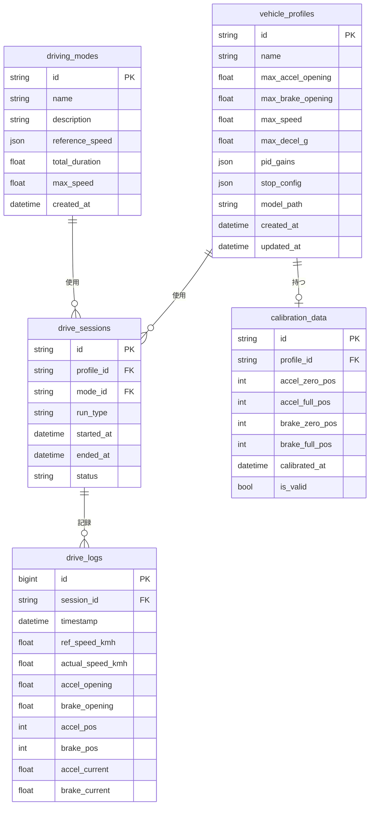
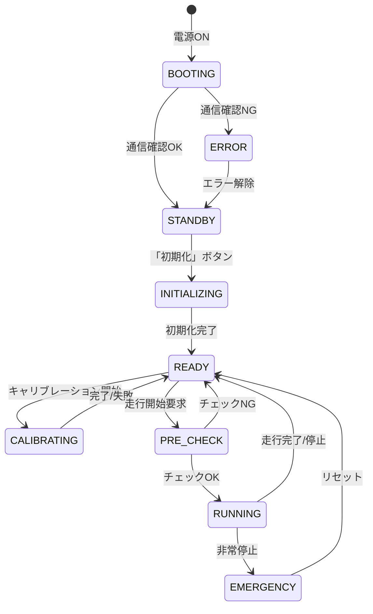
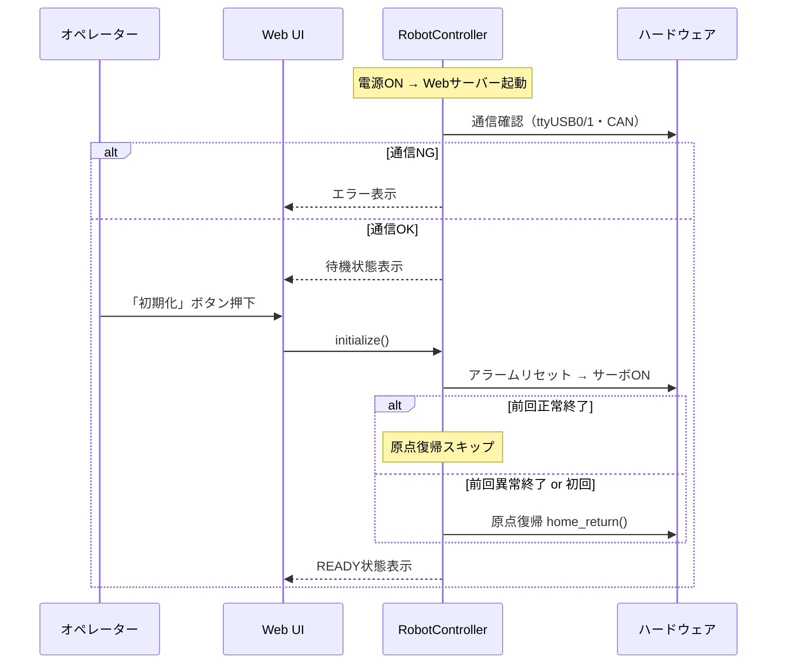
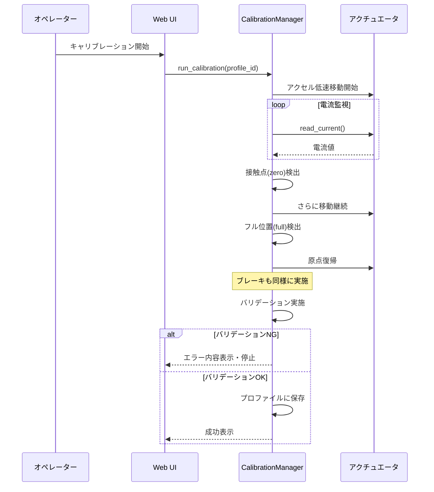
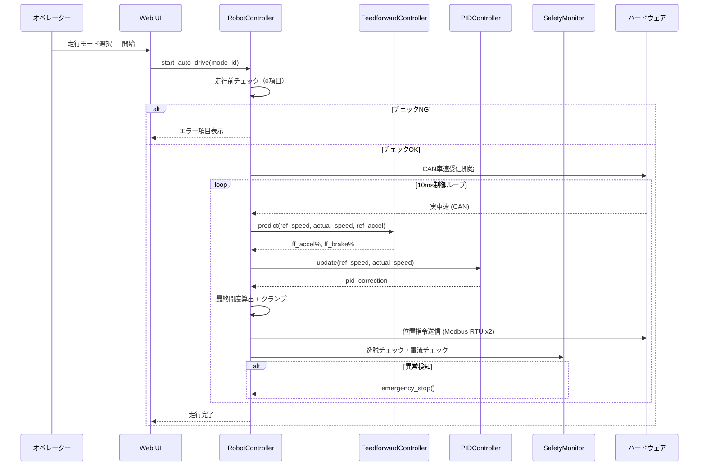
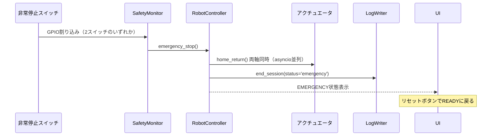
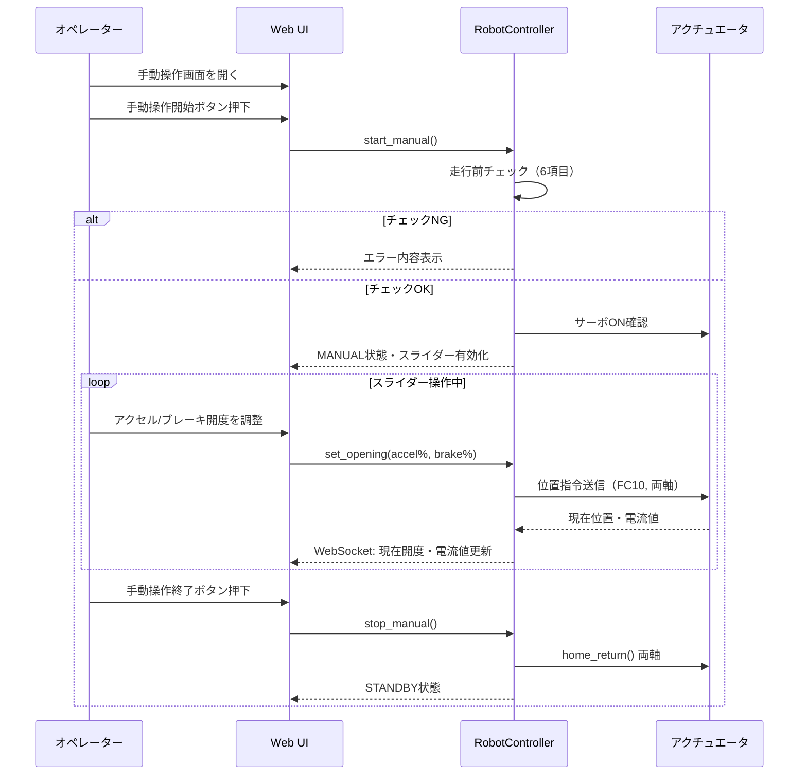
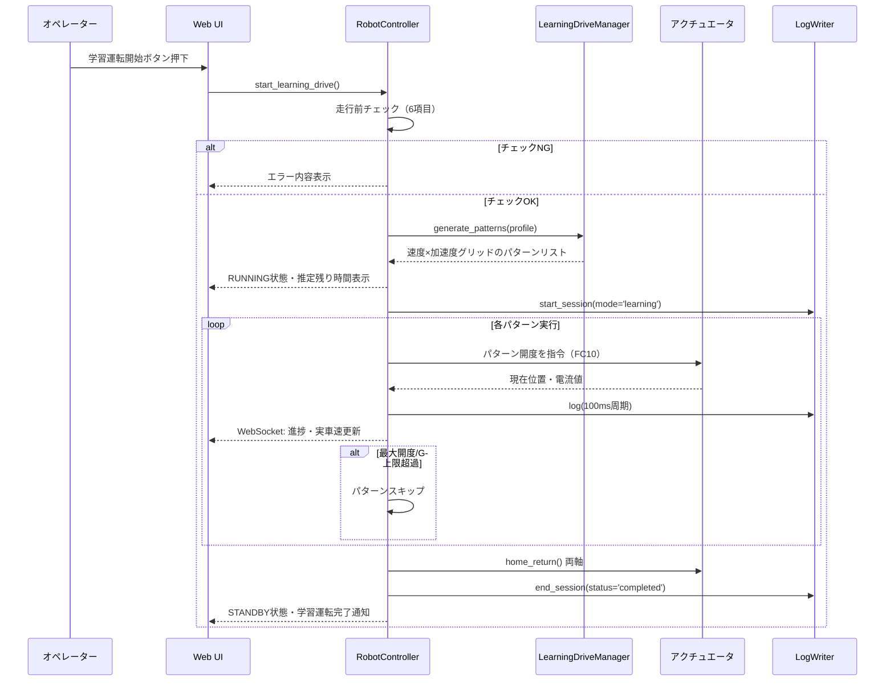
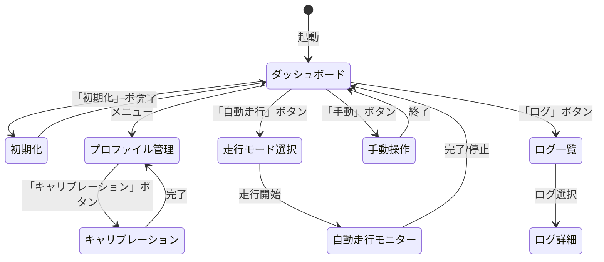

# 機能設計書 (Functional Design Document)

## システム構成図

```mermaid
graph TB
    Browser[ブラウザ<br/>操作エリアPC]

    subgraph RaspberryPi5["Raspberry Pi 5"]
        WebUI[Web UI<br/>FastAPI + フロントエンド]

        subgraph ControlLayer["制御レイヤー (asyncio)"]
            RobotController[RobotController<br/>メインループ 10ms]
            FFController[FeedforwardController<br/>運転モデル]
            PIDController[PIDController<br/>フィードバック]
            SafetyMonitor[SafetyMonitor<br/>常時監視]
        end

        subgraph HWLayer["ハードウェア抽象レイヤー"]
            AccelDriver[AccelActuatorDriver<br/>ttyUSB0 / Modbus RTU]
            BrakeDriver[BrakeActuatorDriver<br/>ttyUSB1 / Modbus RTU]
            CANReader[CANReader<br/>Kvaser USB-CAN]
            GPIOMonitor[GPIOMonitor<br/>UPS / 非常停止]
        end

        subgraph DataLayer["データレイヤー"]
            LogWriter[LogWriter<br/>100ms周期]
            PostgreSQL[(PostgreSQL<br/>アクティブログ 3ヶ月)]
            ArchiveManager[ArchiveManager<br/>CSV圧縮 → USB SSD]
        end
    end

    subgraph Hardware["ハードウェア"]
        PCON1[P-CON-CB #1<br/>アクセル SLAVE_ID=1]
        PCON2[P-CON-CB #2<br/>ブレーキ SLAVE_ID=2]
        CAN[Kvaser USB-CAN<br/>シャシダイナモ]
        ACUPS[AC UPS<br/>接点出力 → GPIO(TBD)]
        EmergencyStop[非常停止スイッチ<br/>2個並列]
    end

    Browser <-->|HTTP / WebSocket| WebUI
    WebUI <-->|内部API| RobotController
    RobotController --> FFController
    RobotController --> PIDController
    RobotController --> SafetyMonitor
    RobotController --> AccelDriver
    RobotController --> BrakeDriver
    RobotController --> CANReader
    RobotController --> GPIOMonitor
    RobotController --> LogWriter
    LogWriter --> PostgreSQL
    PostgreSQL --> ArchiveManager
    ArchiveManager -->|圧縮CSV| USBSSD[(USB SSD<br/>アーカイブ)]
    AccelDriver <-->|Modbus RTU| PCON1
    BrakeDriver <-->|Modbus RTU| PCON2
    CANReader <-->|CAN bus| CAN
    GPIOMonitor <-->|GPIO 接点入力| ACUPS
    PCON1 --> ActuatorA[アクセルアクチュエータ<br/>IAI RCP6-ROD]
    PCON2 --> ActuatorB[ブレーキアクチュエータ<br/>IAI RCP6-ROD]
```

---

## 技術スタック

| 分類 | 技術 | 選定理由 |
|------|------|----------|
| 言語 | Python 3.13 | asyncioによる並列制御、豊富なライブラリ |
| 非同期フレームワーク | asyncio | 10ms制御ループとI/O並列化 |
| Webフレームワーク | FastAPI | 非同期対応、自動API生成、WebSocket |
| Web UI | HTML/JS + Jinja2 | ブラウザ接続のみで操作可能、FastAPIと統合容易 |
| Modbusライブラリ | pymodbus | Modbus RTU/ASCII対応 |
| CANライブラリ | python-can (Kvaser backend) | Kvaser USB-CANドライバ対応 |
| データベース | PostgreSQL 15 | 時系列ログ管理、3ヶ月分 |
| ORMなし | psycopg2 / asyncpg | シンプルなSQL、高速書き込み |
| GPIO | RPi.GPIO | AC UPS接点出力によるAC断検知、非常停止割り込み |
| 圧縮・アーカイブ | gzip / shutil | ログCSV圧縮 |
| 設定管理 | JSON / TOML | 車両プロファイル |

---

## データモデル定義

### エンティティ: VehicleProfile（車両プロファイル）

```python
@dataclass
class VehicleProfile:
    id: str                      # UUID
    name: str                    # プロファイル名（例: "Prius_2024"）
    max_accel_opening: float     # アクセル最大開度 [%] 0-100
    max_brake_opening: float     # ブレーキ最大開度 [%] 0-100
    max_speed: float             # 最高車速 [km/h]
    max_decel_g: float           # 最大減速G [G]
    pid_gains: PIDGains          # PIDゲイン設定
    stop_config: StopConfig      # 停止判定設定
    calibration: CalibrationData | None  # キャリブレーションデータ
    model_path: str | None       # 運転モデルファイルパス
    created_at: datetime
    updated_at: datetime

@dataclass
class PIDGains:
    kp: float                    # 比例ゲイン
    ki: float                    # 積分ゲイン
    kd: float                    # 微分ゲイン

@dataclass
class StopConfig:
    deviation_threshold: float   # 逸脱閾値 [km/h]（例: 2.0）
    deviation_duration: float    # 逸脱継続時間 [s]（例: 4.0）
```

**制約**:
- `name` はシステム内で一意
- `max_accel_opening`, `max_brake_opening` は 0.0〜100.0
- `max_speed` は 0より大きい値

---

### エンティティ: CalibrationData（キャリブレーションデータ）

```python
@dataclass
class CalibrationData:
    accel_zero_pos: int          # アクセル接触点 [pulse]
    accel_full_pos: int          # アクセル最大位置 [pulse]
    accel_stroke: int            # アクセルストローク [pulse]
    brake_zero_pos: int          # ブレーキ接触点 [pulse]
    brake_full_pos: int          # ブレーキ最大位置 [pulse]
    brake_stroke: int            # ブレーキストローク [pulse]
    calibrated_at: datetime
    is_valid: bool               # バリデーション結果
```

**制約**:
- `accel_full_pos > accel_zero_pos`（アクセル方向が正）
- ストロークが規定範囲内（実測値から±20%以内を想定）

---

### エンティティ: DrivingMode（走行モード）

```python
@dataclass
class DrivingMode:
    id: str                      # UUID
    name: str                    # モード名（例: "WLTP_Class3"）
    description: str             # 説明
    reference_speed: list[SpeedPoint]  # 基準車速時系列
    total_duration: float        # 総走行時間 [s]
    max_speed: float             # 最高車速 [km/h]
    created_at: datetime

@dataclass
class SpeedPoint:
    time_s: float                # 時刻 [s]
    speed_kmh: float             # 基準車速 [km/h]
```

---

### エンティティ: DriveLog（走行ログ）

```python
# PostgreSQL テーブル定義
# Table: drive_sessions
@dataclass
class DriveSession:
    id: str                      # UUID
    profile_id: str              # FK → vehicle_profiles
    mode_id: str | None          # FK → driving_modes（自動運転時）
    run_type: str                # 'auto' | 'manual' | 'learning'
    started_at: datetime
    ended_at: datetime | None
    status: str                  # 'running' | 'completed' | 'error' | 'emergency'

# Table: drive_logs（100ms周期）
@dataclass
class DriveLog:
    id: bigint                   # AUTO INCREMENT
    session_id: str              # FK → drive_sessions
    timestamp: datetime          # 記録時刻
    ref_speed_kmh: float | None  # 基準車速 [km/h]
    actual_speed_kmh: float      # 実車速 [km/h]
    accel_opening: float         # アクセル開度 [%]
    brake_opening: float         # ブレーキ開度 [%]
    accel_pos: int               # アクセル位置 [pulse]
    brake_pos: int               # ブレーキ位置 [pulse]
    accel_current: float         # アクセル電流値 [mA]
    brake_current: float         # ブレーキ電流値 [mA]
```

---

### ER図



---

## コンポーネント設計

### RobotController（メインコントローラ）

**責務**:
- 10ms制御ループのスケジューリング（asyncio）
- システム状態機械の管理
- 各コンポーネントの協調制御

```python
class RobotController:
    async def start() -> None          # システム起動
    async def stop() -> None           # 正常停止（原点復帰→サーボOFF）
    async def emergency_stop() -> None # 非常停止（即座に原点復帰）
    async def run_calibration() -> CalibrationResult
    async def run_learning_drive() -> DriveSession
    async def start_auto_drive(mode_id: str) -> DriveSession
    async def start_manual() -> DriveSession
    def get_system_state() -> SystemState
```

**状態機械**:


---

### ActuatorDriver（アクチュエータドライバ）

**責務**:
- Modbus RTU通信でP-CON-CBに位置指令を送信
- 現在位置・電流値の読み取り
- アラームリセット・サーボON/OFF

```python
class ActuatorDriver:
    def __init__(port: str, slave_id: int)
    async def connect() -> None
    async def reset_alarm() -> None
    async def servo_on() -> None
    async def servo_off() -> None
    async def move_to_position(pos: int) -> None  # 10ms周期で呼ぶ
    async def home_return() -> None               # 原点復帰
    async def read_position() -> int              # 現在位置 [pulse]
    async def read_current() -> float             # 電流値 [mA]
    async def is_alarm_active() -> bool
```

**Modbusレジスタマッピング** (MJ0162-12A Modbus仕様書 第12版より):

FC03 読み取り:
| 機能 | アドレス (HEX) | サイズ | 記号 | 備考 |
|------|--------------|--------|------|------|
| 現在位置 | 0x9000-0x9001 | 32bit符号付き | PNOW | 単位: 0.01mm |
| アラームコード | 0x9002 | 16bit | ALMC | 0=正常 |
| デバイスステータス1 | 0x9005 | 16bit | DSS1 | bit12=SV, bit10=ALMH, bit4=HEND, bit3=PEND |
| 拡張デバイスステータス | 0x9007 | 16bit | DSSE | bit5=MOVE(移動中) |
| 電流値 | 0x900C-0x900D | 32bit符号付き | CNOW | 単位: mA |

FC05 コイル書き込み:
| 機能 | アドレス (HEX) | ON値 | 記号 | 備考 |
|------|--------------|------|------|------|
| サーボON | 0x0403 | FF00 | SON | 0000でOFF |
| アラームリセット | 0x0407 | FF00 | ALRS | エッジ入力、完了後0000に戻す |
| 原点復帰 | 0x040B | FF00 | HOME | DSS1 HEND(bit4)=1で完了確認 |

FC10 直値移動指令 (レジスタ書き込み後、自動的に移動開始):
| 機能 | アドレス (HEX) | サイズ | 記号 | 備考 |
|------|--------------|--------|------|------|
| 目標位置 | 0x9900-0x9901 | 32bit符号付き | PCMD | 単位: 0.01mm |
| 速度指令 | 0x9904-0x9905 | 32bit | VCMD | 単位: mm/s |
| 加減速指令 | 0x9906 | 16bit | ACMD | 単位: mm/s² |
| 制御フラグ | 0x9908 | 16bit | CTLF | |

---

### FeedforwardController（フィードフォワード制御）

**責務**:
- 運転モデル（学習済みマップ）から目標アクセル・ブレーキ位置を算出
- 基準車速・速度偏差・加速度を入力として開度[%]を出力

```python
class FeedforwardController:
    def load_model(model_path: str) -> None
    def predict(
        ref_speed: float,        # 基準車速 [km/h]
        actual_speed: float,     # 実車速 [km/h]
        ref_accel: float,        # 基準加速度 [km/h/s]
    ) -> tuple[float, float]     # (accel_opening%, brake_opening%)
```

**運転モデル構造** (学習運転ログから生成):
- 入力: `(ref_speed, ref_accel)` の2次元グリッド
- 出力: `accel_opening [%]`, `brake_opening [%]`
- 補間: 線形補間（グリッド間）
- ファイル形式: `.pkl`（pickleまたはnumpy形式）

---

### PIDController（フィードバック制御）

**責務**:
- 実車速と基準車速の偏差からフィードバック補正量を算出
- アクセル・ブレーキそれぞれに独立したPID

```python
class PIDController:
    def __init__(kp: float, ki: float, kd: float, dt: float = 0.01)
    def update(setpoint: float, measurement: float) -> float
    def reset() -> None
```

**制御則**:
```
error = ref_speed - actual_speed
pid_correction = Kp * error + Ki * ∫error dt + Kd * d(error)/dt
```

**FF+PID出力合成と最終開度算出** (RobotController内で実行):
```
# FFコントローラーから目標開度を取得
ff_accel, ff_brake = ff_controller.predict(ref_speed, delta_speed)

# PID補正量を加算（符号でアクセル/ブレーキを振り分け）
raw_accel = ff_accel + max(0.0, pid_correction)
raw_brake = ff_brake + max(0.0, -pid_correction)

# アクセル・ブレーキの排他制御（初期実装）
# 両方に開度が生じた場合はアクセル優先でブレーキをゼロにする
# ※ 実機チューニングで変更の可能性あり
if raw_accel > 0.0 and raw_brake > 0.0:
    raw_brake = 0.0

# プロファイルの最大開度でクランプ
final_accel = clamp(raw_accel, 0.0, profile.max_accel_opening)
final_brake = clamp(raw_brake, 0.0, profile.max_brake_opening)
```

---

### SafetyMonitor（安全監視）

**責務**:
- 非常停止スイッチ（GPIO）の監視（割り込みベース）
- 電流値異常の監視
- AC電源断の監視（AC UPS 接点出力 → GPIO、ピン番号TBD）
- 逸脱条件による自動停止

```python
class SafetyMonitor:
    async def start_monitoring() -> None
    def register_emergency_callback(cb: Callable) -> None
    def check_overcurrent(current_ma: float, axis: str) -> bool
    def check_deviation(ref: float, actual: float, duration: float) -> bool
    async def handle_ac_power_loss() -> None
```

**電流異常検出アルゴリズム**:
```
# キャリブレーション中の接触点・フル検出
moving_avg = 移動平均（ウィンドウ幅: 50ms分 = 5サンプル）
threshold = baseline_current * 1.5  # 平常時電流の1.5倍
if current > moving_avg + threshold:
    → 機械的終端に到達（接触点またはフル位置）

# 走行中の過電流保護（閾値はP-CON-CB仕様から設定）
if current > OVERCURRENT_LIMIT:
    → 緊急停止
```

**AC電源断シーケンス**:
```
1. AC UPS接点出力 → GPIO でAC断検知 → 安全停止トリガ
2. 全アクチュエータ home_return()（AC UPS バッテリー給電中）
3. 走行ログを PostgreSQL にフラッシュ
4. PostgreSQL 正常終了
5. システムシャットダウン
```

**AC UPS に関する設計前提（機種未確定）**:

> ⚠️ **TBD**: AC UPS の機種は未確定。以下の前提で設計しており、機種確定後に見直しが必要。

- **電源構成**: `AC100V → AC UPS → 5V PSU → Raspberry Pi` および `AC UPS → 24V PSU → P-CON-CB`
- **AC断検知**: AC UPS の「バッテリー運転中」接点出力を Raspberry Pi GPIO（ピン番号TBD）に接続
  - 接点 OFF（通電中）→ ON（バッテリー運転中）の立ち上がりエッジで検知
- **バックアップ時間の前提**: AC断後、30秒以上のバックアップ給電が可能であること
  - home_return() + PostgreSQL終了 + シャットダウン を合計30秒以内に収める設計とする
- **UPS残量監視**: 機種確定後に接点出力または USB（NUT）経由での残量取得を検討する

---

### CANReader（CAN車速取得）

**責務**:
- Kvaser USB-CANからシャシダイナモ車速を受信
- DBC定義（`config/can/`）に従いデコード

```python
class CANReader:
    async def connect(interface: str = "kvaser") -> None
    async def read_speed() -> float    # 実車速 [km/h]
    async def close() -> None
```

---

### CalibrationManager（キャリブレーション管理）

**責務**:
- アクセル・ブレーキの独立したゼロフルキャリブレーション実行
- バリデーション（接触点・フル・ストローク・順序）
- 結果のプロファイルへの保存

```python
class CalibrationManager:
    async def run_calibration(profile_id: str) -> CalibrationResult

    async def _detect_zero(driver: ActuatorDriver) -> int
    # ゆっくり押し込み → 電流急増で接触点を検出

    async def _detect_full(driver: ActuatorDriver, zero_pos: int) -> int
    # さらに押し込み → 電流急増でフル位置を検出

    def _validate(result: CalibrationData) -> ValidationResult
    # 接触点 < フル位置、ストローク妥当性チェック
```

**キャリブレーション手順**（アクセル・ブレーキ独立、順序任意）:
```
1. サーボON → 原点復帰
2. 低速で正方向に移動開始
3. 電流移動平均 + 閾値超えで接触点(zero)を記録
4. 接触点から低速でさらに正方向に移動
5. 再び閾値超えでフル位置(full)を記録
6. 原点復帰
7. ストローク = full - zero を計算・バリデーション
```

---

### LearningDriveManager（学習運転管理）

**責務**:
- 学習パターン（速度・加速度グリッド）の生成とフィルタリング
- パターン走行の実行とログ収集
- 運転モデルの学習・更新

```python
class LearningDriveManager:
    def generate_patterns(profile: VehicleProfile) -> list[LearningPattern]
    # max_opening / max_decel_g を超えるパターンを自動スキップ

    async def run_pattern(pattern: LearningPattern) -> LearningLog
    def train_model(logs: list[LearningLog], profile_id: str) -> str
    # 学習結果を model_path に保存し、プロファイルを更新
```

---

### LogWriter（ログ記録）

**責務**:
- 100ms周期でPostgreSQLに走行データを書き込み
- セッション開始・終了の記録

```python
class LogWriter:
    async def start_session(profile_id: str, mode_id: str | None, run_type: str) -> str
    async def write_log(session_id: str, data: DriveLogData) -> None
    async def end_session(session_id: str, status: str) -> None
```

---

### ArchiveManager（アーカイブ管理）

**責務**:
- 3ヶ月超のセッションをCSV+gzip圧縮でUSB SSDに移行
- USB SSDが80%超で古いアーカイブから自動削除

```python
class ArchiveManager:
    async def run_archiving() -> None    # 定期実行（例: 毎日深夜）
    def _export_to_csv(session_id: str) -> Path
    def _compress(csv_path: Path) -> Path
    def _check_storage_usage() -> float  # 使用率 [%]
    def _delete_oldest_archive() -> None
```

---

## ユースケース図

### UC1: 起動・初期化



---

### UC2: キャリブレーション



---

### UC3: 自動運転



---

### UC4: 非常停止



### UC5: 手動操作



---

### UC6: 学習運転



---

## 走行前チェック仕様

走行開始前に以下の6項目をすべてパスする必要があります（自動運転・学習運転・手動操作共通）。

| # | チェック項目 | 確認内容 | NG時の動作 |
|---|------------|---------|-----------|
| 1 | 通信確認 | ttyUSB0・ttyUSB1・CAN接続 | エラー表示・停止 |
| 2 | サーボ状態 | サーボON・アラームなし | エラー表示・停止 |
| 3 | キャリブレーション | 有効なキャリブレーションデータあり | エラー表示・停止 |
| 4 | プロファイル | 車両プロファイル選択済み | エラー表示・停止 |
| 5 | UPS残量 | AC UPS バッテリー残量 20%以上（TBD: 取得方法は機種確定後） | エラー表示・停止 |
| 6 | アクチュエータ位置 | 両軸が原点付近にあること | エラー表示・停止 |

---

## Web UI 画面設計

### 画面遷移図



### 主要画面

#### ダッシュボード（メイン）

| 表示要素 | 内容 |
|---------|------|
| システム状態 | STANDBY / READY / RUNNING / EMERGENCY（バッジ） |
| 実車速 | 大きな数値表示 [km/h] |
| アクセル・ブレーキ開度 | ゲージ [%] |
| 基準車速グラフ | リアルタイムライングラフ（基準・実車速） |
| 操作ボタン | 初期化 / 自動走行 / 学習運転 / 手動 / 停止 |

#### 自動走行モニター

| 表示要素 | 内容 |
|---------|------|
| リアルタイムグラフ | 基準車速（赤）・実車速（青）・開度（緑/橙） |
| 逸脱量 | 実車速 - 基準車速 [km/h] |
| 経過時間 / 残り時間 | プログレスバー |
| 非常停止ボタン | 常時表示 |

---

## REST API設計（Post-MVP）

### 走行制御

```
POST /api/v1/drive/start
Body: { "mode_id": "uuid", "profile_id": "uuid" }
Response: { "session_id": "uuid", "status": "running" }

POST /api/v1/drive/stop
Response: { "session_id": "uuid", "status": "stopped" }

GET /api/v1/drive/status
Response: { "state": "RUNNING", "actual_speed": 60.2, "ref_speed": 60.0, ... }
```

### WebSocket（リアルタイムデータ）

```
WS /ws/realtime
Push: {
  "timestamp": "ISO8601",
  "actual_speed_kmh": 60.2,
  "ref_speed_kmh": 60.0,
  "accel_opening": 42.3,
  "brake_opening": 0.0,
  "accel_current_ma": 850.0,
  "brake_current_ma": 120.0
}
```

---

## エラーハンドリング

### エラーの分類

| エラー種別 | 処理 | GUIへの表示 |
|-----------|------|------------|
| 通信断（Modbus） | 制御ループ停止 → 緊急停止 | 「アクチュエータ通信エラー」+ 軸番号 |
| CAN受信タイムアウト | 走行停止 → 原点復帰 | 「車速信号タイムアウト」 |
| 過電流検知 | 制御ループ停止 → 緊急停止 | 「過電流：[軸名] [値]mA」 |
| 走行逸脱 | 自動停止 → 原点復帰 | 「逸脱超過：±Xkm/h × Ys」 |
| AC電源断 | 安全停止シーケンス | 「AC電源断：安全停止中」 |
| キャリブレーション失敗 | 停止・エラー保存 | 「キャリブレーション失敗：[項目]」 |
| UPS残量低下 | 走行前チェックで停止 | 「UPS残量不足：XX%（20%以上必要）」 |

---

## テスト戦略

### ユニットテスト
- PIDController: ステップ応答、積分リセット
- FeedforwardController: モデル補間精度
- CalibrationManager: バリデーションロジック
- SafetyMonitor: 閾値判定、タイマー動作

### 統合テスト
- RobotController: 状態遷移シーケンス（モックハードウェア使用）
- LogWriter: PostgreSQL書き込み・アーカイブ

### ハードウェア結合テスト
- 実機Modbus通信（アクチュエータ単体）
- CAN受信（シャシダイナモ模擬信号）
- 非常停止GPIO割り込み
- UPS電源断シミュレーション
