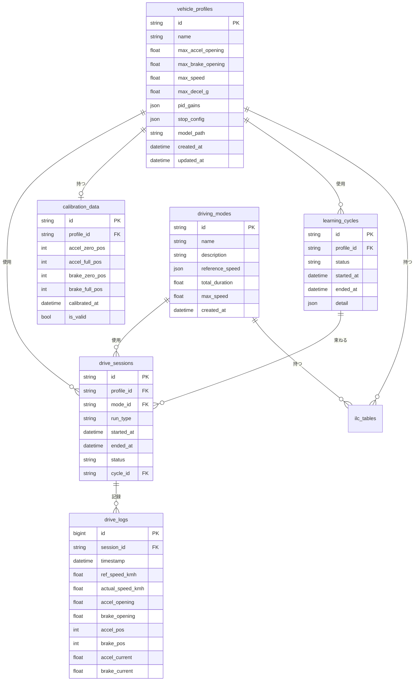
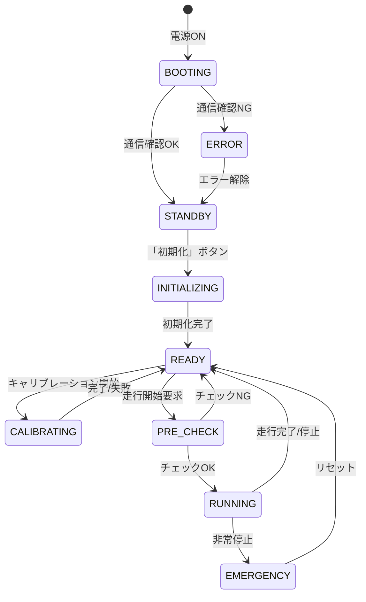
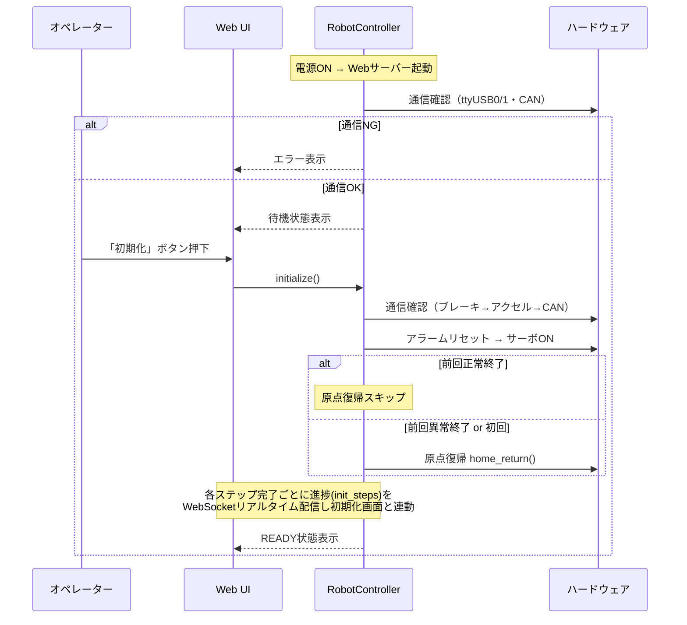
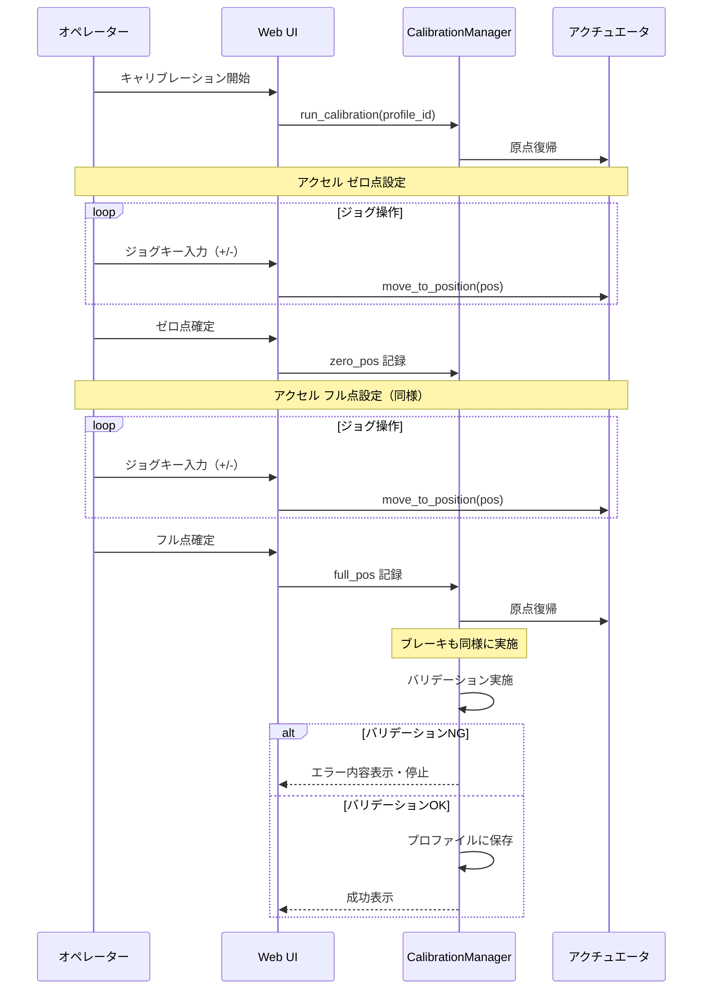
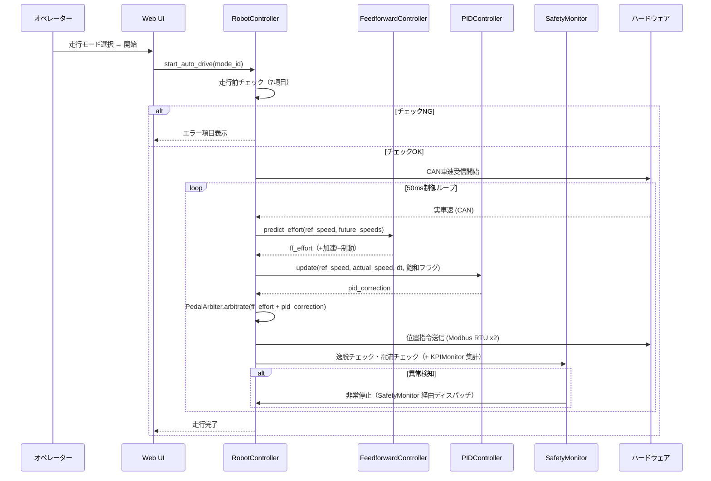
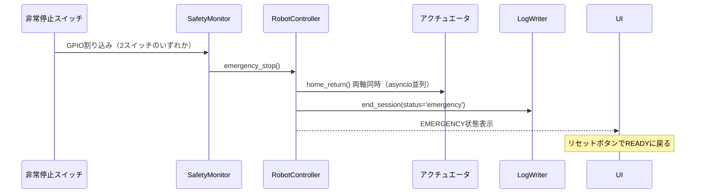
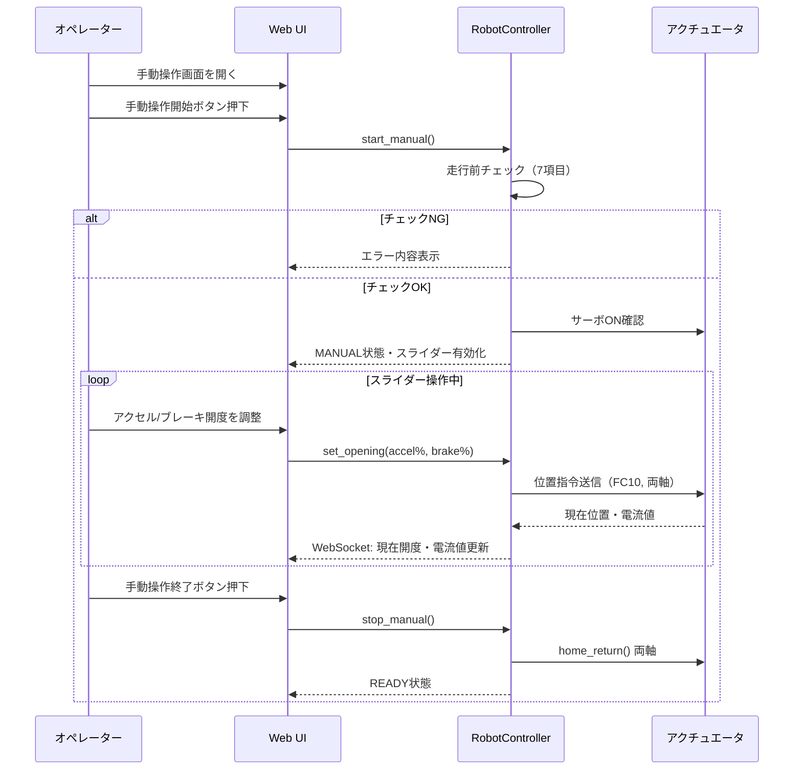
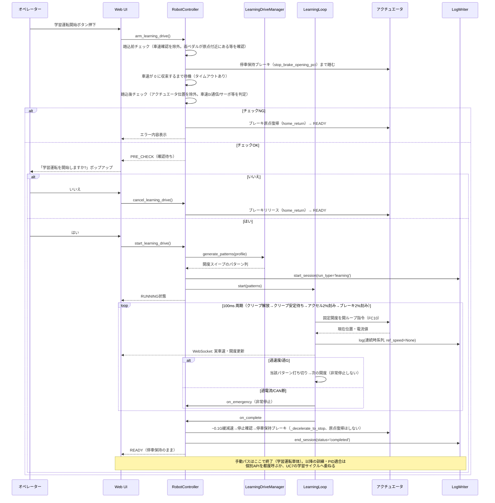
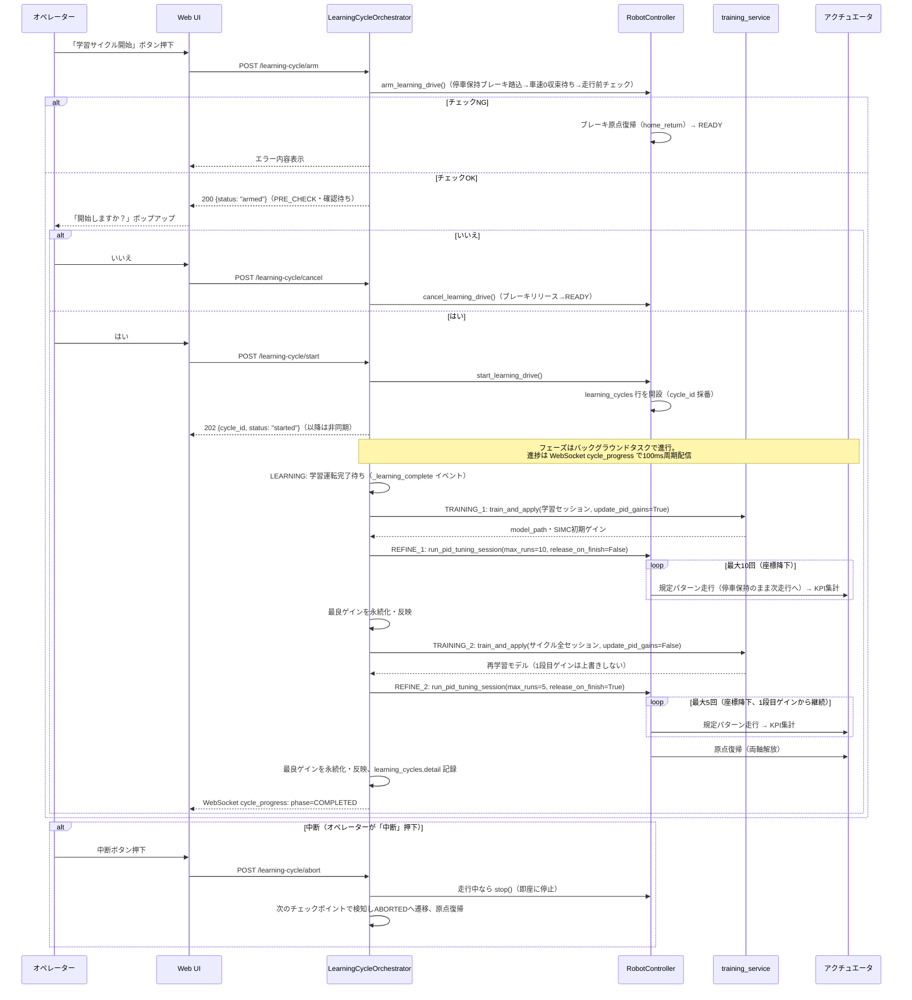
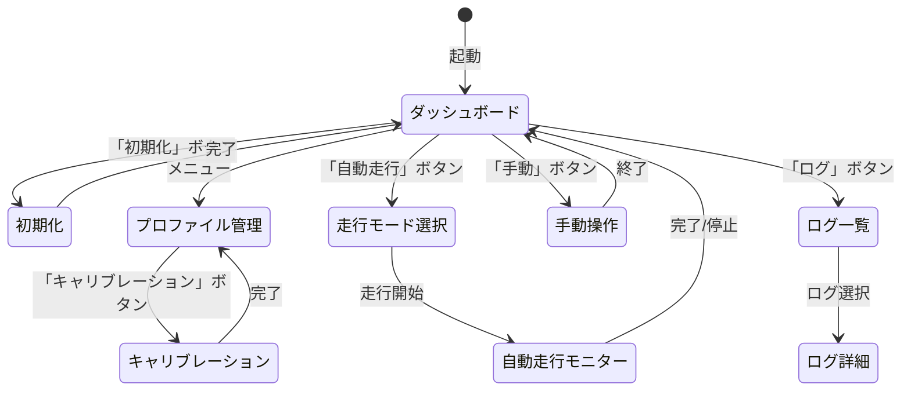

# 機能設計書 (Functional Design Document)

## システム構成図

```mermaid
graph TB
    Browser[ブラウザ<br/>操作エリアPC]

    subgraph RaspberryPi5["Raspberry Pi 5"]
        WebUI[Web UI<br/>FastAPI + フロントエンド]

        subgraph ControlLayer["制御レイヤー (asyncio)"]
            RobotController[RobotController<br/>メインループ 50ms]
            FFController[FeedforwardController<br/>運転モデル＋ゲインスケジュール]
            PIDController[PIDController<br/>フィードバック]
            ILCService[ILCService<br/>反復学習補正]
            SafetyMonitor[SafetyMonitor<br/>常時監視]
        end

        subgraph HWLayer["ハードウェア抽象レイヤー"]
            AccelDriver[AccelActuatorDriver<br/>ttyUSB0 / Modbus RTU]
            BrakeDriver[BrakeActuatorDriver<br/>ttyUSB1 / Modbus RTU]
            ButtonServoDriver[ButtonServoDriver<br/>I2C / PCA9685]
            CANReader[CANReader<br/>Kvaser USB-CAN]
            GPIOMonitor[GPIOMonitor<br/>UPS / 非常停止]
        end

        subgraph DataLayer["データレイヤー"]
            LogWriter[LogWriter<br/>100ms周期]
            PostgreSQL[(PostgreSQL<br/>アクティブログ 3ヶ月)]
            ArchiveManager[ArchiveManager<br/>CSV圧縮 → USB SSD]
        end
    end

    subgraph Hardware["ハードウェア"]
        PCON1[P-CON-CB #1<br/>アクセル SLAVE_ID=1]
        PCON2[P-CON-CB #2<br/>ブレーキ SLAVE_ID=2]
        PCA9685[PCA9685<br/>I2C 0x40 / 16ch PWM]
        CAN[Kvaser USB-CAN<br/>シャシダイナモ]
        ACUPS[AC UPS<br/>接点出力 → GPIO27(物理ピン13)]
        EmergencyStop[非常停止スイッチ<br/>2個並列]
    end

    Browser <-->|HTTP / WebSocket| WebUI
    WebUI <-->|内部API| RobotController
    RobotController --> FFController
    RobotController --> PIDController
    RobotController --> ILCService
    RobotController --> SafetyMonitor
    RobotController --> AccelDriver
    RobotController --> BrakeDriver
    RobotController --> ButtonServoDriver
    RobotController --> CANReader
    RobotController --> GPIOMonitor
    RobotController --> LogWriter
    LogWriter --> PostgreSQL
    PostgreSQL --> ArchiveManager
    ArchiveManager -->|圧縮CSV| USBSSD[(USB SSD<br/>アーカイブ)]
    AccelDriver <-->|Modbus RTU| PCON1
    BrakeDriver <-->|Modbus RTU| PCON2
    ButtonServoDriver <-->|I2C| PCA9685
    CANReader <-->|CAN bus| CAN
    GPIOMonitor <-->|GPIO 接点入力| ACUPS
    PCON1 --> ActuatorA[アクセルアクチュエータ<br/>IAI RCP6-ROD]
    PCON2 --> ActuatorB[ブレーキアクチュエータ<br/>IAI RCP6-ROD]
    PCA9685 --> ButtonServos[ボタンサーボ ×16<br/>SG90 / エンジンスタート・シフト・オプション]
```

---

## 技術スタック

| 分類 | 技術 | 選定理由 |
|------|------|----------|
| 言語 | Python 3.13 | asyncioによる並列制御、豊富なライブラリ |
| 非同期フレームワーク | asyncio | 50ms制御ループとI/O並列化 |
| Webフレームワーク | FastAPI | 非同期対応、自動API生成、WebSocket |
| Web UI | HTML/JS + Jinja2 | ブラウザ接続のみで操作可能、FastAPIと統合容易 |
| Modbusライブラリ | pymodbus | Modbus RTU/ASCII対応 |
| CANライブラリ | python-can (Kvaser backend) | Kvaser USB-CANドライバ対応 |
| データベース | PostgreSQL 15 | 時系列ログ管理、3ヶ月分 |
| ORMなし | psycopg2 / asyncpg | シンプルなSQL、高速書き込み |
| GPIO | RPi.GPIO | AC UPS接点出力によるAC断検知、非常停止割り込み |
| 圧縮・アーカイブ | gzip / shutil | ログCSV圧縮 |
| 設定管理 | JSON / TOML | 車両プロファイル |

---

## データモデル定義

### エンティティ: VehicleProfile（車両プロファイル）

```python
@dataclass
class VehicleProfile:
    id: str                      # UUID
    name: str                    # プロファイル名（例: "Prius_2024"）
    max_accel_opening: float     # アクセル最大開度 [%] 0-100
    max_brake_opening: float     # ブレーキ最大開度 [%] 0-100
    max_speed: float             # 最高車速 [km/h]
    max_decel_g: float           # 最大減速G [G]
    pid_gains: PIDGains          # PIDゲイン設定
    stop_config: StopConfig      # 停止判定設定
    calibration: CalibrationData | None  # キャリブレーションデータ
    model_path: str | None       # 運転モデルファイルパス
    created_at: datetime
    updated_at: datetime

@dataclass
class PIDGains:
    kp: float                    # 比例ゲイン
    ki: float                    # 積分ゲイン
    kd: float                    # 微分ゲイン

@dataclass
class StopConfig:
    deviation_threshold_kmh: float   # 逸脱閾値 [km/h]（例: 2.0）
    deviation_duration_s: float      # 逸脱継続時間 [s]（例: 4.0）
```

**制約**:
- `name` はシステム内で一意
- `max_accel_opening`, `max_brake_opening` は 0.0〜100.0
- `max_speed` は 0より大きい値

---

### エンティティ: CalibrationData（キャリブレーションデータ）

```python
@dataclass
class CalibrationData:
    accel_zero_pos: int          # アクセル接触点 [pulse]
    accel_full_pos: int          # アクセル最大位置 [pulse]
    accel_stroke: int            # アクセルストローク [pulse]
    brake_zero_pos: int          # ブレーキ接触点 [pulse]
    brake_full_pos: int          # ブレーキ最大位置 [pulse]
    brake_stroke: int            # ブレーキストローク [pulse]
    calibrated_at: datetime
    is_valid: bool               # バリデーション結果
```

**制約**:
- `accel_full_pos > accel_zero_pos`（アクセル方向が正）
- ストロークが規定範囲内（実測値から±20%以内を想定）

---

### エンティティ: DrivingMode（走行モード）

```python
@dataclass
class DrivingMode:
    id: str                      # UUID
    name: str                    # モード名（例: "WLTP_Class3"）
    description: str             # 説明
    reference_speed: list[SpeedPoint]  # 基準車速時系列
    total_duration: float        # 総走行時間 [s]
    max_speed: float             # 最高車速 [km/h]
    created_at: datetime

@dataclass
class SpeedPoint:
    time_s: float                # 時刻 [s]
    speed_kmh: float             # 基準車速 [km/h]
```

---

### エンティティ: TimeSchedule（タイムスケジュール）

基準車速を使わず、時系列でペダル開度とボタン操作を自動化する。ペダル動作とボタンイベントを**同一タイムライン**上で管理する（統合タイムライン）。実行は `ScheduleLoop`（開ループ・100ms 周期）が担い、ペダル開度を線形補間して位置指令、ボタンイベントを時刻で発火する。走行ログは run_type='auto'・mode_id=None・ref_speed=None で記録する。

```python
@dataclass
class TimeSchedule:
    id: str                      # UUID
    name: str                    # スケジュール名
    description: str             # 説明
    pedal_points: list[PedalPoint]    # 時系列のアクセル・ブレーキ開度
    button_events: list[ButtonEvent]  # 時系列のボタン押下イベント
    total_duration: float        # 総時間 [s]
    created_at: datetime

@dataclass
class PedalPoint:
    time_s: float                # 時刻 [s]
    accel_opening: float         # アクセル開度 [%]
    brake_opening: float         # ブレーキ開度 [%]

@dataclass
class ButtonEvent:
    time_s: float                # 押下開始時刻 [s]
    channel: int                 # PCA9685 チャンネル（0-15、ButtonServoDriver のマッピング参照）
    press_duration_s: float      # 押下時間 [s]（ボタンごとに設定、例: 始動1.0 / シフト0.5）
```

---

### エンティティ: DriveLog（走行ログ）

```python
# PostgreSQL テーブル定義
# Table: drive_sessions
@dataclass
class DriveSession:
    id: str                      # UUID
    profile_id: str              # FK → vehicle_profiles
    mode_id: str | None          # FK → driving_modes（自動運転時）
    run_type: str                # 'auto' | 'manual' | 'learning' | 'tuning'
    started_at: datetime
    ended_at: datetime | None
    status: str                  # 'running' | 'completed' | 'error' | 'emergency'
    cycle_id: str | None         # FK → learning_cycles（学習サイクル参加中のみ設定）

# Table: drive_logs（100ms周期）
@dataclass
class DriveLog:
    id: bigint                   # AUTO INCREMENT
    session_id: str              # FK → drive_sessions
    timestamp: datetime          # 記録時刻
    ref_speed_kmh: float | None  # 基準車速 [km/h]
    actual_speed_kmh: float      # 実車速 [km/h]
    accel_opening: float         # アクセル開度 [%]
    brake_opening: float         # ブレーキ開度 [%]
    accel_pos: int               # アクセル位置 [pulse]
    brake_pos: int               # ブレーキ位置 [pulse]
    accel_current: float         # アクセル電流値 [mA]
    brake_current: float         # ブレーキ電流値 [mA]

# Table: learning_cycles
# 学習運転〜PID適合の一連のセッションを1サイクルとして束ねる（20260703-learning-process-revamp）。
# 学習運転開始で新サイクルが開設され（drive_sessions.cycle_id を付与）、以降の適合走行
# （run_type='tuning'）が同一サイクルへ参加する。manual・通常autoは cycle_id=NULL のまま。
@dataclass
class LearningCycle:
    id: str                      # UUID
    profile_id: str              # FK → vehicle_profiles
    status: str                  # 'running' | 'completed' | 'error' | 'aborted'
    started_at: datetime
    ended_at: datetime | None
    detail: dict                 # JSONB。段階別ゲイン/コスト/モデルパス/メトリクス

# Table: ilc_tables
# 反復学習制御（ILC）の時刻別補正 effort を profile×mode 単位で永続化する（Stage C）。
# 主キーは (profile_id, mode_id)。モードの基準軌跡変更・リセットで削除される。
@dataclass
class ILCTable:
    profile_id: str              # FK → vehicle_profiles（複合PK）
    mode_id: str                 # FK → driving_modes（複合PK）
    enabled: bool                # 補正の適用・学習の有効/無効
    iteration: int               # 学習反復回数（0=未学習）
    dt_s: float                  # 補正グリッド周期 [s]（0.1）
    efforts: list[float]         # JSONB。時刻別補正 effort [%]（+加速/−制動、±10%）
    best_p95_kmh: float | None   # 最良走行 p95（発散検知の基準）
    kpi_history: list[dict]      # JSONB。反復ごとの p95/max/reversal（収束表示用）
    updated_at: datetime
```

---

### ER図


```mermaid
erDiagram
    vehicle_profiles ||--o{ drive_sessions : "使用"
    vehicle_profiles ||--o| calibration_data : "持つ"
    vehicle_profiles ||--o{ learning_cycles : "使用"
    vehicle_profiles ||--o{ ilc_tables : "持つ"
    driving_modes ||--o{ drive_sessions : "使用"
    driving_modes ||--o{ ilc_tables : "持つ"
    drive_sessions ||--o{ drive_logs : "記録"
    learning_cycles ||--o{ drive_sessions : "束ねる"

    vehicle_profiles {
        string id PK
        string name
        float max_accel_opening
        float max_brake_opening
        float max_speed
        float max_decel_g
        json pid_gains
        json stop_config
        string model_path
        datetime created_at
        datetime updated_at
    }

    calibration_data {
        string id PK
        string profile_id FK
        int accel_zero_pos
        int accel_full_pos
        int brake_zero_pos
        int brake_full_pos
        datetime calibrated_at
        bool is_valid
    }

    driving_modes {
        string id PK
        string name
        string description
        json reference_speed
        float total_duration
        float max_speed
        datetime created_at
    }

    drive_sessions {
        string id PK
        string profile_id FK
        string mode_id FK
        string run_type
        datetime started_at
        datetime ended_at
        string status
        string cycle_id FK
    }

    learning_cycles {
        string id PK
        string profile_id FK
        string status
        datetime started_at
        datetime ended_at
        json detail
    }

    drive_logs {
        bigint id PK
        string session_id FK
        datetime timestamp
        float ref_speed_kmh
        float actual_speed_kmh
        float accel_opening
        float brake_opening
        int accel_pos
        int brake_pos
        float accel_current
        float brake_current
    }
```

---

## コンポーネント設計

### RobotController（メインコントローラ）

**責務**:
- 50ms制御ループのスケジューリング（asyncio）
- システム状態機械の管理
- 各コンポーネントの協調制御

```python
class RobotController:
    async def start() -> None          # システム起動
    async def stop() -> None           # 正常停止（原点復帰→サーボOFF）
    async def emergency_stop() -> None # 非常停止（即座に原点復帰）
    async def run_calibration() -> CalibrationResult
    async def run_learning_drive() -> DriveSession
    async def start_auto_drive(mode_id: str) -> DriveSession
    async def start_manual() -> DriveSession
    def get_system_state() -> SystemState
```

**状態機械**:

```mermaid
stateDiagram-v2
    [*] --> BOOTING : 電源ON
    BOOTING --> STANDBY : 通信確認OK
    BOOTING --> ERROR : 通信確認NG
    STANDBY --> INITIALIZING : 「初期化」ボタン
    INITIALIZING --> READY : 初期化完了
    READY --> CALIBRATING : キャリブレーション開始
    CALIBRATING --> READY : 完了/失敗
    READY --> PRE_CHECK : 走行開始要求
    PRE_CHECK --> RUNNING : チェックOK
    PRE_CHECK --> READY : チェックNG
    RUNNING --> READY : 走行完了/停止
    RUNNING --> EMERGENCY : 非常停止
    EMERGENCY --> READY : リセット
    ERROR --> STANDBY : エラー解除
```

---

### ActuatorDriver（アクチュエータドライバ）

**責務**:
- Modbus RTU通信でP-CON-CBに位置指令を送信
- 現在位置・電流値の読み取り
- アラームリセット・サーボON/OFF

```python
class ActuatorDriver:
    def __init__(port: str, slave_id: int)
    async def connect() -> None
    async def enable_modbus_control() -> None  # PMSL コイルで Modbus 操作権を取得（reset_alarm より先に呼ぶ）
    async def reset_alarm() -> None
    async def servo_on() -> None
    async def servo_off() -> None
    async def move_to_position(pos: int) -> None  # 50ms周期で呼ぶ
    async def home_return() -> None               # 原点復帰
    async def read_position() -> int              # 現在位置 [pulse]
    async def read_current() -> float             # 電流値 [mA]
    async def is_alarm_active() -> bool
```

**Modbusレジスタマッピング** (MJ0162-12A Modbus仕様書 第12版より):

FC03 読み取り:
| 機能 | アドレス (HEX) | サイズ | 記号 | 備考 |
|------|--------------|--------|------|------|
| 現在位置 | 0x9000-0x9001 | 32bit符号付き | PNOW | 単位: 0.01mm |
| アラームコード | 0x9002 | 16bit | ALMC | 0=正常 |
| デバイスステータス1 | 0x9005 | 16bit | DSS1 | bit12=SV, bit10=ALMH, bit4=HEND, bit3=PEND |
| 拡張デバイスステータス | 0x9007 | 16bit | DSSE | bit5=MOVE(移動中) |
| 電流値 | 0x900C-0x900D | 32bit符号付き | CNOW | 単位: mA |

FC05 コイル書き込み:
| 機能 | アドレス (HEX) | ON値 | 記号 | 備考 |
|------|--------------|------|------|------|
| サーボON | 0x0403 | FF00 | SON | 0000でOFF |
| アラームリセット | 0x0407 | FF00 | ALRS | エッジ入力、完了後0000に戻す |
| 原点復帰 | 0x040B | FF00 | HOME | DSS1 HEND(bit4)=1で完了確認 |

FC10 直値移動指令 (レジスタ書き込み後、自動的に移動開始):
| 機能 | アドレス (HEX) | サイズ | 記号 | 備考 |
|------|--------------|--------|------|------|
| 目標位置 | 0x9900-0x9901 | 32bit符号付き | PCMD | 単位: 0.01mm |
| 速度指令 | 0x9904-0x9905 | 32bit | VCMD | 単位: mm/s |
| 加減速指令 | 0x9906 | 16bit | ACMD | 単位: mm/s² |
| 制御フラグ | 0x9908 | 16bit | CTLF | |

---

### ButtonServoDriver（ボタンサーボドライバ）

**責務**:
- I2C経由でPCA9685にPWM信号を設定し、指定チャンネルのボタンサーボ（SG90）を押下／待機位置に駆動
- ボタンの押下（待機位置 → 押下位置 → 待機位置へ復帰）を、指定した押下時間だけ保持して実行
- 非常停止・エラー時に全チャンネルを待機位置へ復帰（ソフトウェア経由）
- 非常停止時にPCA9685の`OE`端子（GPIO22接続）をHIGHにし、I2C通信を待たずハードウェアレベルで全16chのPWM出力を即遮断する（ソフトウェアフリーズ時の最終防衛線）

**設計方針**:
- `ActuatorDriver` と同様に `Protocol` ベースのインターフェースとし、非ハードウェア環境向けスタブと差し替え可能にする
- 押下角度は全チャンネル共通のグローバル設定値（待機／押下の2ポジション）。押下時間のみ呼び出し側（タイムスケジュール）で可変
- PCA9685のI2Cバスはアクセル・ブレーキ用のRS-485バス（Modbus RTU）と独立しており、50ms制御ループと競合しない
- OE制御はSafetyMonitorの非常停止ディスパッチ（`trigger_emergency()`）から呼び出し、`release_all()`（ソフト経由）と並行してハード遮断も行う二重系とする

```python
class ButtonServoDriver:
    def __init__(i2c_address: int, pwm_freq_hz: int, rest_angle: float, press_angle: float, oe_gpio: int)
    async def connect() -> None
    async def press(channel: int, duration_s: float) -> None  # 押下 → duration_s 保持 → 待機へ復帰
    async def release_all() -> None                            # 全チャンネルを待機位置へ（非常停止・エラー時）
    def disable_outputs() -> None                              # OE=HIGHでハードウェア即遮断（非常停止時）
    def enable_outputs() -> None                                # OE=LOWで出力復帰（初期化・復旧時）
```

**チャンネル ⇔ ボタン マッピング**:

| Channel | ボタン | Channel | ボタン |
|---------|--------|---------|--------|
| 0 | エンジンスタート | 8 | オプション_5 |
| 1 | シフト P | 9 | オプション_6 |
| 2 | シフト N | 10 | オプション_7 |
| 3 | シフト D | 11 | オプション_8 |
| 4 | オプション_1 | 12 | オプション_9 |
| 5 | オプション_2 | 13 | オプション_10 |
| 6 | オプション_3 | 14 | オプション_11 |
| 7 | オプション_4 | 15 | オプション_12 |

**PWM諸元**: I2Cアドレス 0x40（既定）、PWM周波数 50Hz。押下角度は全チャンネル共通のグローバル設定（`config/settings.toml` の `[servo]` セクション）。OE端子はGPIO22（物理ピン15）に接続し、非常停止時のハードウェア遮断に使用（詳細は `docs/architecture.md` 参照）。

---

### FeedforwardController（フィードフォワード制御）

**責務**:
- 運転モデル（先読み型 多項式Ridge 逆モデル）から符号付き努力量を算出
- 現在の基準車速・先読み基準車速（0.5/1.0/2.0/3.0 秒先）・過去基準車速（0.5/1.0 秒前）を
  入力として努力量を出力（+: 名目アクセル開度 [%]、−: 名目ブレーキ開度 [%]）

```python
class FeedforwardController:
    def load_model(model_path: str) -> None
    def unload_model() -> None     # プロファイル切替時に必ず呼ぶ（前車両モデルの残留防止）
    def set_params(params: FeedforwardParams) -> None
    def predict_effort(
        v0: float,                       # 現在の基準車速 [km/h]
        future_speeds: Sequence[float],  # 各先読みホライズンの基準車速 [km/h]
        past_speeds: Sequence[float],    # 各過去ホライズンの基準車速 [km/h]
    ) -> float                           # 努力量 [%]（+加速 / −制動）
```

**運転モデル構造** (学習運転ログから生成):
- 入力: 先読み特徴量。構成は `FeatureSpec` dataclass（`src/domain/model_training.py`）で設定可能
  （20260703-learning-process-revamp）。デフォルト `DEFAULT_FEATURE_SPEC` は従来の固定9次元と
  完全一致: `[v0, dv_0.5, dv_1.0, dv_2.0, dv_3.0, v0², dv_1.0·v0, dv_past_0.5, dv_past_1.0]`。
  過去方向Δv（v0 − 0.5s/1.0s 前の速度）はランプ過渡か定常保持かを識別し、「同じ先読み形状でも
  開度が違う」曖昧さを解消する。`FeatureSpec` は先読み/過去ホライズン・レジーム判定ホライズン・
  二次項/交互作用項の有無・加速度項（中央差分 `a_h=(v(t+h)-2v0+v(t-h))/h²`）を切替可能にし、
  `scripts/evaluate_feature_sets.py` によるオフライン A/B 評価を可能にする。
- **特徴量セットのオフライン評価結果（2026-07-03、実ログで実施）**: 本番デフォルトは**現行9特徴を維持**する。
  - **加速度項（中央差分 0.5〜3.0s）・先読み点間の傾き項は不採用**: 全条件（訓練1/4セッション ×
    holdout規定パターン/実走行モード）で改善なし〜悪化。傾き項は既存Δv特徴の線形結合のため
    2次多項式+Ridgeでは理論上冗長で、in-sampleのみ改善しholdoutで悪化する（過学習方向）。
    過去2.0/3.0s の速度点追加（past拡張）も悪化のみ。
  - **短期先読み（0.1/0.2/0.3s）は訓練データが多いときのみ有効**（訓練4セッションで両holdout
    -4〜5%、訓練1セッションでは規定パターンholdoutで+6.8%悪化）。学習サイクル運用で訓練データが
    増えた後に再評価する。
  - **特徴量選択より訓練データ量の効果が支配的**（baseline同士で訓練1→4セッションで-16%）。
    holdout R²が負〜0.2に留まる主因は開ループ学習データと閉ループ配備データの分布ギャップであり、
    学習サイクル2段目（サイクル全ログ再学習）が対処する問題そのもの。
- 推定器: **完全2次多項式展開＋標準化＋Ridge** の Pipeline ×2。ブレーキの不感帯→急制動等の
  非線形を多項式項（dv²・dv·v0 等の相互作用）で表現する。停止時 0 の物理制約は FF 側の
  停車短絡・負予測クランプで担保する。
  （一時、単調制約付き HistGradientBoosting を試したが、学習パターンに定常巡航サンプルが
  ほぼ無いため実走行の巡航域で予測が定数に飽和し閉ループ追従が破綻。poly Ridge は同じ外挿域
  でも滑らかに補間するため復帰した。詳細: `.steering/20260630-learning-wide-speed-range/design.md`）
- レジーム: `FeatureSpec.regime_horizon_s` の Δv ≥ 0 → アクセルモデル、< 0 → ブレーキモデル
  （coast 含む全減速標本で学習。既定は dv_1.0）。
- 学習データ: 手動パス（`/learning/train`）は既定で**直近の学習走行セッションのみ**を使う
  （`session_ids` または `cycle_id` を明示指定した場合はそれを優先）。学習サイクル
  （`LearningCycleOrchestrator`）は2段階で学習する: 1段目は学習運転ログのみ、2段目はサイクル内
  全ログ（学習運転+全PID適合走行）で再学習し、FF逆モデルの学習データに閉ループ走行実績を
  取り込む（PIDゲインは2段目訓練では上書きしない）。
- 外挿対策: 学習観測最高車速 `speed_clip_max` を保存し、推論時に v0・先読み/過去速度を学習域へ
  クリップ（多項式の域外発散を防ぎ学習端で有界。残差は PID・包絡線ガバナが吸収）。
- ファイル形式: `.pkl`（model_type = "poly_spec_inverse_lookahead"）。`feature_spec` を
  plain dict で保存し、`FeedforwardController.load_model` がそれを復元して特徴構築・レジーム判定
  に使う（モジュール定数のハードコード参照はしない）。feature_spec を持たない旧 pkl は
  ロード時に拒否され再学習を強制する。

**線形モデルで表現できない領域の補完**（FeedforwardParams 定数 + ルール）:
1. **停車保持**: v0 ≤ 0.5km/h かつ 0.5 秒先 ≤ 0.5km/h → `-stop_brake_opening_pct`
   （0.5 秒先判定により発進直前まで保持ブレーキを維持する）
2. **クリープ**: v0 < creep_speed かつ加速要求が [0, creep_rate] → 駆動不要（努力量 0）
3. **惰行テーパ**: v0 ≥ creep_speed の緩減速（≤ engine_brake_decel）はブレーキではなく
   スロットルを巡航開度から線形に漸減して作る（dv=0 境界で FF 出力が連続になる）
4. クリープ速度未満の減速要求はブレーキ必須（ペダルオフでは加速する領域）

---

### PIDController（フィードバック制御）

**責務**:
- 実車速と基準車速の偏差からフィードバック補正量（努力量への加算分）を算出
- アンチワインドアップ（条件付き積分 + 積分量クランプ）と出力権限制限を内蔵

```python
class PIDController:
    def __init__(kp: float, ki: float, kd: float, dt: float = 0.05, output_limit: float = 100.0)
    def update(
        setpoint: float,
        measurement: float,
        dt: float | None = None,          # 計測 dt（サイクルスキップ時の微分スパイク防止）
        *,
        saturated_high: bool = False,     # 前サイクルで加速側が飽和（積分停止）
        saturated_low: bool = False,      # 前サイクルで制動側が飽和（積分停止）
    ) -> float                            # ±output_limit にクランプ
    def reset() -> None
    def set_gains(kp, ki, kd) -> None
    def set_output_limit(limit: float) -> None  # プロファイルの pid_output_limit_pct を反映
```

**制御則**:
```
error = ref_speed - actual_speed
pid_correction = Kp * error + Ki * ∫error dt + Kd * d(error)/dt
（飽和方向への積分は停止、|Ki·∫| ≤ output_limit、出力は ±output_limit）
```

**plan+trim+ILC出力合成とペダル調停** (DriveLoop → PedalArbiter):
```
# 名目 effort（ペダルプラン）・トリム補正・ILC を符号付き努力量として合成（+: 加速、−: 制動）
base_effort = plan.effort_at(elapsed_s)          # 走行開始時に焼き込んだ名目 effort（now-frame）
phase       = plan.phase_at(elapsed_s)           # DRIVE / COAST / BRAKE / STOP_HOLD
trim_u      = trim.update(ref_speed_pid, actual, phase=phase, gain_scale=g(v)/g_nominal)
ilc_effort  = ilc.effort_at(elapsed_s) if ilc else 0.0  # 反復学習補正（任意・±10%）

# フェーズ権限: 速い補正層が非アクティブなら向きを制限（DRIVE≥0/COAST=0/BRAKE≤0/STOP_HOLDはプラン値）
effort = apply_phase_authority(base_effort + trim_u + ilc_effort, phase, trim.is_fast_active)

# ペダルへの写像は PedalArbiter のみが行う（同時踏みは構造的に発生しない）
out = arbiter.arbitrate(effort, dt)
# out.accel_opening / out.brake_opening（高々一方のみ非ゼロ）
# out.saturated_high / saturated_low → 次サイクルのトリム条件付き積分へ
```

> トリム（TrimController）は偏差の大きさで凍結帯（|偏差|≤0.1・ペダルを動かさない）／低速トリム
> （0.1〜0.5・レート制限＋量子化）／速い補正層（≥0.5・プロファイル PID×ゲインスケジュール）を切り替え、
> 人間的な「ゆっくり少し直す」操作を機構化する。速い補正層は max≤1.0km/h の安全網。ペダルプランが
> クリープ発進・エンジンブレーキ優先・停止中保持・不要切替排除を構造的に保証する。KPI は学習サイクルの
> VERIFY フェーズで合格させる。プランなし（FF 未ロードのブートストラップ）は FF を毎サイクル評価し速い
> 補正層 PID を直結する従来経路にフォールバックする。ILC は同一モード反復走行の残差補正（下記）。

---

### PedalArbiter（ペダル調停）

**責務**:
- 努力量 → (アクセル開度, ブレーキ開度) への写像。常にどちらか一方のみ非ゼロ
- 振動抑制 KPI（偏差符号反転 ≤1 回/5 秒）を機構として支える

**調停ルール**（FeedforwardParams の調停定数で構成）:
1. **切替ヒステリシス**: |effort| ≤ switch_hysteresis_pct は惰行（両ペダル 0）。
   帯内の符号チャタでペダル反転しない
2. **アクセル再踏込ディレイ**: 制動後 accel_reengage_dwell_s 以内のアクセルは抑止。
   **制動側にディレイはない**（減速権限を遅延させない安全要件）
3. **不感帯逆補償**: 最終指令が物理死帯 (0, deadband) に落ちない（0 か deadband 以上）
4. **レートリミット**: 開度の増加方向のみ accel/brake_rate_limit_pct_s で制限。
   解放・ペダル切替時の旧ペダルは即座に 0
5. **クランプと飽和フラグ**: プロファイル最大開度でクランプし、削られた方向の
   飽和フラグを返す（PID のアンチワインドアップ入力）

```python
class PedalArbiter:
    def __init__(params: FeedforwardParams, max_accel_opening: float, max_brake_opening: float)
    def reset() -> None
    def arbitrate(effort: float, dt: float) -> ArbiterOutput
```

---

### KPIMonitor（KPI 実行時計測）

**責務**:
- プライマリー KPI（P95 ≤ 0.2km/h・最大 1.0km/h・符号反転 ≤1 回/5 秒）の走行中計測
- 1.0km/h ハード上限超過の即時 warning、走行終了時のサマリ提供

固定長ヒストグラム + 5 秒窓 deque のためメモリは走行時間によらず一定。
走行終了時に RobotController がサマリをログ出力し `last_kpi_summary` で公開する。

```python
class KPIMonitor:
    def update(ref_kmh, actual_kmh, now_s, accel_opening=None) -> None  # 毎サイクル
    def summary() -> dict[str, float]
    # {n_samples, max_abs_deviation_kmh, p95_kmh, reversal_max_per_5s, hard_limit_violations,
    #  over_limit_integral_kmhs, time_over_limit_s,
    #  accel_on_count, accel_on_per_min, pedal_travel_pct}  # ペダル活動度（ハンチング指標）
```

`accel_opening` を渡すとアクセル ON-OFF 立ち上がり回数（ハンチング指標）を集計する。PID 自動適合の
`tuning_cost` はこの `accel_on_per_min` にも重みを掛け、偏差 KPI を満たしても操作が過剰にハンチング
する解を選ばないようにする（B-7）。

---

### ILCService（反復学習制御）

**責務**:
- 走行開始時に profile×mode の補正テーブルをロードして `ILCController` を DriveLoop に注入
- 走行正常完了後に `drive_logs` の残差から次回の補正テーブルを学習し `ilc_tables` に永続化

**フロー**:
1. **prepare**（走行前）: `ilc_repo.get(profile, mode)` → 有効かつ efforts 非空なら `ILCController` を返す。
   無効・未学習・失敗時は None（補正なしで走行継続。ILC は安全の前提にしない）
2. **合成**（走行中）: DriveLoop が `ilc.effort_at(elapsed_s)` を FF+PID に加算（±10% クランプ）
3. **learn_from_session**（走行後・正常完了のみ）: 残差 e(t)=ref−actual から
   `u_{j+1}(t)=clip(Q(u_j(t)+L·e_j(t+Δ)), ±10%)` を計算し upsert（Q=ゼロ位相ローパス、L=0.4/fopdt_k、
   Δ=fopdt_theta）。発散検知（今回 p95 > 最良 p95×1.2）で学習スキップ。手動/非常停止では学習しない

```python
class ILCService:
    async def prepare(profile, mode) -> ILCController | None
    async def learn_from_session(session_id, profile, mode, kpi_summary) -> None  # fire-and-forget
```

**WebUI（自動走行画面）**: モード選択時に ILC 状態パネルを表示する（`ILCPanel`）。反復学習 第N回・
有効/無効・最良 p95・反復ごとの p95 収束列を表示し、有効化/無効化・リセットを操作できる（走行中は
操作不可）。API は `GET /api/v1/drive/ilc/{profile_id}/{mode_id}` と
`POST .../{enable|disable|reset}`。モードの基準軌跡変更（`PUT /modes/{id}`）で補正テーブルは自動リセット。

---

### SafetyMonitor（安全監視）

**責務**:
- 非常停止スイッチ（GPIO）の監視（割り込みベース）
- 電流値異常の監視
- AC電源断の監視（AC UPS 接点出力 → GPIO27、物理ピン13、プルアップ、LOW=AC断）[要確認: AC UPS機種確定後に更新]
- 逸脱条件による自動停止

```python
class SafetyMonitor:
    async def start_monitoring() -> None
    def register_emergency_callback(cb: Callable[[], Awaitable[None]]) -> None
    def check_overcurrent(current_ma: float, axis: str) -> bool
    def check_deviation(ref: float, actual: float, duration: float) -> bool
    async def trigger_emergency() -> None   # GPIOMonitor・RobotControllerから呼ばれる
    async def handle_ac_power_loss() -> None
```

**電流異常検出アルゴリズム**:
```
# キャリブレーション中の過電流安全監視（緊急遮断のみ）
if current > OVERCURRENT_EMERGENCY_LIMIT:
    → 緊急停止（ジョグ操作中の安全保護）

# 走行中の過電流保護（閾値はP-CON-CB仕様から設定）
if current > OVERCURRENT_LIMIT:
    → 緊急停止
```

**AC電源断シーケンス**:
```
1. AC UPS接点出力 → GPIO でAC断検知 → 安全停止トリガ
2. 全アクチュエータ home_return()（AC UPS バッテリー給電中）
3. 走行ログを PostgreSQL にフラッシュ
4. PostgreSQL 正常終了
5. システムシャットダウン
```

**AC UPS 構成（確定）**:

- **機種**: APC Smart-UPS 750 (SUA750JB)
- **接続**: シリアルポート (DB-9) → USB変換アダプタ → Raspberry Pi `/dev/ttyUSBx`
- **監視**: NUT (Network UPS Tools) の `apcsmart` ドライバでシリアル経由監視
  - NUT デーモン（upsd）を systemd サービスとして常時起動
  - Python コードは NUT socket (TCP 3493) で接続し状態を取得
- **電源構成**: `AC100V → APC Smart-UPS 750 → 5V PSU → Raspberry Pi` および `AC UPS → 24V PSU → P-CON-CB`
- **AC断検知**: NUT の `ups.status` に `OB`（On Battery）が含まれたら AC断と判定
  - `NutUPSMonitor` が 5秒周期でポーリングし、OL→OB 遷移でコールバックを発火
  - GPIO27 の接点出力方式は使用しない（SUA750JB は標準で NC/NO 接点出力を持たない）
- **バッテリー残量監視**: NUT の `battery.charge` 変数で取得
  - 走行前チェックでの 20% 閾値確認に使用
  - WebSocket 経由でリアルタイム配信
- **バックアップ時間**: APC Smart-UPS 750 はフル充電時に最低数分のバックアップが可能
  - home_return() + PostgreSQL終了 + シャットダウン を合計30秒以内に収める設計は維持

---

### CANReader（CAN車速取得）

**責務**:
- Kvaser USB-CANからシャシダイナモ車速を受信
- DBC定義（`config/can/`）に従いデコード

```python
class CANReader:
    async def connect(interface: str = "kvaser") -> None
    async def read_speed() -> float    # 実車速 [km/h]
    async def close() -> None
```

---

### CalibrationManager（キャリブレーション管理）

**責務**:
- アクセル・ブレーキの独立したゼロフルキャリブレーション実行
- バリデーション（ストローク妥当性・ゼロ<フルの順序）
- 結果のプロファイルへの保存

```python
class CalibrationManager:
    async def run_calibration(profile_id: str) -> CalibrationResult

    async def _detect_zero(driver: ActuatorDriver) -> int
    # 原点復帰後、オペレーターがジョグ操作でゼロ位置を合わせて記録

    async def _detect_full(driver: ActuatorDriver, zero_pos: int) -> int
    # ゼロ位置からオペレーターがジョグ操作でフル位置を合わせて記録

    def _validate(result: CalibrationData) -> ValidationResult
    # ゼロ < フル位置、ストローク妥当性チェック
```

**キャリブレーション手順**（アクセル・ブレーキ独立、順序任意）:
```
1. サーボON → 原点復帰
2. オペレーターがジョグ操作（+/-キー）でゼロ位置に合わせて確定
3. オペレーターがジョグ操作でフル位置に合わせて確定
4. 原点復帰
5. ストローク = full - zero を計算・バリデーション
```

---

### LearningDriveManager（学習運転 パターン生成）

**責務**:
- 開ループ実行する開度パターン列を生成する（Phase 8 方式）

```python
class LearningDriveManager:
    def generate_patterns(profile: VehicleProfile) -> list[LearningPattern]
    # ① クリープ解放（停車保持ブレーキを段階的に緩める）→ ② クリープ安定待ち（accel=brake=0）
    # → ③ 全車速域 加速スイープ（ACCEL_SWEEP）数段: 固定アクセル開度（max_accel の 30/50/70/100%）で
    #     0→0.9×max_speed（cap）まで加速し、速度全域 × 異なる加速率を採取。cap 到達/timeout 後に
    #     リセットブレーキで停車へ戻す（各段の起点を 0 に揃え「踏む→戻す→低速キープ」を解消）。
    # → ④ 定常ブレーキ計測（BRAKE_HOLD）数段: cap まで加速→固定ブレーキ開度（10/20/30/40%）を一定保持
    #     して定常減速を記録（加速プラトーと対称・清浄な減速サンプル）。
    # → ⑤ コーストダウン数本（高開度で加速→ブレーキ無しで低速まで惰行＝エンジンブレーキ計測）
    # accel_sweep_fracs / brake_hold_openings_pct / coast_down_count で段数（=本数・予算）を制御。
    # max_accel_opening / max_brake_opening でスケール・クランプ。
```

**実行は LearningLoop（開ループ実行ループ）が担う**:
- 走行全体を連続した1本の (実車速, 開度) 軌跡として `drive_logs` に記録（基準速度は持たないため
  `ref_speed_kmh=None`）。電流・車速・安全判定は毎サイクル、位置指令はフェーズ入場時のみ。
- 全車速域 加速（ACCEL_SWEEP）: DRIVE_ACCEL（固定開度で cap まで加速）→ DRIVE_BRAKE（リセットブレーキで
  停車復帰）。加速区間は brake=0 の純アクセルで全車速域 × 加速率のクリーンなサンプルを採る。
- 定常ブレーキ（BRAKE_HOLD）: DRIVE_ACCEL（cap まで加速）→ BRAKE_HOLD（固定ブレーキを一定保持して定常
  減速を記録）。減速区間は accel=0 の純ブレーキで、加速プラトーと対称な清浄な減速サンプルになる。
  各フェーズは片軸のみ非ゼロ＝加速と制動を物理的に分離する（同時踏み禁止）。
- **包絡線ガバナ（プロファイルの上限G・最高車速を厳守）**: 学習走行はプロファイルの安全包絡内に収める。
  - 上限G: 平滑加速度（時間窓スロープ。CAN ノイズ対策）が `max_decel_g × g_limit_frac` を超えたら、
    アクセル/ブレーキの開度の踏み増しを止め、超過が続けば段階的に下げる（加速・減速とも上限G以内に保つ）。
  - 最高車速: 加速は `max_speed × accel_speed_cap_frac`（cap）到達を主離脱条件にする（max_speed 手前で
    終了）。万一超過したら惰行では戻らないため DRIVE_BRAKE で能動的に（上限G以内で）減速して復帰する。
  - 上限開度: 開度→位置換算時に `max_accel_opening`/`max_brake_opening` でクランプ。
  - 自動走行も同じ包絡内でしか動かないため、包絡を超える高開度は学習対象外（踏まない）。effective な開度は
    「上限G に達する開度まで」に自然に絞られる。
- 加速離脱（DRIVE_ACCEL）: cap 到達を主離脱条件とし、cap に届かない低開度は `accel_full_range_timeout_s`
  で打ち切る（プラトー早期離脱はせず、cap まで加速を伸ばして全車速域を採取する）。
- 惰行計測（COAST / COAST_DOWN）: COAST_DOWN は accel=brake=0 でエンジンブレーキ＋走行抵抗の自然減速率を
  低速まで惰行して計測し、速度全域の減速カーブを採る。
- 時間指定の滑らかな踏み込み（ランプ）: いきなり目標開度を指令せず、`ramp_time_s` 秒かけて 0→目標へ
  到達する**時間指定移動**（servo が距離÷時間で速度算出）でアクチュエータを滑らかに動かす。制御ループの
  周期ジッタに依存しない。ガバナ後の指令開度が変化した軸だけ移動を発行する。
- 同時踏み禁止: 各フェーズは片ペダルのみ非ゼロ。最終段で `enforce_pedal_exclusion` を通し、自動走行
  （PedalArbiter）と学習走行の双方で構造的に同時踏みを起こさない。
- クリープ安定待ち（CREEP_SETTLE）: accel=brake=0 で車速が安定するまで保持しクリープ車速・加速率を採る。
- 不感帯プローブ（ACCEL_DEADBAND_PROBE）: CREEP_SETTLE 直後・ACCEL_SWEEP 開始前に、低いアクセル開度
  （0.5/1.0/2.0/3.0/5.0%）を無ランプ・昇順で数秒ずつ保持し、開度→応答（加速度）曲線からアクセル不感帯を
  推定するサンプルを採る。ブレーキ不感帯は BRAKE_HOLD の低開度段（1/2/3/5%）が兼ねる。
- 非常停止: 過電流・CAN 断・サイクル例外は非常停止。包絡超過（G/速度）は非常停止せずガバナ/能動制動で守る。

**運転モデルの学習は model_training モジュールが担う**（`/drive/learning/train`）:
- 連続走行ログから先読み 多項式Ridge 逆モデルを学習し `model_path` に保存。
- `estimate_dynamics_params` がクリープ車速・クリープ加速率・アクセル/ブレーキ不感帯等の物理定数を
  推定しプロファイルへ反映（不感帯は開度→応答曲線のオンセット検出、他は中央値。いずれもサンプル不足時は
  既存値を保持）。

---

### PIDTuning（PID 自動適合）

FF が名目開度を出し PID は残差（追従誤差）だけを補正する構成のため、PID が見るプラントは
「開度→車速」の物理特性そのもの。これを **学習運転が記録した開ループのステップ応答**
（アクセル一定保持→車速プラトー）から同定し、PID を自動適合する（`src/domain/pid_tuning.py`）。
手動編集（プロファイル編集フォーム）は温存する。

**A. モデルベース解析適合（追加走行ゼロ）** — `/drive/learning/train` に統合:
- `identify_fopdt` が学習ログのアクセル保持区間から一次遅れ+むだ時間（FOPDT: ゲインK・時定数τ・
  むだ時間θ）を中央値集約で同定（区間不足なら None を返し既存ゲインを保持）。
- `compute_pid_gains_simc` が SIMC（Skogestad）則で Kp/Ki を算出（Kd は初期 0）。閉ループ時定数
  τc = max(θ, tau_c_factor·τ) を安定性ノブとする。
- 算出ゲインは `profile.pid_gains` へ自動保存し `refresh_active_profile` で制御スタックへ即時反映。

**B. 閉ループ検証/絞り込み（規定パターン走行）** — `/drive/pid-tune/validate`・`/refine`:
- `build_tuning_trajectory` が規定速度パターン（加速・保持・再加速・保持・減速・保持・停止）を生成。
  **プロファイルの安全包絡を厳守**: 全速度点 ≤ `max_speed`、加減速レート = `DECEL_MARGIN(0.8)×max_decel_g×G_TO_KMHS`
  （減速区間長を上限Gから算出し ≤ 上限G を保証）。
- 既存の自動走行経路（`start_auto_drive`／走行前チェック・非常停止経路を含む）で走行し、
  `KPIMonitor` の集計（`last_kpi_summary`）を `tuning_cost` で正規化スカラーへ写像。
- `validate` は 1 回走行して KPI・コストを提示（API のみ）。`refine` は `CoordinateDescentTuner`（座標降下）が
  Kp/Ki/Kd を反復探索（`max_runs` 指定・既定15回）し最良ゲインを保存。hard 上限違反は 100x ペナルティで
  自動棄却、走行中の非常停止は `PidTuningAborted` で中断する。適合走行のセッションは `run_type='tuning'`
  で記録される（通常の自動走行 `'auto'` と区別可能。20260703-learning-process-revamp で分離）。
  `run_pid_tuning_session` は `release_on_finish`（正常完了時に停車保持ブレーキを解放するか）と
  `on_run`（走行ごとの進捗コールバック。中断検知に使用）を受け付け、`LearningCycleOrchestrator`
  （後述）と手動 `/pid-tune/refine` の両方から共有される。
- **適合中は逸脱（基準車速からの乖離）による自動非常停止を無効化する**（`DriveLoop(disable_deviation_check=True)`）。
  未適合ゲインの追従誤差が逸脱しきい値を超えて非常停止すると適合自体が成立しないため。過電流・CAN 断・
  サイクルウォッチドッグ等の他の安全網は維持する。KPI 集計も従来どおり行う（コスト評価に必要）。

**学習終了 → 適合への橋渡し（緩減速・停止確認）**: 学習の最終パターンは惰行/減速の途中で終わり車両が
転動したまま終わることがある。その状態で規定パターン（0km/h 始点）を走らせると追従誤差が大きく
逸脱扱いになるため、`stop_learning_drive` は READY へ遷移する前に **~0.1G の緩減速で停止を確認**してから
停車保持ブレーキへ移行する（`_decelerate_to_stop`：閉ループでブレーキ開度を調整し車速が停車しきい値
未満へ収束するまで待つ）。原点復帰はせず停止保持を維持し、適合セッション完了時に解放する。

---

### LearningCycleOrchestrator（学習サイクル・オーケストレータ）

`src/app/learning_cycle.py`。WebUI の「学習サイクル開始」ボタンから、学習運転〜訓練〜PID適合
〜再学習〜PID適合の全フェーズを自動進行させる（20260703-learning-process-revamp。旧
`learning.js` のクライアント側自動チェーン `busyRef`/`wasRunningRef` は本オーケストレータへ置き換え、
削除済み — 残すとオーケストレーション中の READY 遷移のたびに二重発火していた）。

**開始フローは自動運転・学習運転単体と同じ arm→確認ポップアップ→start**（2026-07-06 修正。
20260703 の刷新時に一時的に「ポップアップ表示 → はい で arm+start を同期実行」という誤った順序
に退行していた — チェック未実施のままポップアップで「開始しますか？」と聞いてしまう不具合）。
`POST /learning-cycle/arm` → `LearningCycleOrchestrator.arm()` が単独で `controller.arm_learning_drive()`
を呼びチェックに合格したら PRE_CHECK で確認待ちにする。フロントは応答後に確認ポップアップを表示し、
「はい」で `POST /learning-cycle/start` → `orchestrator.start()`、「いいえ」で
`POST /learning-cycle/cancel` → `orchestrator.cancel()` を呼ぶ。

**フェーズ**: `IDLE → ARMING → LEARNING → TRAINING_1 → REFINE_1 → TRAINING_2 → REFINE_2 →
COMPLETED`（中断時 `ABORTED`、エラー時 `ERROR`）。

1. **ARMING**: `arm()`（ボタン押下、ポップアップ表示前）が `arm_learning_drive` を呼び、停車保持
   ブレーキ踏込・車速0収束待ち・走行前チェックを行う（数秒かかる）。合格したプロファイルIDを
   保持して PRE_CHECK で確認待ちにする。**LEARNING**: 確認ポップアップ「はい」で `start()` が
   `start_learning_drive` を呼び学習サイクル（`learning_cycles` 行）を開設し `cycle_id` を採番、
   応答後は非同期タスクで以降のフェーズが進行する。
2. **TRAINING_1**: 学習運転セッションのログのみで `training_service.train_and_apply`
   （`update_pid_gains=True`）を実行し、運転モデル + SIMC初期ゲインを算出。
3. **REFINE_1**: 規定パターンで座標降下適合（既定 `refine_runs_stage1=10` 回）。
   `release_on_finish=False` で停車保持ブレーキを維持したまま次フェーズへ。最良ゲインを永続化。
4. **TRAINING_2**: サイクル内**全**セッション（学習運転+全適合走行）のログで再学習
   （`update_pid_gains=False`。1段目の座標降下結果をSIMC値で上書きしない）。
5. **REFINE_2**: 座標降下適合（既定 `refine_runs_stage2=5` 回）。1段目ゲインから継続し、
   `release_on_finish=True` で完了時に原点復帰・解放。
6. **COMPLETED**: `learning_cycles.detail` に段階別ゲイン/コスト/モデルパス/メトリクスを記録して終了。

**安全不変条件**: 学習運転終了（停車保持）〜2段目適合完了までの全期間、車両は停車保持ブレーキで
静止し続ける。例外・中断発生時は必ず `release_stop_hold`（両軸原点復帰）を実行してから
`learning_cycles` 行をクローズする。

**中断**: `abort()` は中断フラグを立て、走行中（RUNNING）なら `controller.stop()` で即座に停止させる。
チェックポイントはフェーズ境界と PID 適合の `on_run` コールバック（次走行開始前）。中断済みサイクルの
セッション群は有効な学習データとして残り、`cycle_id` 指定の手動再学習に使える。

**進捗配信**: `CycleProgress`（phase・run_index/run_total・best_cost・message）を WebSocket の
`cycle_progress` フィールドで100ms周期配信する（`RealtimeData.cycle_progress`）。

**手動パスとの関係**: 既存の個別API（`/learning/arm`・`/learning/start`・`/learning/train`・
`/pid-tune/refine` 等）はそのまま維持され、手動で個別フェーズを実行する経路として使える。

---

### LogWriter（ログ記録）

**責務**:
- 100ms周期でPostgreSQLに走行データを書き込み
- セッション開始・終了の記録

```python
class LogWriter:
    async def start_session(profile_id: str, mode_id: str | None, run_type: str) -> str
    async def write_log(session_id: str, data: DriveLogData) -> None
    async def end_session(session_id: str, status: str) -> None
```

---

### ArchiveManager（アーカイブ管理）

**責務**:
- 内蔵SSD使用率が80%を超えた場合に3ヶ月超のセッションをCSV+gzip圧縮でUSB SSDに移行（常時起動ではないため定期実行なし、容量トリガー）
- USB SSDが80%超で古いアーカイブから自動削除

**実行タイミング**: 起動時・走行終了時に内蔵SSD使用率をチェックし、80%超の場合のみ実行

```python
class ArchiveManager:
    async def check_and_archive() -> None  # 容量チェック → 必要なら移行
    def _export_to_csv(session_id: str) -> Path
    def _compress(csv_path: Path) -> Path
    def _check_storage_usage() -> float  # 使用率 [%]
    def _delete_oldest_archive() -> None
```

---

## ユースケース図

### UC1: 起動・初期化


```mermaid
sequenceDiagram
    participant Op as オペレーター
    participant UI as Web UI
    participant RC as RobotController
    participant HW as ハードウェア

    Note over RC: 電源ON → Webサーバー起動
    RC->>HW: 通信確認（ttyUSB0/1・CAN）
    alt 通信NG
        RC-->>UI: エラー表示
    else 通信OK
        RC-->>UI: 待機状態表示
        Op->>UI: 「初期化」ボタン押下
        UI->>RC: initialize()
        RC->>HW: 通信確認（ブレーキ→アクセル→CAN）
        RC->>HW: アラームリセット → サーボON
        alt 前回正常終了
            Note over RC: 原点復帰スキップ
        else 前回異常終了 or 初回
            RC->>HW: 原点復帰 home_return()
        end
        Note over RC,UI: 各ステップ完了ごとに進捗(init_steps)を<br/>WebSocketリアルタイム配信し初期化画面と連動
        RC-->>UI: READY状態表示
    end
```

> 初期化画面の各チェック欄（通信確認・アラームリセット・サーボON・原点復帰）は、
> `RobotController.initialize()` が実ハード操作の完了を `init_steps`
> （pending / running / done / skipped / error）として保持し、WebSocket
> リアルタイム配信（`RealtimeData.init_steps`）経由でフロントに反映される。
> フロントは疑似タイマーではなく配信された実進捗を描画する。

---

### UC2: キャリブレーション


```mermaid
sequenceDiagram
    participant Op as オペレーター
    participant UI as Web UI
    participant CM as CalibrationManager
    participant HW as アクチュエータ

    Op->>UI: キャリブレーション開始
    UI->>CM: run_calibration(profile_id)
    CM->>HW: 原点復帰
    Note over Op,HW: アクセル ゼロ点設定
    loop ジョグ操作
        Op->>UI: ジョグキー入力（+/-）
        UI->>HW: move_to_position(pos)
    end
    Op->>UI: ゼロ点確定
    UI->>CM: zero_pos 記録
    Note over Op,HW: アクセル フル点設定（同様）
    loop ジョグ操作
        Op->>UI: ジョグキー入力（+/-）
        UI->>HW: move_to_position(pos)
    end
    Op->>UI: フル点確定
    UI->>CM: full_pos 記録
    CM->>HW: 原点復帰
    Note over CM: ブレーキも同様に実施
    CM->>CM: バリデーション実施
    alt バリデーションNG
        CM-->>UI: エラー内容表示・停止
    else バリデーションOK
        CM->>CM: プロファイルに保存
        CM-->>UI: 成功表示
    end
```

---

### UC3: 自動運転


```mermaid
sequenceDiagram
    participant Op as オペレーター
    participant UI as Web UI
    participant RC as RobotController
    participant FF as FeedforwardController
    participant PID as PIDController
    participant SM as SafetyMonitor
    participant HW as ハードウェア

    Op->>UI: 走行モード選択 → 開始
    UI->>RC: start_auto_drive(mode_id)
    RC->>RC: 走行前チェック（7項目）
    alt チェックNG
        RC-->>UI: エラー項目表示
    else チェックOK
        RC->>HW: CAN車速受信開始
        loop 50ms制御ループ
            HW-->>RC: 実車速 (CAN)
            RC->>FF: predict_effort(ref_speed, future_speeds)
            FF-->>RC: ff_effort（+加速/−制動）
            RC->>PID: update(ref_speed, actual_speed, dt, 飽和フラグ)
            PID-->>RC: pid_correction
            RC->>RC: PedalArbiter.arbitrate(ff_effort + pid_correction)
            RC->>HW: 位置指令送信 (Modbus RTU x2)
            RC->>SM: 逸脱チェック・電流チェック（+ KPIMonitor 集計）
            alt 異常検知
                SM->>RC: 非常停止（SafetyMonitor 経由ディスパッチ）
            end
        end
        RC-->>UI: 走行完了
    end
```

---

### UC4: 非常停止


```mermaid
sequenceDiagram
    participant SW as 非常停止スイッチ
    participant SM as SafetyMonitor
    participant RC as RobotController
    participant HW as アクチュエータ
    participant LW as LogWriter

    SW->>SM: GPIO割り込み（2スイッチのいずれか）
    SM->>RC: emergency_stop()
    RC->>HW: home_return() 両軸同時（asyncio並列）
    RC->>LW: end_session(status='emergency')
    RC-->>UI: EMERGENCY状態表示
    Note over UI: リセットボタンでREADYに戻る
```

### UC5: 手動操作


```mermaid
sequenceDiagram
    participant Op as オペレーター
    participant UI as Web UI
    participant RC as RobotController
    participant HW as アクチュエータ

    Op->>UI: 手動操作画面を開く
    Op->>UI: 手動操作開始ボタン押下
    UI->>RC: start_manual()
    RC->>RC: 走行前チェック（7項目）
    alt チェックNG
        RC-->>UI: エラー内容表示
    else チェックOK
        RC->>HW: サーボON確認
        RC-->>UI: MANUAL状態・スライダー有効化
        loop スライダー操作中
            Op->>UI: アクセル/ブレーキ開度を調整
            UI->>RC: set_opening(accel%, brake%)
            RC->>HW: 位置指令送信（FC10, 両軸）
            HW-->>RC: 現在位置・電流値
            RC-->>UI: WebSocket: 現在開度・電流値更新
        end
        Op->>UI: 手動操作終了ボタン押下
        UI->>RC: stop_manual()
        RC->>HW: home_return() 両軸
        RC-->>UI: READY状態
    end
```

---

### UC6: 学習運転


```mermaid
sequenceDiagram
    participant Op as オペレーター
    participant UI as Web UI
    participant RC as RobotController
    participant LM as LearningDriveManager
    participant LL as LearningLoop
    participant HW as アクチュエータ
    participant LW as LogWriter

    Op->>UI: 学習運転開始ボタン押下
    UI->>RC: arm_learning_drive()
    RC->>RC: 踏込前チェック（車速確認を除外。両ペダルが原点付近にある等を確認）
    RC->>HW: 停車保持ブレーキ（stop_brake_opening_pct）まで踏む
    RC->>RC: 車速が 0 に収束するまで待機（タイムアウトあり）
    RC->>RC: 踏込後チェック（アクチュエータ位置を除外。車速0/通信/サーボ等を判定）
    alt チェックNG
        RC->>HW: ブレーキ原点復帰（home_return）→ READY
        RC-->>UI: エラー内容表示
    else チェックOK
        RC-->>UI: PRE_CHECK（確認待ち）
        UI-->>Op: 「学習運転を開始しますか?」ポップアップ
        alt いいえ
            Op->>UI: いいえ
            UI->>RC: cancel_learning_drive()
            RC->>HW: ブレーキリリース（home_return）→ READY
        else はい
            Op->>UI: はい
            UI->>RC: start_learning_drive()
            RC->>LM: generate_patterns(profile)
            LM-->>RC: 開度スイープのパターン列
            RC->>LW: start_session(run_type='learning')
            RC->>LL: start(patterns)
            RC-->>UI: RUNNING状態
            loop 100ms 周期（クリープ解放→クリープ安定待ち→アクセル2%刻み→ブレーキ2%刻み）
                LL->>HW: 固定開度を開ループ指令（FC10）
                HW-->>LL: 現在位置・電流値
                LL->>LW: log(連続時系列, ref_speed=None)
                LL-->>UI: WebSocket: 実車速・開度更新
                alt 過速度/過G
                    LL->>LL: 当該パターン打ち切り→次の開度（非常停止しない）
                else 過電流/CAN断
                    LL->>RC: on_emergency（非常停止）
                end
            end
            LL->>RC: on_complete
            RC->>HW: ~0.1G緩減速→停止確認→停車保持ブレーキ（_decelerate_to_stop、原点復帰はしない）
            RC->>LW: end_session(status='completed')
            RC-->>UI: READY（停車保持のまま）
            Note over UI,LW: 手動パスはここで終了（学習運転単体）。以降の訓練・PID適合は<br/>個別APIを都度呼ぶか、UC7の学習サイクルへ委ねる
        end
    end
```

---

### UC7: 学習サイクル（2段階学習フロー全自動）


```mermaid
sequenceDiagram
    participant Op as オペレーター
    participant UI as Web UI
    participant OR as LearningCycleOrchestrator
    participant RC as RobotController
    participant TS as training_service
    participant HW as アクチュエータ

    Op->>UI: 「学習サイクル開始」ボタン押下
    UI->>OR: POST /learning-cycle/arm
    OR->>RC: arm_learning_drive()（停車保持ブレーキ踏込→車速0収束待ち→走行前チェック）
    alt チェックNG
        RC->>RC: ブレーキ原点復帰（home_return）→ READY
        OR-->>UI: エラー内容表示
    else チェックOK
        OR-->>UI: 200 {status: "armed"}（PRE_CHECK・確認待ち）
        UI-->>Op: 「開始しますか？」ポップアップ
        alt いいえ
            Op->>UI: いいえ
            UI->>OR: POST /learning-cycle/cancel
            OR->>RC: cancel_learning_drive()（ブレーキリリース→READY）
        else はい
            Op->>UI: はい
            UI->>OR: POST /learning-cycle/start
            OR->>RC: start_learning_drive()
            RC->>RC: learning_cycles 行を開設（cycle_id 採番）
            OR-->>UI: 202 {cycle_id, status: "started"}（以降は非同期）

            Note over OR,HW: フェーズはバックグラウンドタスクで進行。<br/>進捗は WebSocket cycle_progress で100ms周期配信

            OR->>OR: LEARNING: 学習運転完了待ち（_learning_complete イベント）
            OR->>TS: TRAINING_1: train_and_apply(学習セッション, update_pid_gains=True)
            TS-->>OR: model_path・SIMC初期ゲイン
            OR->>RC: REFINE_1: run_pid_tuning_session(max_runs=10, release_on_finish=False)
            loop 最大10回（座標降下）
                RC->>HW: 規定パターン走行（停車保持のまま次走行へ）→ KPI集計
            end
            OR->>OR: 最良ゲインを永続化・反映
            OR->>TS: TRAINING_2: train_and_apply(サイクル全セッション, update_pid_gains=False)
            TS-->>OR: 再学習モデル（1段目ゲインは上書きしない）
            OR->>RC: REFINE_2: run_pid_tuning_session(max_runs=5, release_on_finish=True)
            loop 最大5回（座標降下、1段目ゲインから継続）
                RC->>HW: 規定パターン走行 → KPI集計
            end
            RC->>HW: 原点復帰（両軸解放）
            OR->>OR: 最良ゲインを永続化・反映、learning_cycles.detail 記録
            OR-->>UI: WebSocket cycle_progress: phase=COMPLETED
        end
    end

    alt 中断（オペレーターが「中断」押下）
        Op->>UI: 中断ボタン押下
        UI->>OR: POST /learning-cycle/abort
        OR->>RC: 走行中なら stop()（即座に停止）
        OR->>OR: 次のチェックポイントで検知しABORTEDへ遷移、原点復帰
    end
```

---

## 走行前チェック仕様

走行開始前に以下の項目をすべてパスする必要があります。項目1〜7は全モード共通（自動運転・学習運転・手動操作）、項目8はタイムスケジュール実行時（ボタンイベントを含む場合）のみ適用します。

| # | チェック項目 | 確認内容 | NG時の動作 |
|---|------------|---------|-----------|
| 1 | 通信確認 | ttyUSB0・ttyUSB1・CAN接続 | エラー表示・停止 |
| 2 | サーボ状態 | サーボON・アラームなし | エラー表示・停止 |
| 3 | キャリブレーション | 有効なキャリブレーションデータあり | エラー表示・停止 |
| 4 | プロファイル | 車両プロファイル選択済み | エラー表示・停止 |
| 5 | UPS残量 | AC UPS バッテリー残量 20%以上（NUT `battery.charge` で取得） | エラー表示・停止 |
| 6 | アクチュエータ位置 | 両軸が原点付近にあること（±10pulse = ±0.1mm） | エラー表示・停止 |
| 7 | 車速確認 | 車速が 0（0.5km/h 未満）であること（走行中の開始を防止） | エラー表示・停止 |
| 8 | ボタンサーボ確認（タイムスケジュール時のみ） | PCA9685 のI2C疎通・全ボタンサーボが待機位置にあること | エラー表示・停止 |

---

## Web UI 画面設計

### 画面遷移図


```mermaid
stateDiagram-v2
    [*] --> ダッシュボード : 起動
    ダッシュボード --> 初期化 : 「初期化」ボタン
    初期化 --> ダッシュボード : 完了
    ダッシュボード --> プロファイル管理 : メニュー
    プロファイル管理 --> キャリブレーション : 「キャリブレーション」ボタン
    キャリブレーション --> プロファイル管理 : 完了
    ダッシュボード --> 走行モード選択 : 「自動走行」ボタン
    走行モード選択 --> 自動走行モニター : 走行開始
    自動走行モニター --> ダッシュボード : 完了/停止
    ダッシュボード --> 手動操作 : 「手動」ボタン
    手動操作 --> ダッシュボード : 終了
    ダッシュボード --> ログ一覧 : 「ログ」ボタン
    ログ一覧 --> ログ詳細 : ログ選択
```

### 主要画面

#### ダッシュボード（メイン）

| 表示要素 | 内容 |
|---------|------|
| システム状態 | STANDBY / READY / RUNNING / EMERGENCY（バッジ） |
| 実車速 | 大きな数値表示 [km/h] |
| アクセル・ブレーキ開度 | ゲージ [%] |
| 基準車速グラフ | リアルタイムライングラフ（基準・実車速）。中央固定プレイヘッド方式（現在位置は中央の●ポインタ） |
| 操作ボタン | 初期化 / 自動走行 / 学習運転 / 手動 / 停止 |

#### 自動走行モニター

| 表示要素 | 内容 |
|---------|------|
| リアルタイムグラフ | **中央固定プレイヘッド**方式の30秒ウィンドウ（過去15秒＋未来15秒）。現在時刻を常にグラフ中央に固定し、波形（軌跡）は右→左へ流れる。現在位置は中央の**●ポインタ**で表され上下にのみ動く（走行前=値0でも常時表示）。1軸目: 基準車速（灰色点線、右半分に先読み表示）・実車速（金色実線）。2軸目: アクセル開度（青）/ブレーキ開度（赤）。3軸目: 全体プロファイルと進捗マーカー（別系統）。実測・開度は走行開始後のデータのみで、画面外（過去15秒より前）の点は描画しない |
| 逸脱量 | 実車速 - 基準車速 [km/h] |
| 経過時間 / 残り時間 | 走行開始ボタン押下後から計測開始 |
| 非常停止ボタン | 常時表示 |

---

## REST API設計（実装済み: `src/web/routers/`）

### 走行制御（`/api/v1/drive/`）

```
POST /api/v1/drive/initialize
Response: { "status": "ok" }

POST /api/v1/drive/start
Body: { "mode_id": "uuid" }
Response: DriveSessionResponse

POST /api/v1/drive/stop
Response: { "status": "ok" }

GET /api/v1/drive/status
Response: SystemStateResponse { "robot_state": "READY", "active_profile_id": null, ... }

POST /api/v1/drive/emergency
Response: { "status": "ok" }

POST /api/v1/drive/reset-emergency
Response: { "status": "ok" }

POST /api/v1/drive/manual/start
Response: DriveSessionResponse

POST /api/v1/drive/manual/stop
Response: { "status": "ok" }

# 学習運転（手動パス: arm→確認→start/cancel）
POST /api/v1/drive/learning/arm | /start | /cancel
POST /api/v1/drive/learning/train
Body: { "profile_id": "uuid", "session_ids": [...]?, "cycle_id": "uuid"? }
# session_ids 指定時はそれを優先。次に cycle_id（サイクル内全セッションで学習）。
# いずれも無指定なら直近の学習走行セッションを既定対象にする。
Response: TrainModelResponse { model_path, metrics{accel/brake: mae/rmse/r2/n}, pid_gains, pid_auto_tuned }

# PID自動適合（規定パターン走行・手動パス）
POST /api/v1/drive/pid-tune/validate   # 1回走行して KPI・コスト（API のみ）
Body: { "profile_id": "uuid" }
Response: { kpi_summary, cost, pid_gains }
POST /api/v1/drive/pid-tune/refine     # 反復走行で最適化し最良ゲインを保存
Body: { "profile_id": "uuid", "max_runs": 15 }
Response: { pid_gains, best_cost, history }

# 学習サイクル（学習運転→訓練→PID適合→再学習→PID適合を1操作で自動実行）
POST /api/v1/drive/learning-cycle/start
Body: { "refine_runs_stage1": 10?, "refine_runs_stage2": 5? }  # 省略時は config/settings.toml [learning] の既定値
Response: 202 { "cycle_id": "uuid", "status": "started" }      # 409: READY以外/実行中、404: プロファイル未選択、422: 走行前チェック不合格
POST /api/v1/drive/learning-cycle/abort
Response: 200 { "status": "aborting" }                         # 409: 実行中でない
GET /api/v1/drive/learning-cycle/status
Response: CycleProgressSchema { cycle_id, phase, run_index, run_total, best_cost, message, started_at }
```

### プロファイル管理（`/api/v1/profiles/`）

```
GET    /api/v1/profiles/
Response: list[ProfileResponse]

POST   /api/v1/profiles/
Body: ProfileCreateRequest { name, max_accel_opening, max_brake_opening, max_speed, max_decel_g, pid_gains, stop_config, model_path }
Response: ProfileResponse (201)

GET    /api/v1/profiles/{profile_id}
Response: ProfileResponse | 404

PUT    /api/v1/profiles/{profile_id}
Body: ProfileUpdateRequest (全フィールド省略可)
Response: ProfileResponse | 404

DELETE /api/v1/profiles/{profile_id}
Response: 204 | 404

POST   /api/v1/drive/select-profile
Body: { "profile_id": "uuid" }
Response: { "status": "ok", "profile_id": "uuid" } | 404
```

### 走行モード管理（`/api/v1/modes/`）

```
GET    /api/v1/modes/
Response: list[ModeResponse]

POST   /api/v1/modes/upload   (multipart/form-data)
Body: file (CSV: time_s,speed_kmh), name?, description?
Response: ModeResponse (201)

GET    /api/v1/modes/{mode_id}
Response: ModeDetailResponse (reference_speed含む) | 404

DELETE /api/v1/modes/{mode_id}
Response: 204 | 404
```

### タイムスケジュール管理（`/api/v1/schedules/`）

走行モード管理（`modes.py`）と同じCRUDパターン、実行制御は走行制御（`drive.py`）と同じコマンドパターンに従う。ボタンイベントとペダル動作を含む統合タイムラインを1エンティティとして扱う。作成・更新は JSON ボディで受ける（`pedal_points` の time_s は単調増加、`channel` は 0-15、`press_duration_s` > 0）。

```
GET    /api/v1/schedules/
Response: list[ScheduleResponse]

POST   /api/v1/schedules/
Body: { name, description?, pedal_points[], button_events[], loop }
Response: ScheduleDetailResponse (201) | 409（名称重複）

GET    /api/v1/schedules/{schedule_id}
Response: ScheduleDetailResponse (pedal_points・button_events含む) | 404

PUT    /api/v1/schedules/{schedule_id}
Response: ScheduleDetailResponse | 404 | 409

DELETE /api/v1/schedules/{schedule_id}
Response: 204 | 404

# 実行制御（RobotController のコマンド。InvalidStateTransition→409, PreCheckFailed→422）
POST   /api/v1/drive/schedule/start   Body: { schedule_id }
POST   /api/v1/drive/schedule/stop
```

### セッション参照（`/api/v1/sessions/`）

```
GET    /api/v1/sessions/
Response: list[SessionResponse]   # SessionResponse に cycle_id（学習サイクル参加時のみ non-null）を含む

GET    /api/v1/sessions/cycles
Response: list[CycleSummaryResponse] { id, profile_id, status, started_at, ended_at, session_count, detail }
# ログ画面でのサイクル単位グループ表示（1サイクル=1折りたたみ項目）に使う

GET    /api/v1/sessions/{session_id}
Response: SessionResponse | 404

GET    /api/v1/sessions/{session_id}/logs
Response: list[LogResponse]

GET    /api/v1/sessions/{session_id}/logs.csv
Response: text/csv（添付ダウンロード。列順は ArchiveManager の CSV と一致） | 404
```

### WebSocket（リアルタイムデータ）

```
WS /ws/realtime
Push (100ms周期):
{
  "timestamp": "ISO8601",
  "robot_state": "READY",
  "actual_speed_kmh": 60.2,
  "ref_speed_kmh": 60.0,
  "accel_opening": 42.3,
  "brake_opening": 0.0,
  "accel_current_ma": 850.0,
  "brake_current_ma": 120.0,
  "cycle_progress": {                 // 学習サイクル未実行時は null
    "cycle_id": "uuid",
    "phase": "REFINE_1",
    "run_index": 3,
    "run_total": 10,
    "best_cost": 0.42,
    "message": "PID適合を実行しています（3/10回）",
    "started_at": "ISO8601"
  }
}
```

---

## エラーハンドリング

### エラーの分類

| エラー種別 | 処理 | GUIへの表示 |
|-----------|------|------------|
| 通信断（Modbus） | 制御ループ停止 → 緊急停止 | 「アクチュエータ通信エラー」+ 軸番号 |
| CAN受信タイムアウト | 走行停止 → 原点復帰 | 「車速信号タイムアウト」 |
| 過電流検知 | 制御ループ停止 → 緊急停止 | 「過電流：[軸名] [値]mA」 |
| 走行逸脱 | 自動停止 → 原点復帰 | 「逸脱超過：±Xkm/h × Ys」 |
| AC電源断 | 安全停止シーケンス | 「AC電源断：安全停止中」 |
| キャリブレーション失敗 | 停止・エラー保存 | 「キャリブレーション失敗：[項目]」 |
| UPS残量低下 | 走行前チェックで停止 | 「UPS残量不足：XX%（20%以上必要）」 |

---

## テスト戦略

### ユニットテスト
- PIDController: ステップ応答、積分リセット
- FeedforwardController: モデル補間精度
- CalibrationManager: バリデーションロジック
- SafetyMonitor: 閾値判定、タイマー動作

### 統合テスト
- RobotController: 状態遷移シーケンス（モックハードウェア使用）
- LogWriter: PostgreSQL書き込み・アーカイブ

### ハードウェア結合テスト
- 実機Modbus通信（アクチュエータ単体）
- CAN受信（シャシダイナモ模擬信号）
- 非常停止GPIO割り込み
- UPS電源断シミュレーション
