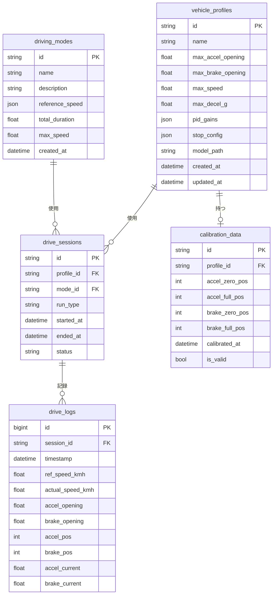
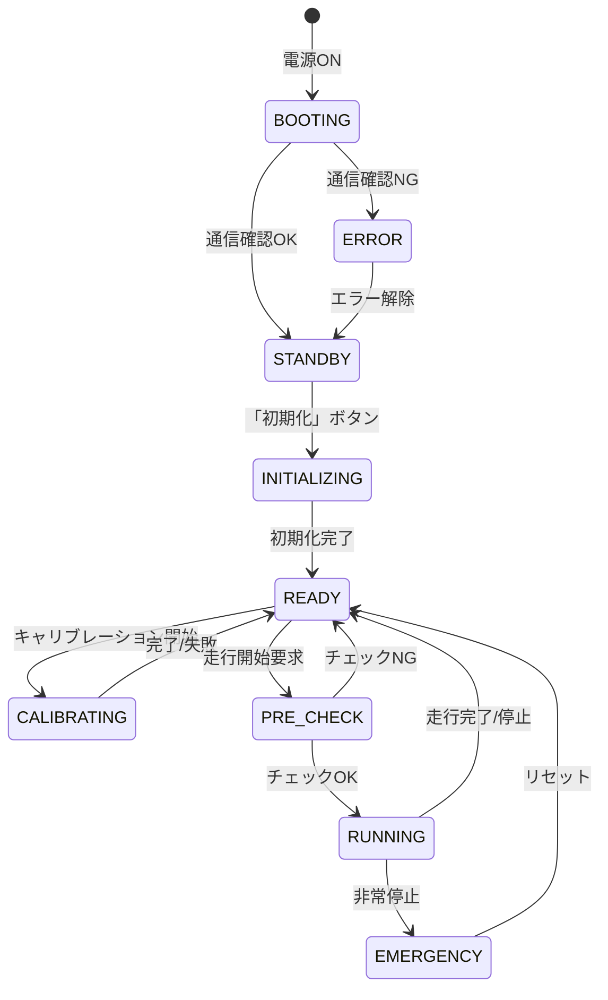
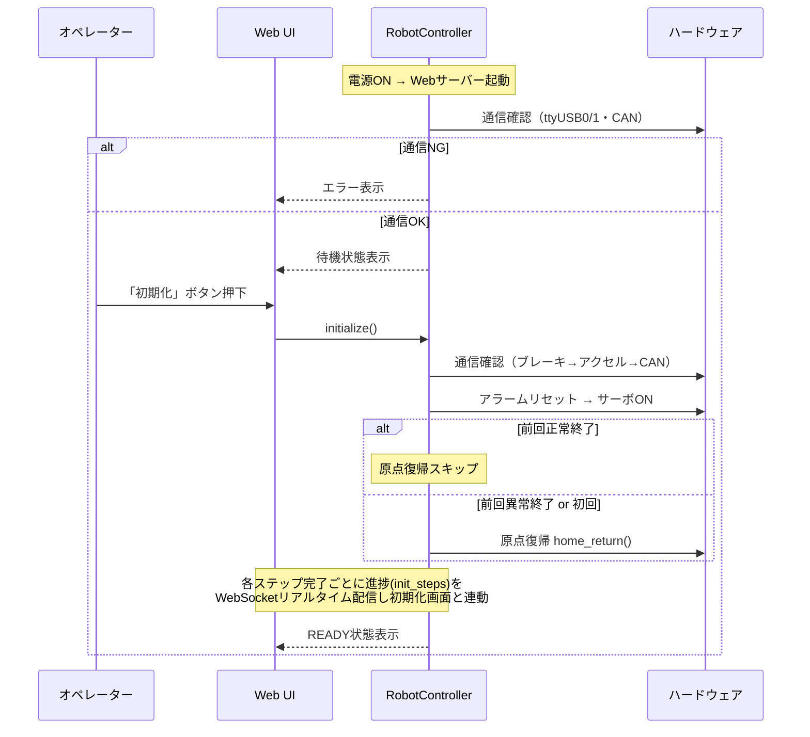
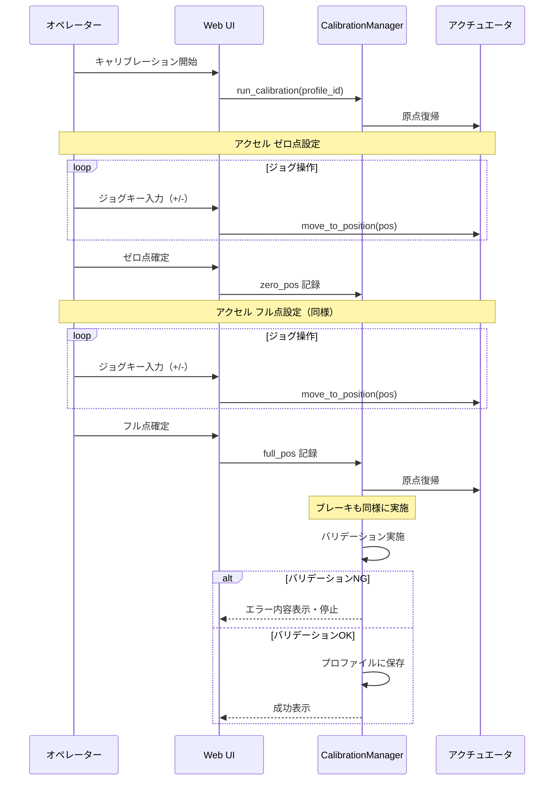
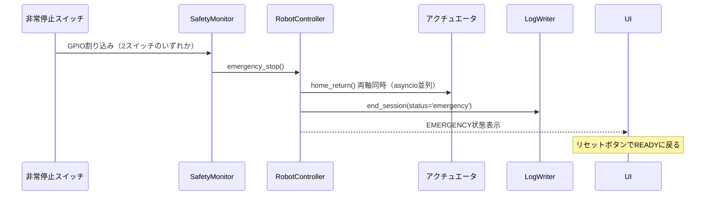
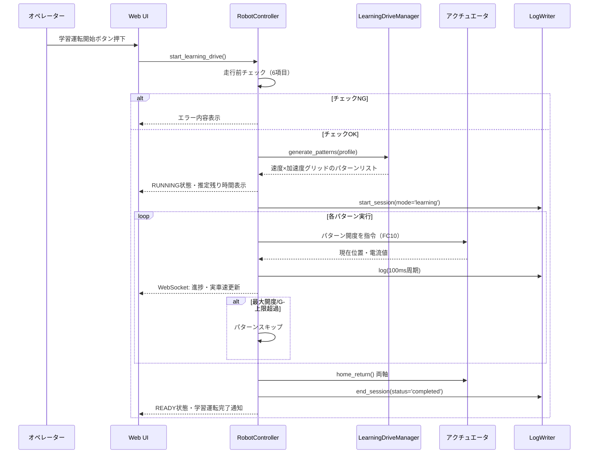
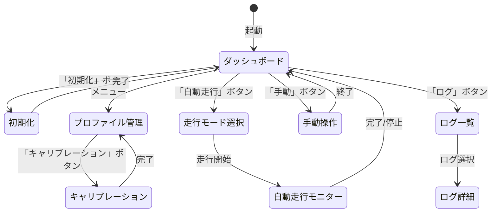

# 機能設計書 (Functional Design Document)

## システム構成図

```mermaid
graph TB
    Browser[ブラウザ<br/>操作エリアPC]

    subgraph RaspberryPi5["Raspberry Pi 5"]
        WebUI[Web UI<br/>FastAPI + フロントエンド]

        subgraph ControlLayer["制御レイヤー (asyncio)"]
            RobotController[RobotController<br/>メインループ 50ms]
            FFController[FeedforwardController<br/>運転モデル]
            PIDController[PIDController<br/>フィードバック]
            SafetyMonitor[SafetyMonitor<br/>常時監視]
        end

        subgraph HWLayer["ハードウェア抽象レイヤー"]
            AccelDriver[AccelActuatorDriver<br/>ttyUSB0 / Modbus RTU]
            BrakeDriver[BrakeActuatorDriver<br/>ttyUSB1 / Modbus RTU]
            CANReader[CANReader<br/>Kvaser USB-CAN]
            GPIOMonitor[GPIOMonitor<br/>UPS / 非常停止]
        end

        subgraph DataLayer["データレイヤー"]
            LogWriter[LogWriter<br/>100ms周期]
            PostgreSQL[(PostgreSQL<br/>アクティブログ 3ヶ月)]
            ArchiveManager[ArchiveManager<br/>CSV圧縮 → USB SSD]
        end
    end

    subgraph Hardware["ハードウェア"]
        PCON1[P-CON-CB #1<br/>アクセル SLAVE_ID=1]
        PCON2[P-CON-CB #2<br/>ブレーキ SLAVE_ID=2]
        CAN[Kvaser USB-CAN<br/>シャシダイナモ]
        ACUPS[AC UPS<br/>接点出力 → GPIO27(物理ピン13)]
        EmergencyStop[非常停止スイッチ<br/>2個並列]
    end

    Browser <-->|HTTP / WebSocket| WebUI
    WebUI <-->|内部API| RobotController
    RobotController --> FFController
    RobotController --> PIDController
    RobotController --> SafetyMonitor
    RobotController --> AccelDriver
    RobotController --> BrakeDriver
    RobotController --> CANReader
    RobotController --> GPIOMonitor
    RobotController --> LogWriter
    LogWriter --> PostgreSQL
    PostgreSQL --> ArchiveManager
    ArchiveManager -->|圧縮CSV| USBSSD[(USB SSD<br/>アーカイブ)]
    AccelDriver <-->|Modbus RTU| PCON1
    BrakeDriver <-->|Modbus RTU| PCON2
    CANReader <-->|CAN bus| CAN
    GPIOMonitor <-->|GPIO 接点入力| ACUPS
    PCON1 --> ActuatorA[アクセルアクチュエータ<br/>IAI RCP6-ROD]
    PCON2 --> ActuatorB[ブレーキアクチュエータ<br/>IAI RCP6-ROD]
```

---

## 技術スタック

| 分類 | 技術 | 選定理由 |
|------|------|----------|
| 言語 | Python 3.13 | asyncioによる並列制御、豊富なライブラリ |
| 非同期フレームワーク | asyncio | 50ms制御ループとI/O並列化 |
| Webフレームワーク | FastAPI | 非同期対応、自動API生成、WebSocket |
| Web UI | HTML/JS + Jinja2 | ブラウザ接続のみで操作可能、FastAPIと統合容易 |
| Modbusライブラリ | pymodbus | Modbus RTU/ASCII対応 |
| CANライブラリ | python-can (Kvaser backend) | Kvaser USB-CANドライバ対応 |
| データベース | PostgreSQL 15 | 時系列ログ管理、3ヶ月分 |
| ORMなし | psycopg2 / asyncpg | シンプルなSQL、高速書き込み |
| GPIO | RPi.GPIO | AC UPS接点出力によるAC断検知、非常停止割り込み |
| 圧縮・アーカイブ | gzip / shutil | ログCSV圧縮 |
| 設定管理 | JSON / TOML | 車両プロファイル |

---

## データモデル定義

### エンティティ: VehicleProfile（車両プロファイル）

```python
@dataclass
class VehicleProfile:
    id: str                      # UUID
    name: str                    # プロファイル名（例: "Prius_2024"）
    max_accel_opening: float     # アクセル最大開度 [%] 0-100
    max_brake_opening: float     # ブレーキ最大開度 [%] 0-100
    max_speed: float             # 最高車速 [km/h]
    max_decel_g: float           # 最大減速G [G]
    pid_gains: PIDGains          # PIDゲイン設定
    stop_config: StopConfig      # 停止判定設定
    calibration: CalibrationData | None  # キャリブレーションデータ
    model_path: str | None       # 運転モデルファイルパス
    created_at: datetime
    updated_at: datetime

@dataclass
class PIDGains:
    kp: float                    # 比例ゲイン
    ki: float                    # 積分ゲイン
    kd: float                    # 微分ゲイン

@dataclass
class StopConfig:
    deviation_threshold_kmh: float   # 逸脱閾値 [km/h]（例: 2.0）
    deviation_duration_s: float      # 逸脱継続時間 [s]（例: 4.0）
```

**制約**:
- `name` はシステム内で一意
- `max_accel_opening`, `max_brake_opening` は 0.0〜100.0
- `max_speed` は 0より大きい値

---

### エンティティ: CalibrationData（キャリブレーションデータ）

```python
@dataclass
class CalibrationData:
    accel_zero_pos: int          # アクセル接触点 [pulse]
    accel_full_pos: int          # アクセル最大位置 [pulse]
    accel_stroke: int            # アクセルストローク [pulse]
    brake_zero_pos: int          # ブレーキ接触点 [pulse]
    brake_full_pos: int          # ブレーキ最大位置 [pulse]
    brake_stroke: int            # ブレーキストローク [pulse]
    calibrated_at: datetime
    is_valid: bool               # バリデーション結果
```

**制約**:
- `accel_full_pos > accel_zero_pos`（アクセル方向が正）
- ストロークが規定範囲内（実測値から±20%以内を想定）

---

### エンティティ: DrivingMode（走行モード）

```python
@dataclass
class DrivingMode:
    id: str                      # UUID
    name: str                    # モード名（例: "WLTP_Class3"）
    description: str             # 説明
    reference_speed: list[SpeedPoint]  # 基準車速時系列
    total_duration: float        # 総走行時間 [s]
    max_speed: float             # 最高車速 [km/h]
    created_at: datetime

@dataclass
class SpeedPoint:
    time_s: float                # 時刻 [s]
    speed_kmh: float             # 基準車速 [km/h]
```

---

### エンティティ: DriveLog（走行ログ）

```python
# PostgreSQL テーブル定義
# Table: drive_sessions
@dataclass
class DriveSession:
    id: str                      # UUID
    profile_id: str              # FK → vehicle_profiles
    mode_id: str | None          # FK → driving_modes（自動運転時）
    run_type: str                # 'auto' | 'manual' | 'learning'
    started_at: datetime
    ended_at: datetime | None
    status: str                  # 'running' | 'completed' | 'error' | 'emergency'

# Table: drive_logs（100ms周期）
@dataclass
class DriveLog:
    id: bigint                   # AUTO INCREMENT
    session_id: str              # FK → drive_sessions
    timestamp: datetime          # 記録時刻
    ref_speed_kmh: float | None  # 基準車速 [km/h]
    actual_speed_kmh: float      # 実車速 [km/h]
    accel_opening: float         # アクセル開度 [%]
    brake_opening: float         # ブレーキ開度 [%]
    accel_pos: int               # アクセル位置 [pulse]
    brake_pos: int               # ブレーキ位置 [pulse]
    accel_current: float         # アクセル電流値 [mA]
    brake_current: float         # ブレーキ電流値 [mA]
```

---

### ER図


```mermaid
erDiagram
    vehicle_profiles ||--o{ drive_sessions : "使用"
    vehicle_profiles ||--o| calibration_data : "持つ"
    driving_modes ||--o{ drive_sessions : "使用"
    drive_sessions ||--o{ drive_logs : "記録"

    vehicle_profiles {
        string id PK
        string name
        float max_accel_opening
        float max_brake_opening
        float max_speed
        float max_decel_g
        json pid_gains
        json stop_config
        string model_path
        datetime created_at
        datetime updated_at
    }

    calibration_data {
        string id PK
        string profile_id FK
        int accel_zero_pos
        int accel_full_pos
        int brake_zero_pos
        int brake_full_pos
        datetime calibrated_at
        bool is_valid
    }

    driving_modes {
        string id PK
        string name
        string description
        json reference_speed
        float total_duration
        float max_speed
        datetime created_at
    }

    drive_sessions {
        string id PK
        string profile_id FK
        string mode_id FK
        string run_type
        datetime started_at
        datetime ended_at
        string status
    }

    drive_logs {
        bigint id PK
        string session_id FK
        datetime timestamp
        float ref_speed_kmh
        float actual_speed_kmh
        float accel_opening
        float brake_opening
        int accel_pos
        int brake_pos
        float accel_current
        float brake_current
    }
```

---

## コンポーネント設計

### RobotController（メインコントローラ）

**責務**:
- 50ms制御ループのスケジューリング（asyncio）
- システム状態機械の管理
- 各コンポーネントの協調制御

```python
class RobotController:
    async def start() -> None          # システム起動
    async def stop() -> None           # 正常停止（原点復帰→サーボOFF）
    async def emergency_stop() -> None # 非常停止（即座に原点復帰）
    async def run_calibration() -> CalibrationResult
    async def run_learning_drive() -> DriveSession
    async def start_auto_drive(mode_id: str) -> DriveSession
    async def start_manual() -> DriveSession
    def get_system_state() -> SystemState
```

**状態機械**:

```mermaid
stateDiagram-v2
    [*] --> BOOTING : 電源ON
    BOOTING --> STANDBY : 通信確認OK
    BOOTING --> ERROR : 通信確認NG
    STANDBY --> INITIALIZING : 「初期化」ボタン
    INITIALIZING --> READY : 初期化完了
    READY --> CALIBRATING : キャリブレーション開始
    CALIBRATING --> READY : 完了/失敗
    READY --> PRE_CHECK : 走行開始要求
    PRE_CHECK --> RUNNING : チェックOK
    PRE_CHECK --> READY : チェックNG
    RUNNING --> READY : 走行完了/停止
    RUNNING --> EMERGENCY : 非常停止
    EMERGENCY --> READY : リセット
    ERROR --> STANDBY : エラー解除
```

---

### ActuatorDriver（アクチュエータドライバ）

**責務**:
- Modbus RTU通信でP-CON-CBに位置指令を送信
- 現在位置・電流値の読み取り
- アラームリセット・サーボON/OFF

```python
class ActuatorDriver:
    def __init__(port: str, slave_id: int)
    async def connect() -> None
    async def enable_modbus_control() -> None  # PMSL コイルで Modbus 操作権を取得（reset_alarm より先に呼ぶ）
    async def reset_alarm() -> None
    async def servo_on() -> None
    async def servo_off() -> None
    async def move_to_position(pos: int) -> None  # 50ms周期で呼ぶ
    async def home_return() -> None               # 原点復帰
    async def read_position() -> int              # 現在位置 [pulse]
    async def read_current() -> float             # 電流値 [mA]
    async def is_alarm_active() -> bool
```

**Modbusレジスタマッピング** (MJ0162-12A Modbus仕様書 第12版より):

FC03 読み取り:
| 機能 | アドレス (HEX) | サイズ | 記号 | 備考 |
|------|--------------|--------|------|------|
| 現在位置 | 0x9000-0x9001 | 32bit符号付き | PNOW | 単位: 0.01mm |
| アラームコード | 0x9002 | 16bit | ALMC | 0=正常 |
| デバイスステータス1 | 0x9005 | 16bit | DSS1 | bit12=SV, bit10=ALMH, bit4=HEND, bit3=PEND |
| 拡張デバイスステータス | 0x9007 | 16bit | DSSE | bit5=MOVE(移動中) |
| 電流値 | 0x900C-0x900D | 32bit符号付き | CNOW | 単位: mA |

FC05 コイル書き込み:
| 機能 | アドレス (HEX) | ON値 | 記号 | 備考 |
|------|--------------|------|------|------|
| サーボON | 0x0403 | FF00 | SON | 0000でOFF |
| アラームリセット | 0x0407 | FF00 | ALRS | エッジ入力、完了後0000に戻す |
| 原点復帰 | 0x040B | FF00 | HOME | DSS1 HEND(bit4)=1で完了確認 |

FC10 直値移動指令 (レジスタ書き込み後、自動的に移動開始):
| 機能 | アドレス (HEX) | サイズ | 記号 | 備考 |
|------|--------------|--------|------|------|
| 目標位置 | 0x9900-0x9901 | 32bit符号付き | PCMD | 単位: 0.01mm |
| 速度指令 | 0x9904-0x9905 | 32bit | VCMD | 単位: mm/s |
| 加減速指令 | 0x9906 | 16bit | ACMD | 単位: mm/s² |
| 制御フラグ | 0x9908 | 16bit | CTLF | |

---

### FeedforwardController（フィードフォワード制御）

**責務**:
- 運転モデル（先読み型 Ridge 逆モデル）から符号付き努力量を算出
- 現在の基準車速と先読み基準車速（0.5/1.0/2.0/3.0 秒先）を入力として努力量を出力
  （+: 名目アクセル開度 [%]、−: 名目ブレーキ開度 [%]）

```python
class FeedforwardController:
    def load_model(model_path: str) -> None
    def unload_model() -> None     # プロファイル切替時に必ず呼ぶ（前車両モデルの残留防止）
    def set_params(params: FeedforwardParams) -> None
    def predict_effort(
        v0: float,                       # 現在の基準車速 [km/h]
        future_speeds: Sequence[float],  # 各先読みホライズンの基準車速 [km/h]
    ) -> float                           # 努力量 [%]（+加速 / −制動）
```

**運転モデル構造** (学習運転ログから生成):
- 入力: 先読み特徴量 7 次元 `[v0, dv_0.5, dv_1.0, dv_2.0, dv_3.0, v0², dv_1.0·v0]`
- レジーム: dv_1.0 ≥ 0 → アクセルモデル、< 0 → ブレーキモデル（Ridge ×2、fit_intercept=False）
- ファイル形式: `.pkl`（model_type = "ridge_inverse_lookahead"）

**線形モデルで表現できない領域の補完**（FeedforwardParams 定数 + ルール）:
1. **停車保持**: v0 ≤ 0.5km/h かつ 0.5 秒先 ≤ 0.5km/h → `-stop_brake_opening_pct`
   （0.5 秒先判定により発進直前まで保持ブレーキを維持する）
2. **クリープ**: v0 < creep_speed かつ加速要求が [0, creep_rate] → 駆動不要（努力量 0）
3. **惰行テーパ**: v0 ≥ creep_speed の緩減速（≤ engine_brake_decel）はブレーキではなく
   スロットルを巡航開度から線形に漸減して作る（dv=0 境界で FF 出力が連続になる）
4. クリープ速度未満の減速要求はブレーキ必須（ペダルオフでは加速する領域）

---

### PIDController（フィードバック制御）

**責務**:
- 実車速と基準車速の偏差からフィードバック補正量（努力量への加算分）を算出
- アンチワインドアップ（条件付き積分 + 積分量クランプ）と出力権限制限を内蔵

```python
class PIDController:
    def __init__(kp: float, ki: float, kd: float, dt: float = 0.05, output_limit: float = 100.0)
    def update(
        setpoint: float,
        measurement: float,
        dt: float | None = None,          # 計測 dt（サイクルスキップ時の微分スパイク防止）
        *,
        saturated_high: bool = False,     # 前サイクルで加速側が飽和（積分停止）
        saturated_low: bool = False,      # 前サイクルで制動側が飽和（積分停止）
    ) -> float                            # ±output_limit にクランプ
    def reset() -> None
    def set_gains(kp, ki, kd) -> None
    def set_output_limit(limit: float) -> None  # プロファイルの pid_output_limit_pct を反映
```

**制御則**:
```
error = ref_speed - actual_speed
pid_correction = Kp * error + Ki * ∫error dt + Kd * d(error)/dt
（飽和方向への積分は停止、|Ki·∫| ≤ output_limit、出力は ±output_limit）
```

**FF+PID出力合成とペダル調停** (DriveLoop → PedalArbiter):
```
# FF と PID を符号付き努力量として合成（+: 加速、−: 制動）
effort = ff_controller.predict_effort(ref_speed, future_speeds) + pid_correction

# ペダルへの写像は PedalArbiter のみが行う（同時踏みは構造的に発生しない）
out = arbiter.arbitrate(effort, dt)
# out.accel_opening / out.brake_opening（高々一方のみ非ゼロ）
# out.saturated_high / saturated_low → 次サイクルの PID 条件付き積分へ
```

> 旧実装（PID 補正の符号分割 + アクセル優先排他）は、FF アクセル中の減速権限喪失と
> FF ブレーキのバンバン制御を生むため廃止した（2026-06-11 コードレビュー指摘 #1）。

---

### PedalArbiter（ペダル調停）

**責務**:
- 努力量 → (アクセル開度, ブレーキ開度) への写像。常にどちらか一方のみ非ゼロ
- 振動抑制 KPI（偏差符号反転 ≤1 回/5 秒）を機構として支える

**調停ルール**（FeedforwardParams の調停定数で構成）:
1. **切替ヒステリシス**: |effort| ≤ switch_hysteresis_pct は惰行（両ペダル 0）。
   帯内の符号チャタでペダル反転しない
2. **アクセル再踏込ディレイ**: 制動後 accel_reengage_dwell_s 以内のアクセルは抑止。
   **制動側にディレイはない**（減速権限を遅延させない安全要件）
3. **不感帯逆補償**: 最終指令が物理死帯 (0, deadband) に落ちない（0 か deadband 以上）
4. **レートリミット**: 開度の増加方向のみ accel/brake_rate_limit_pct_s で制限。
   解放・ペダル切替時の旧ペダルは即座に 0
5. **クランプと飽和フラグ**: プロファイル最大開度でクランプし、削られた方向の
   飽和フラグを返す（PID のアンチワインドアップ入力）

```python
class PedalArbiter:
    def __init__(params: FeedforwardParams, max_accel_opening: float, max_brake_opening: float)
    def reset() -> None
    def arbitrate(effort: float, dt: float) -> ArbiterOutput
```

---

### KPIMonitor（KPI 実行時計測）

**責務**:
- プライマリー KPI（P95 ≤ 0.2km/h・最大 1.0km/h・符号反転 ≤1 回/5 秒）の走行中計測
- 1.0km/h ハード上限超過の即時 warning、走行終了時のサマリ提供

固定長ヒストグラム + 5 秒窓 deque のためメモリは走行時間によらず一定。
走行終了時に RobotController がサマリをログ出力し `last_kpi_summary` で公開する。

```python
class KPIMonitor:
    def update(ref_kmh: float, actual_kmh: float, now_s: float) -> None  # 毎サイクル
    def summary() -> dict[str, float]
    # {n_samples, max_abs_deviation_kmh, p95_kmh, reversal_max_per_5s, hard_limit_violations}
```

---

### SafetyMonitor（安全監視）

**責務**:
- 非常停止スイッチ（GPIO）の監視（割り込みベース）
- 電流値異常の監視
- AC電源断の監視（AC UPS 接点出力 → GPIO27、物理ピン13、プルアップ、LOW=AC断）[要確認: AC UPS機種確定後に更新]
- 逸脱条件による自動停止

```python
class SafetyMonitor:
    async def start_monitoring() -> None
    def register_emergency_callback(cb: Callable[[], Awaitable[None]]) -> None
    def check_overcurrent(current_ma: float, axis: str) -> bool
    def check_deviation(ref: float, actual: float, duration: float) -> bool
    async def trigger_emergency() -> None   # GPIOMonitor・RobotControllerから呼ばれる
    async def handle_ac_power_loss() -> None
```

**電流異常検出アルゴリズム**:
```
# キャリブレーション中の過電流安全監視（緊急遮断のみ）
if current > OVERCURRENT_EMERGENCY_LIMIT:
    → 緊急停止（ジョグ操作中の安全保護）

# 走行中の過電流保護（閾値はP-CON-CB仕様から設定）
if current > OVERCURRENT_LIMIT:
    → 緊急停止
```

**AC電源断シーケンス**:
```
1. AC UPS接点出力 → GPIO でAC断検知 → 安全停止トリガ
2. 全アクチュエータ home_return()（AC UPS バッテリー給電中）
3. 走行ログを PostgreSQL にフラッシュ
4. PostgreSQL 正常終了
5. システムシャットダウン
```

**AC UPS 構成（確定）**:

- **機種**: APC Smart-UPS 750 (SUA750JB)
- **接続**: シリアルポート (DB-9) → USB変換アダプタ → Raspberry Pi `/dev/ttyUSBx`
- **監視**: NUT (Network UPS Tools) の `apcsmart` ドライバでシリアル経由監視
  - NUT デーモン（upsd）を systemd サービスとして常時起動
  - Python コードは NUT socket (TCP 3493) で接続し状態を取得
- **電源構成**: `AC100V → APC Smart-UPS 750 → 5V PSU → Raspberry Pi` および `AC UPS → 24V PSU → P-CON-CB`
- **AC断検知**: NUT の `ups.status` に `OB`（On Battery）が含まれたら AC断と判定
  - `NutUPSMonitor` が 5秒周期でポーリングし、OL→OB 遷移でコールバックを発火
  - GPIO27 の接点出力方式は使用しない（SUA750JB は標準で NC/NO 接点出力を持たない）
- **バッテリー残量監視**: NUT の `battery.charge` 変数で取得
  - 走行前チェックでの 20% 閾値確認に使用
  - WebSocket 経由でリアルタイム配信
- **バックアップ時間**: APC Smart-UPS 750 はフル充電時に最低数分のバックアップが可能
  - home_return() + PostgreSQL終了 + シャットダウン を合計30秒以内に収める設計は維持

---

### CANReader（CAN車速取得）

**責務**:
- Kvaser USB-CANからシャシダイナモ車速を受信
- DBC定義（`config/can/`）に従いデコード

```python
class CANReader:
    async def connect(interface: str = "kvaser") -> None
    async def read_speed() -> float    # 実車速 [km/h]
    async def close() -> None
```

---

### CalibrationManager（キャリブレーション管理）

**責務**:
- アクセル・ブレーキの独立したゼロフルキャリブレーション実行
- バリデーション（ストローク妥当性・ゼロ<フルの順序）
- 結果のプロファイルへの保存

```python
class CalibrationManager:
    async def run_calibration(profile_id: str) -> CalibrationResult

    async def _detect_zero(driver: ActuatorDriver) -> int
    # 原点復帰後、オペレーターがジョグ操作でゼロ位置を合わせて記録

    async def _detect_full(driver: ActuatorDriver, zero_pos: int) -> int
    # ゼロ位置からオペレーターがジョグ操作でフル位置を合わせて記録

    def _validate(result: CalibrationData) -> ValidationResult
    # ゼロ < フル位置、ストローク妥当性チェック
```

**キャリブレーション手順**（アクセル・ブレーキ独立、順序任意）:
```
1. サーボON → 原点復帰
2. オペレーターがジョグ操作（+/-キー）でゼロ位置に合わせて確定
3. オペレーターがジョグ操作でフル位置に合わせて確定
4. 原点復帰
5. ストローク = full - zero を計算・バリデーション
```

---

### LearningDriveManager（学習運転管理）

**責務**:
- 学習パターン（速度・加速度グリッド）の生成とフィルタリング
- パターン走行の実行とログ収集
- 運転モデルの学習・更新

```python
class LearningDriveManager:
    def generate_patterns(profile: VehicleProfile) -> list[LearningPattern]
    # max_opening / max_decel_g を超えるパターンを自動スキップ

    async def run_pattern(pattern: LearningPattern) -> LearningLog
    def train_model(logs: list[LearningLog], profile_id: str) -> str
    # 学習結果を model_path に保存し、プロファイルを更新
```

---

### LogWriter（ログ記録）

**責務**:
- 100ms周期でPostgreSQLに走行データを書き込み
- セッション開始・終了の記録

```python
class LogWriter:
    async def start_session(profile_id: str, mode_id: str | None, run_type: str) -> str
    async def write_log(session_id: str, data: DriveLogData) -> None
    async def end_session(session_id: str, status: str) -> None
```

---

### ArchiveManager（アーカイブ管理）

**責務**:
- 内蔵SSD使用率が80%を超えた場合に3ヶ月超のセッションをCSV+gzip圧縮でUSB SSDに移行（常時起動ではないため定期実行なし、容量トリガー）
- USB SSDが80%超で古いアーカイブから自動削除

**実行タイミング**: 起動時・走行終了時に内蔵SSD使用率をチェックし、80%超の場合のみ実行

```python
class ArchiveManager:
    async def check_and_archive() -> None  # 容量チェック → 必要なら移行
    def _export_to_csv(session_id: str) -> Path
    def _compress(csv_path: Path) -> Path
    def _check_storage_usage() -> float  # 使用率 [%]
    def _delete_oldest_archive() -> None
```

---

## ユースケース図

### UC1: 起動・初期化


```mermaid
sequenceDiagram
    participant Op as オペレーター
    participant UI as Web UI
    participant RC as RobotController
    participant HW as ハードウェア

    Note over RC: 電源ON → Webサーバー起動
    RC->>HW: 通信確認（ttyUSB0/1・CAN）
    alt 通信NG
        RC-->>UI: エラー表示
    else 通信OK
        RC-->>UI: 待機状態表示
        Op->>UI: 「初期化」ボタン押下
        UI->>RC: initialize()
        RC->>HW: 通信確認（ブレーキ→アクセル→CAN）
        RC->>HW: アラームリセット → サーボON
        alt 前回正常終了
            Note over RC: 原点復帰スキップ
        else 前回異常終了 or 初回
            RC->>HW: 原点復帰 home_return()
        end
        Note over RC,UI: 各ステップ完了ごとに進捗(init_steps)を<br/>WebSocketリアルタイム配信し初期化画面と連動
        RC-->>UI: READY状態表示
    end
```

> 初期化画面の各チェック欄（通信確認・アラームリセット・サーボON・原点復帰）は、
> `RobotController.initialize()` が実ハード操作の完了を `init_steps`
> （pending / running / done / skipped / error）として保持し、WebSocket
> リアルタイム配信（`RealtimeData.init_steps`）経由でフロントに反映される。
> フロントは疑似タイマーではなく配信された実進捗を描画する。

---

### UC2: キャリブレーション


```mermaid
sequenceDiagram
    participant Op as オペレーター
    participant UI as Web UI
    participant CM as CalibrationManager
    participant HW as アクチュエータ

    Op->>UI: キャリブレーション開始
    UI->>CM: run_calibration(profile_id)
    CM->>HW: 原点復帰
    Note over Op,HW: アクセル ゼロ点設定
    loop ジョグ操作
        Op->>UI: ジョグキー入力（+/-）
        UI->>HW: move_to_position(pos)
    end
    Op->>UI: ゼロ点確定
    UI->>CM: zero_pos 記録
    Note over Op,HW: アクセル フル点設定（同様）
    loop ジョグ操作
        Op->>UI: ジョグキー入力（+/-）
        UI->>HW: move_to_position(pos)
    end
    Op->>UI: フル点確定
    UI->>CM: full_pos 記録
    CM->>HW: 原点復帰
    Note over CM: ブレーキも同様に実施
    CM->>CM: バリデーション実施
    alt バリデーションNG
        CM-->>UI: エラー内容表示・停止
    else バリデーションOK
        CM->>CM: プロファイルに保存
        CM-->>UI: 成功表示
    end
```

---

### UC3: 自動運転


```mermaid
sequenceDiagram
    participant Op as オペレーター
    participant UI as Web UI
    participant RC as RobotController
    participant FF as FeedforwardController
    participant PID as PIDController
    participant SM as SafetyMonitor
    participant HW as ハードウェア

    Op->>UI: 走行モード選択 → 開始
    UI->>RC: start_auto_drive(mode_id)
    RC->>RC: 走行前チェック（6項目）
    alt チェックNG
        RC-->>UI: エラー項目表示
    else チェックOK
        RC->>HW: CAN車速受信開始
        loop 50ms制御ループ
            HW-->>RC: 実車速 (CAN)
            RC->>FF: predict_effort(ref_speed, future_speeds)
            FF-->>RC: ff_effort（+加速/−制動）
            RC->>PID: update(ref_speed, actual_speed, dt, 飽和フラグ)
            PID-->>RC: pid_correction
            RC->>RC: PedalArbiter.arbitrate(ff_effort + pid_correction)
            RC->>HW: 位置指令送信 (Modbus RTU x2)
            RC->>SM: 逸脱チェック・電流チェック（+ KPIMonitor 集計）
            alt 異常検知
                SM->>RC: 非常停止（SafetyMonitor 経由ディスパッチ）
            end
        end
        RC-->>UI: 走行完了
    end
```

---

### UC4: 非常停止


```mermaid
sequenceDiagram
    participant SW as 非常停止スイッチ
    participant SM as SafetyMonitor
    participant RC as RobotController
    participant HW as アクチュエータ
    participant LW as LogWriter

    SW->>SM: GPIO割り込み（2スイッチのいずれか）
    SM->>RC: emergency_stop()
    RC->>HW: home_return() 両軸同時（asyncio並列）
    RC->>LW: end_session(status='emergency')
    RC-->>UI: EMERGENCY状態表示
    Note over UI: リセットボタンでREADYに戻る
```

### UC5: 手動操作


```mermaid
sequenceDiagram
    participant Op as オペレーター
    participant UI as Web UI
    participant RC as RobotController
    participant HW as アクチュエータ

    Op->>UI: 手動操作画面を開く
    Op->>UI: 手動操作開始ボタン押下
    UI->>RC: start_manual()
    RC->>RC: 走行前チェック（6項目）
    alt チェックNG
        RC-->>UI: エラー内容表示
    else チェックOK
        RC->>HW: サーボON確認
        RC-->>UI: MANUAL状態・スライダー有効化
        loop スライダー操作中
            Op->>UI: アクセル/ブレーキ開度を調整
            UI->>RC: set_opening(accel%, brake%)
            RC->>HW: 位置指令送信（FC10, 両軸）
            HW-->>RC: 現在位置・電流値
            RC-->>UI: WebSocket: 現在開度・電流値更新
        end
        Op->>UI: 手動操作終了ボタン押下
        UI->>RC: stop_manual()
        RC->>HW: home_return() 両軸
        RC-->>UI: READY状態
    end
```

---

### UC6: 学習運転


```mermaid
sequenceDiagram
    participant Op as オペレーター
    participant UI as Web UI
    participant RC as RobotController
    participant LM as LearningDriveManager
    participant HW as アクチュエータ
    participant LW as LogWriter

    Op->>UI: 学習運転開始ボタン押下
    UI->>RC: start_learning_drive()
    RC->>RC: 走行前チェック（6項目）
    alt チェックNG
        RC-->>UI: エラー内容表示
    else チェックOK
        RC->>LM: generate_patterns(profile)
        LM-->>RC: 速度×加速度グリッドのパターンリスト
        RC-->>UI: RUNNING状態・推定残り時間表示
        RC->>LW: start_session(mode='learning')
        loop 各パターン実行
            RC->>HW: パターン開度を指令（FC10）
            HW-->>RC: 現在位置・電流値
            RC->>LW: log(100ms周期)
            RC-->>UI: WebSocket: 進捗・実車速更新
            alt 最大開度/G上限超過
                RC->>RC: パターンスキップ
            end
        end
        RC->>HW: home_return() 両軸
        RC->>LW: end_session(status='completed')
        RC-->>UI: READY状態・学習運転完了通知
    end
```

---

## 走行前チェック仕様

走行開始前に以下の6項目をすべてパスする必要があります（自動運転・学習運転・手動操作共通）。

| # | チェック項目 | 確認内容 | NG時の動作 |
|---|------------|---------|-----------|
| 1 | 通信確認 | ttyUSB0・ttyUSB1・CAN接続 | エラー表示・停止 |
| 2 | サーボ状態 | サーボON・アラームなし | エラー表示・停止 |
| 3 | キャリブレーション | 有効なキャリブレーションデータあり | エラー表示・停止 |
| 4 | プロファイル | 車両プロファイル選択済み | エラー表示・停止 |
| 5 | UPS残量 | AC UPS バッテリー残量 20%以上（NUT `battery.charge` で取得） | エラー表示・停止 |
| 6 | アクチュエータ位置 | 両軸が原点付近にあること（±10pulse = ±0.1mm） | エラー表示・停止 |

---

## Web UI 画面設計

### 画面遷移図


```mermaid
stateDiagram-v2
    [*] --> ダッシュボード : 起動
    ダッシュボード --> 初期化 : 「初期化」ボタン
    初期化 --> ダッシュボード : 完了
    ダッシュボード --> プロファイル管理 : メニュー
    プロファイル管理 --> キャリブレーション : 「キャリブレーション」ボタン
    キャリブレーション --> プロファイル管理 : 完了
    ダッシュボード --> 走行モード選択 : 「自動走行」ボタン
    走行モード選択 --> 自動走行モニター : 走行開始
    自動走行モニター --> ダッシュボード : 完了/停止
    ダッシュボード --> 手動操作 : 「手動」ボタン
    手動操作 --> ダッシュボード : 終了
    ダッシュボード --> ログ一覧 : 「ログ」ボタン
    ログ一覧 --> ログ詳細 : ログ選択
```

### 主要画面

#### ダッシュボード（メイン）

| 表示要素 | 内容 |
|---------|------|
| システム状態 | STANDBY / READY / RUNNING / EMERGENCY（バッジ） |
| 実車速 | 大きな数値表示 [km/h] |
| アクセル・ブレーキ開度 | ゲージ [%] |
| 基準車速グラフ | リアルタイムライングラフ（基準・実車速） |
| 操作ボタン | 初期化 / 自動走行 / 学習運転 / 手動 / 停止 |

#### 自動走行モニター

| 表示要素 | 内容 |
|---------|------|
| リアルタイムグラフ | 直近30秒ウィンドウ。1軸目: 基準車速（灰色点線）・実車速（青色実線）。2軸目: アクセル/ブレーキ開度。3軸目: 全体プロファイルと現在位置マーカー。走行開始後のデータのみ表示 |
| 逸脱量 | 実車速 - 基準車速 [km/h] |
| 経過時間 / 残り時間 | 走行開始ボタン押下後から計測開始 |
| 非常停止ボタン | 常時表示 |

---

## REST API設計（実装済み: `src/web/routers/`）

### 走行制御（`/api/v1/drive/`）

```
POST /api/v1/drive/initialize
Response: { "status": "ok" }

POST /api/v1/drive/start
Body: { "mode_id": "uuid" }
Response: DriveSessionResponse

POST /api/v1/drive/stop
Response: { "status": "ok" }

GET /api/v1/drive/status
Response: SystemStateResponse { "robot_state": "READY", "active_profile_id": null, ... }

POST /api/v1/drive/emergency
Response: { "status": "ok" }

POST /api/v1/drive/reset-emergency
Response: { "status": "ok" }

POST /api/v1/drive/manual/start
Response: DriveSessionResponse

POST /api/v1/drive/manual/stop
Response: { "status": "ok" }
```

### プロファイル管理（`/api/v1/profiles/`）

```
GET    /api/v1/profiles/
Response: list[ProfileResponse]

POST   /api/v1/profiles/
Body: ProfileCreateRequest { name, max_accel_opening, max_brake_opening, max_speed, max_decel_g, pid_gains, stop_config, model_path }
Response: ProfileResponse (201)

GET    /api/v1/profiles/{profile_id}
Response: ProfileResponse | 404

PUT    /api/v1/profiles/{profile_id}
Body: ProfileUpdateRequest (全フィールド省略可)
Response: ProfileResponse | 404

DELETE /api/v1/profiles/{profile_id}
Response: 204 | 404

POST   /api/v1/drive/select-profile
Body: { "profile_id": "uuid" }
Response: { "status": "ok", "profile_id": "uuid" } | 404
```

### 走行モード管理（`/api/v1/modes/`）

```
GET    /api/v1/modes/
Response: list[ModeResponse]

POST   /api/v1/modes/upload   (multipart/form-data)
Body: file (CSV: time_s,speed_kmh), name?, description?
Response: ModeResponse (201)

GET    /api/v1/modes/{mode_id}
Response: ModeDetailResponse (reference_speed含む) | 404

DELETE /api/v1/modes/{mode_id}
Response: 204 | 404
```

### セッション参照（`/api/v1/sessions/`）

```
GET    /api/v1/sessions/
Response: list[SessionResponse]

GET    /api/v1/sessions/{session_id}
Response: SessionResponse | 404

GET    /api/v1/sessions/{session_id}/logs
Response: list[LogResponse]
```

### WebSocket（リアルタイムデータ）

```
WS /ws/realtime
Push (100ms周期):
{
  "timestamp": "ISO8601",
  "robot_state": "READY",
  "actual_speed_kmh": 60.2,
  "ref_speed_kmh": 60.0,
  "accel_opening": 42.3,
  "brake_opening": 0.0,
  "accel_current_ma": 850.0,
  "brake_current_ma": 120.0
}
```

---

## エラーハンドリング

### エラーの分類

| エラー種別 | 処理 | GUIへの表示 |
|-----------|------|------------|
| 通信断（Modbus） | 制御ループ停止 → 緊急停止 | 「アクチュエータ通信エラー」+ 軸番号 |
| CAN受信タイムアウト | 走行停止 → 原点復帰 | 「車速信号タイムアウト」 |
| 過電流検知 | 制御ループ停止 → 緊急停止 | 「過電流：[軸名] [値]mA」 |
| 走行逸脱 | 自動停止 → 原点復帰 | 「逸脱超過：±Xkm/h × Ys」 |
| AC電源断 | 安全停止シーケンス | 「AC電源断：安全停止中」 |
| キャリブレーション失敗 | 停止・エラー保存 | 「キャリブレーション失敗：[項目]」 |
| UPS残量低下 | 走行前チェックで停止 | 「UPS残量不足：XX%（20%以上必要）」 |

---

## テスト戦略

### ユニットテスト
- PIDController: ステップ応答、積分リセット
- FeedforwardController: モデル補間精度
- CalibrationManager: バリデーションロジック
- SafetyMonitor: 閾値判定、タイマー動作

### 統合テスト
- RobotController: 状態遷移シーケンス（モックハードウェア使用）
- LogWriter: PostgreSQL書き込み・アーカイブ

### ハードウェア結合テスト
- 実機Modbus通信（アクチュエータ単体）
- CAN受信（シャシダイナモ模擬信号）
- 非常停止GPIO割り込み
- UPS電源断シミュレーション
